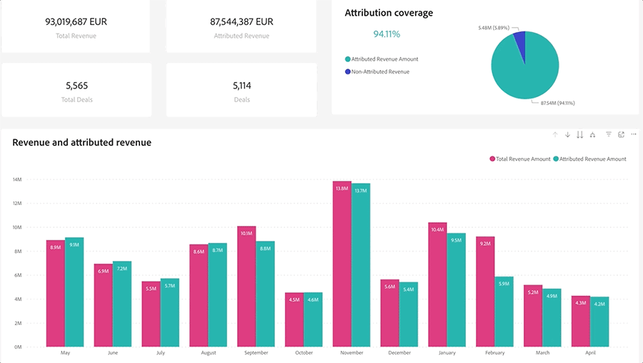

# 대시보드 기본 사항 살펴보기 {#discover-dashboard-basics}

이 문서는 다시 설계된 인터페이스의 기본 기능을 안내하므로 데이터를 쉽게 액세스하고 해석할 수 있습니다. 필터 창의 역학을 자세히 살펴보고 드릴 기능, 교차 필터링 및 툴팁과 같은 향상된 보고 기능의 복잡성을 찾아냅니다.

>[!NOTE]
>
>이 대시보드는 현재 베타 버전입니다. 이 전환 단계에서는 현재 및 새 대시보드에 모두 액세스할 수 있습니다. 현재 대시보드는 완전히 전환하여 최적의 기능을 보장하면 더 이상 사용되지 않습니다.

## 필터 창 {#filter-pane}

모든 대시보드에는 원활한 탐색 및 맞춤화를 위한 다음 컨트롤과 함께 다양한 필터가 있습니다.

<table style="table-layout:auto"> 
 <tbody> 
  <tr> 
   <th>이름</th> 
   <th>설명</th>
  </tr> 
  <tr> 
   <td><b>필터 전환 단추</b></td>
   <td>필터 창을 열거나 닫으려면 전환합니다.
   
</td>
  </tr>
  <tr> 
   <td><b>검색창</b></td>
   <td>필터 창 상단의 검색을 사용하여 특정 필터를 검색합니다. 각 필터에는 자체 검색 창도 있습니다.
   
</td>
  </tr>
   <tr> 
   <td><b>필터 지우기 단추</b></td>
   <td>필터를 지우려면 각 필터의 오른쪽 상단 모서리에 있는 지우개 아이콘을 클릭합니다.
   
</td>
  </tr>
  <tr> 
   <td><b>적용 단추</b></td>
   <td>을(를) 클릭하여 대시보드에서 필터 변경 사항을 확인하고 구현합니다.
   
</td>
  </tr>
 </tbody> 
</table>

## 시각화에 대한 필터 {#filters-on-visual}

적용된 필터의 읽기 전용 목록을 보려면 시각적 개체의 오른쪽 상단 모서리에 마우스를 가져다 대십시오.

## 보고서 기능 {#report-capabilities}

### 드릴다운 및 위로 {#drill-down-and-up}

* 시각화에 계층을 표시하는지 확인합니다. 작업 표시줄에 드릴 제어 옵션이 있으면 이를 나타냅니다.

* 회색 배경으로 강조 표시된 단일 아래쪽 화살표를 클릭하여 드릴다운을 활성화합니다. 되돌리려면 드릴업 아이콘을 사용합니다.

한 번에 한 필드씩 드릴다운하려면 드릴다운 아이콘을 켜고 막대와 같은 시각적 요소를 선택합니다.

이중 화살표 드릴다운 아이콘을 사용하여 다음 계층 레벨로 이동합니다.

포크와 유사한 아이콘을 사용하여 현재 보기에 추가적인 계층 수준을 추가할 수 있습니다.

### 드릴스루 {#drill-through}

시각적 요소 뒤의 데이터를 탐색하려면 시각적 요소를 마우스 오른쪽 단추로 클릭하고 &quot;드릴스루&quot; 옵션을 선택합니다.

### 데이터 내보내기 {#export-data}

시각화에서 기본 데이터를 내보내려면 오른쪽 상단 모서리로 마우스를 가져갑니다. &quot;기타 옵션&quot; 버튼을 클릭하고 &quot;데이터 내보내기&quot;를 선택한 다음 선호하는 형식을 선택한 다음 &quot;내보내기&quot;를 클릭합니다.

### 포커스 모드 {#focus-mode}

특정 시각적 또는 타일을 확대하려면 오른쪽 상단 모서리로 마우스를 가져간 후 &quot;포커스&quot; 버튼을 선택합니다.

### 교차 필터링 {#cross-filtering}

하나의 시각화에서 값 또는 축 레이블을 선택하면 보고서 페이지의 다른 시각화가 상호 필터링되어 관련성이 있고 필터링된 데이터만 표시됩니다.

### 툴팁 {#tooltips}

툴팁은 표시된 데이터에 대한 추가 세부 정보를 제공합니다. 간단히 시각적 요소에 마우스를 가져다 대면 상황별 툴팁이 팝업되어 특정 데이터 포인트와 관련된 통찰력이나 설명을 제공할 수 있습니다.

