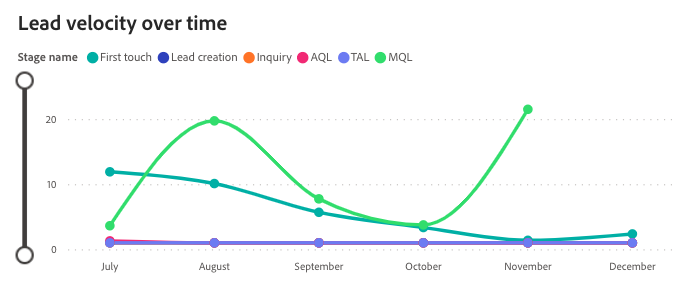

# 리드 속도 대시보드 {#lead-velocity-dashboard}

Velocity 대시보드는 잠재 고객이 판매 단계를 이동하는 속도에 대한 동적 보기를 제공하여 마케터와 영업 팀이 다양한 채널에서 전환 시간에 대한 중요한 통찰력을 얻을 수 있도록 합니다. 이 도구는 잠재 고객 전환 기간 및 판매 단계 진행 효율성에 대한 주요 질문에 답하는 데 유용하며, 이를 통해 성장 및 전환 가속화를 위한 참여 전략을 최적화할 수 있습니다.

이 대시보드가 답변하는 질문:

* 평균적으로 리드를 전환하는 데 얼마나 걸립니까?
* 평균적으로 각 단계에 대해 리드 또는 연락처가 다음 단계로 진행되는 데 얼마나 걸립니까? 이 기간은 시간이 지남에 따라 어떻게 변합니까?

## 대시보드 구성 요소 {#dashboard-components}

&quot;잠재 고객&quot; 또는 &quot;연락처&quot;를 표시할지 여부는 설정 > 속성 설정 > 기본 대시보드 개체에 설정된 기본 설정에 따라 결정됩니다.

### 단계별 잠재 고객/연락처 속도 {#lead-contact-velocity-by-stage}

막대 차트에는 특정 기간 동안 잠재 고객/담당자가 각 판매 단계에서 소비한 평균 기간(일)이 표시됩니다.

이 차트가 답하는 질문:

* 일반적으로 잠재 고객/연락처의 지속 시간이 가장 긴 판매 단계는 무엇입니까?
* 첫 번째 터치 단계에서 보낸 시간은 &#39;MQL&#39; 단계와 어떻게 비교됩니까?

### 시간 경과에 따른 리드/연락처 속도 {#lead-contact-velocity-over-time}

시계열 라인 차트에는 지정된 기간 동안 잠재 고객/담당자가 각 판매 단계에서 소비하는 평균 시간(일)이 표시됩니다.

* 드릴다운 및 위로 기능을 사용하여 월별, 분기별 또는 연도별로 데이터를 분류할 수 있습니다.
* 마우스를 라인 위로 가져가면 자세한 정보가 표시됩니다.

이 차트가 답하는 질문:

* 관찰된 개월 동안 리드/연락처에 대한 각 단계에서 소요된 시간의 추세는 무엇입니까?
* 영업 단계에서 리드/연락처가 가장 빠른 진행을 경험한 달은 언제입니까?

### 채널별 잠재 고객/연락처 속도 {#lead-contact-velocity-by-channel}

막대 차트는 리드/연락처가 각 단계 단계에 남아 있는 평균 기간(일)을 채널별로 분류하여 표시합니다.

마우스를 라인 위로 가져가면 자세한 정보가 표시됩니다.

이 차트가 답하는 질문:

* 단계 단계를 통해 가장 빠른 리드 진행을 보여주는 채널은 무엇입니까?
* &quot;MQL&quot; 단계의 리드 속도는 채널마다 어떻게 다릅니까?

## 필터 창 {#filter-pane}

이 대시보드에는 다음 설정 및 필터가 포함되어 있습니다.

* 날짜
   * 기준: 날짜 전환
* 단계
* 채널
* 부채널
* Campaign
* 세그먼트
