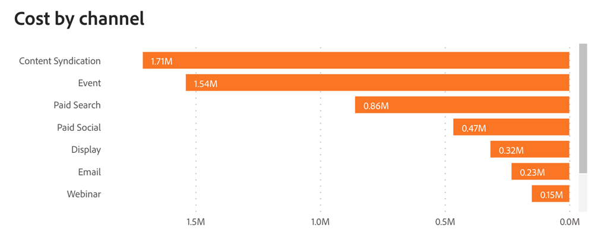

# ROI 대시보드 {#roi-dashboard}

ROI 대시보드는 마케터에게 채널, 하위 채널 및 캠페인의 투자 수익에 대한 세분화된 보기를 제공합니다. 비용 및 매출 패턴을 꼼꼼히 분석하는 동시에 리드당 비용, 거래 및 기회와 같은 지표를 파악하여 마케팅 기여도를 포괄적으로 파악합니다.

>[!NOTE]
>
>이 대시보드는 현재 베타 버전입니다. 이 전환 단계에서는 현재 및 새 대시보드에 모두 액세스할 수 있습니다. 현재 대시보드는 완전히 전환하여 최적의 기능을 보장하면 더 이상 사용되지 않습니다.

**질문과 대답은 다음과 같습니다.**

* 각 채널, 하위 채널 및 캠페인에 대한 ROI 값은 무엇입니까?
* 비용과 수익이 각 채널, 하위 채널 및 캠페인에 어떻게 분배되었습니까?
* Cost-per-Lead, Cost-per-Deal, and cost-per-Opportunity는 무엇입니까?

## 대시보드 구성 요소 {#dashboard-components}

### KPI 타일 {#kpi-tiles}

* **비용**: 연결된 데이터 소스의 총 비용 및 수동으로 업로드한 비용.
* **속성 수익**: 선택한 속성 모델을 기반으로, 필터링된 날짜 기간 내에 마감된 터치포인트가 있는 기회 의 총 수익 기여도
* **실현된 속성 수익**: 선택한 속성 모델을 기반으로, 터치포인트가 있는 기회 및 마감된 시기에 상관없이 필터링된 날짜 기간 내의 총 수익 기여도.
* **총 새 리드 수**: 터치된 리드와 터치되지 않은 리드를 모두 포함하여 생성된 총 새 리드 수입니다.
* **새 잠재 고객당 비용**: 총 비용을 총 새 Lead 수로 나눈 새 Lead 당 평균 비용입니다.
* **총 새 영업 기회**: 터치된 기회와 터치되지 않은 기회를 모두 포함하여 생성된 총 새 기회 수입니다.
* **새 영업 기회당 비용**: 총 비용을 총 새 Opportunity 수로 나눈 새 Opportunity 당 평균 비용입니다.
* **총 거래 수**: 터치포인트가 없는 기회를 포함한 &quot;성공한 마감&quot; 기회 수
* **단순 ROI**: 필터링된 날짜 기간에 비용으로 나눈 속성 수익.
* **실현된 ROI**: 실현된 속성 수익을 필터링된 날짜 기간의 비용으로 나눈 값입니다.

### 채널별 비용 및 수익 그래프 {#cost-and-revenue-by-channel-graph}

다양한 채널, 하위 채널 및 캠페인과 상대적인 크기에 대한 비교 관점을 제공하도록 설계된 비용 및 매출을 보여주는 막대 차트입니다.

* 드릴다운 및 상향 기능을 활용하여 데이터를 하위 채널 및 캠페인별로 분류할 수 있습니다.
* 각 막대 위로 마우스를 가져가 단순 및 실현된 ROI를 조회합니다.

**이 차트가 답하는 질문:**

* 각 채널, 하위 채널 및 캠페인에 대한 ROI 값은 무엇입니까?
* 매출액 대비 비정상적으로 비용이 높거나 낮은 이상 채널 또는 하위 채널이 있습니까?

### 시간 경과에 따른 실현 및 간단한 ROI {#realized-vs-simple-roi-over-time}

시간 경과에 따른 진행을 추적하면서 실현된 ROI와 간단한 ROI 간의 비교를 표시하는 시계열 라인 차트입니다.

* 마우스로 그래프의 섹션을 가리키면 단순 ROI 및 실현 ROI가 표시됩니다.

**이 차트가 답하는 질문:**

* 실현된 ROI는 특정 기간 동안의 단순 ROI와 어떻게 비교됩니까?
* 실현 ROI 추세는 같은 기간 동안 중요한 마케팅 이벤트와 어떻게 관련이 있습니까?

### 시간 경과에 따른 비용 그래프 {#cost-over-time-graph}

월별/분기별/연도별로 연관된 채널별로 세그먼트화된 총 비용을 표시하는 스택 막대 차트.

* 드릴다운 및 위로 기능을 활용하여 데이터를 월, 분기 또는 연도로 분류할 수 있습니다.
* 막대 세그먼트 또는 막대 사이의 공간을 마우스로 가리키면 자세한 정보가 표시됩니다.

**이 차트가 답하는 질문:**

* 모든 채널의 총 비용은 한 분기/달에서 다음 분기/달로 어떻게 비교됩니까?
* 특정 채널에 대한 비용은 시간이 지남에 따라 어떻게 발전해왔습니까?

### 채널별 비용 그래프 {#cost-by-channel-graph}

채널/하위 채널/캠페인으로 세그먼트화된 마케팅 지출을 표시하는 막대 차트입니다.

* 드릴다운 및 상향 기능을 활용하여 채널/하위 채널/캠페인별로 데이터를 분류할 수 있습니다.

**이 차트가 답하는 질문:**

* 기본 채널 내에서 가장 높은 할당을 갖는 하위 채널 또는 캠페인은 무엇입니까?
* 다른 마케팅 경로보다 자금이 부족한 것으로 보이는 마케팅 경로(채널, 하위 채널 또는 캠페인)는 무엇입니까?

### ROI 요약 테이블 {#roi-summary-table}

세부 분류를 위해 개별 채널별로 분류된 속성 매출, 비용 및 ROI를 표시하는 표

* 각 채널 옆의 &quot;+&quot; 아이콘을 클릭하여 하위 채널 및 캠페인별로 분류를 표시합니다.

**열:**

* 채널/서브채널/캠페인
* 비용
* 속성 수익
* 실현된 속성 수익
* 단순 ROI
* 실현된 ROI
* 미실현 속성 파이프라인 수익: 필터링된 날짜 기간 내에 생성된 터치포인트(오픈 기회)에 연결된 파이프라인 수익.

### 마케팅 지출 테이블 {#marketing-spend-table}

세부 분류를 위해 개별 채널별로 분류된 비용, 신규 리드, 기회 및 거래를 표시하는 표

* 각 채널 옆의 &quot;+&quot; 아이콘을 클릭하여 하위 채널 및 캠페인별로 분류를 표시합니다.

**열:**

* 채널/서브채널/캠페인
* 비용
* 새 잠재 고객
* 새 잠재 고객당 비용
* 새로운 영업 기회
* 새 영업 기회당 비용
* 거래
* 거래당 비용

## 필터 창 {#filter-pane}

이 대시보드에는 다음 설정 및 필터가 포함되어 있습니다.

* 날짜
   * 기준:
      * 생성 일자: 뉴스 리드, 새 기회
      * 비용 발생 일자: 비용
      * 마감일: 속성 매출(단순 ROI), 거래
      * 접점 날짜: 실현된 속성 매출의 접점(실현된 ROI)
* 속성 모델
* 채널, 하위 채널
* 캠페인

>[!MORELIKETHIS]
>
>[대시보드 기본 사항 살펴보기](/help/marketo-measure-discover-ui/dashboards/discover-dashboard-basics.md){target="_blank"}
