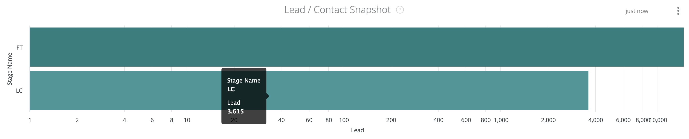

# 스냅샷 대시보드 설명서 {#snapshot-dashboard-documentation}

스냅샷 대시보드를 사용하면 Lead/Contact 및 Opportunity 단계에 걸친 레코드 배포와 함께 특정 시점의 CRM 상태를 볼 수 있습니다.

이 대시보드에는 두 개의 타일이 있습니다.

* **리드/연락처 스냅샷:** 선택한 일자의 각 단계에 있는 잠재 고객 또는 연락처 레코드 수입니다.

>[!NOTE]
>
>모든 Discover 대시보드에서 Lead 또는 Contact 중 하나의 개인 객체만 보고할 수 있습니다. 다음에서 설정됩니다. [!UICONTROL Settings] > [!UICONTROL Reporting] > [!UICONTROL Attribution Settings] > [!UICONTROL Default Dashboard Object].

* **영업 기회 스냅숏:** 선택한 날짜의 각 단계에 있는 Opportunity 레코드 수입니다.

이 대시보드는 다음 필터(모든 필터가 두 타일에 적용됨)를 지원합니다.

* 스냅샷 날짜: 스냅샷 날짜를 선택합니다.
* CRM 계정 ID/이름: CRM 계정 ID 또는 이름별로 레코드를 필터링합니다.

>[!NOTE]
>
>제안 사항에는 이름만 표시됩니다.

* 채널: 채널을 기준으로 레코드를 필터링합니다. 터치포인트 중 하나가 채널에 연결된 경우 레코드는 채널에 연결됩니다.
* 하위 채널: 하위 채널별로 레코드를 필터링합니다. 터치포인트 중 어느 하나라도 하위 채널에 연결되어 있으면 레코드는 하위 채널에 연결됩니다.
* 캠페인: 캠페인별로 레코드를 필터링합니다. 접점이 캠페인에 연결된 경우 레코드는 캠페인에 연결됩니다.
* 캠페인 소스: 캠페인 소스별로 레코드를 필터링합니다. 캠페인 소스의 예는 다음과 같습니다 [!DNL Adwords], [!DNL BingAds], [!DNL Facebook], [!DNL LinkedIn]등 접점이 캠페인 소스에 연결되어 있는 경우 레코드는 캠페인 소스에 연결됩니다.
* 광고 계정 ID/이름: 광고 계정 ID 또는 이름별로 레코드를 필터링합니다. 접점이 선택된 광고 계정의 캠페인에 연결된 경우 레코드는 광고 계정에 연결됩니다.

>[!NOTE]
>
>제안 이름만 표시합니다.

* 세그먼트 필터: 사용자 지정 세그먼트별로 레코드를 필터링합니다. 터치포인트 중 하나가 세그먼트에 연결된 경우 레코드는 세그먼트에 연결됩니다.

모든 필터에서 &quot;AND&quot; 논리가 사용됩니다.

>[!NOTE]
>
>레코드가 선택한 날짜에 단계를 변경하면 레코드는 시작 및 종료 단계와 모든 통과 단계에 대해 계산됩니다.

## 잠재 고객/연락처 스냅샷 {#lead-contact-snapshot}

단계에는 오픈 리드/접촉 단계의 FT, LC 및 선택된 단계 단계가 포함됩니다([!UICONTROL Settings] > [!UICONTROL CRM] > [!UICONTROL Stage Mapping]).

각 막대에서 드릴다운하여 각 단계에 대한 리드/연락처 레코드를 볼 수 있습니다.

## 영업 기회 스냅숏 {#opportunity-snapshot}

단계에는 FT, LC, 오픈 리드/접촉 단계의 선택된 단계([!UICONTROL Settings] > [!UICONTROL CRM] > [!UICONTROL Stage Mapping]). Open Opportunity 단계의 OC 및 선택된 단계([!UICONTROL Settings] > [!UICONTROL CRM] > [!UICONTROL Stage Mapping]).

각 단계에서 드릴다운하여 각 단계에 대한 Opportunity 레코드를 볼 수 있습니다.
