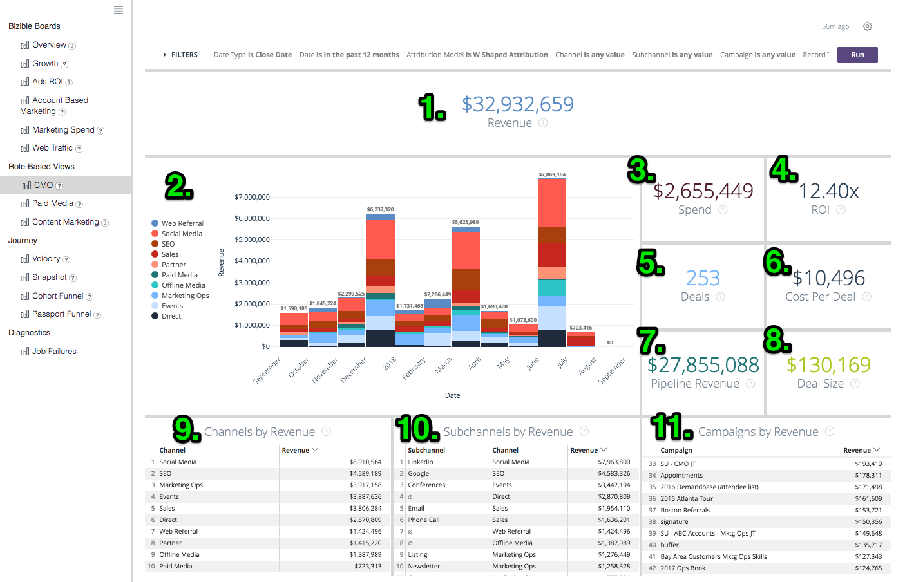

# 정의 및 백과사전 {#definitions-and-encyclopedia}

다음은 Discover 플랫폼에 있는 다양한 보드 및 타일과 해당 보드 내의 필터에 대한 개요입니다. 각 게시판의 스크린샷 내에는 여러 개의 타일이 있으며, 이에 대한 정의는 아래의 해당 게시판 섹션에서 찾을 수 있습니다.

**[!DNL Marketo Measure]게시판**

개요

성장

광고 ROI

계정 기반 마케팅

마케팅 지출

웹 트래픽

**역할 기반 보기**

CMO

유료 미디어

콘텐츠 마케팅

마케팅 운영

**여정**

속도

스냅샷

Passport 단계

참여 경로

## [!DNL Marketo Measure] 게시판 {#marketo-measure-boards}

### 개요 {#overview}

개요 는 매출, 지출 및 ROI에 대한 마케팅 팀의 영향과 관련하여 사용자가 수행하는 성과를 개략적으로 살펴볼 수 있도록 합니다.

**필터**

날짜 유형은 종료 날짜입니다.

날짜는 지난 12개월 이내

기여도 분석 모델이 W자형입니다.

지표는 매출입니다.

Dimension: 채널

채널이 __과 같음

하위 채널이 __과 같음

캠페인이 __과 같음

범주

**매출**

`1.` 속성 모델에 따른 마감된 원 기회의 총 수익 금액.

을 클릭하여 세부 정보를 표시하고 데이터를 시각화 및 테이블로 표시하여 드릴다운합니다.

**개요**

`2.` 이 차트는 필터 메뉴의 지표 드롭다운을 사용하여 시간 경과에 따라 매출 / 파이프라인 매출 / 지출 / 거래 / 기회 / 각 채널에 속하는 리드 / 연락처를 표시합니다.

**지출**

`3.` API 비용과 자가 보고 비용 모두로 기록된 총 지출액이 가장 높은 채널 수준에서 롤업되었습니다.

을 클릭하여 세부 정보를 표시하고 데이터를 시각화 및 테이블로 표시하여 드릴다운합니다.

**ROI**

`4.` 필터 메뉴의 Dimension 드롭다운을 사용하면 선택한 전체 날짜 범위 동안 기여도 분석 모델을 기반으로 각 채널/하위 채널/캠페인/계정/광고 그룹/광고/광고주/크리에이티브/키워드/배치/사이트에 기여한 ROI의 양을 보여줍니다.

**ROI 요약**

필터 메뉴의 Dimension 드롭다운을 사용하면 선택한 전체 날짜 범위 동안 기여도 분석 모델을 기반으로 각 채널/하위 채널/캠페인/계정/광고 그룹/광고/광고주/크리에이티브/키워드/배치/사이트에 기여한 수익, 지출 및 ROI의 양을 보여줍니다.

**거래**

`5.` 속성 모델 카운트를 기반으로 한 총 Closed Won 영업 기회 수. 날짜 유형 &quot;터치포인트 날짜&quot;를 선택한 경우 이 날짜 유형을 사용하여 영업 기회 내에서 일부 터치포인트를 제외할 수 있으므로 부분 카운트가 가능합니다.

을 클릭하여 세부 정보를 표시하고 데이터를 시각화 및 테이블로 표시하여 드릴다운합니다.

**거래당 비용**

`6.` 총 지출액을 총 거래 횟수로 나누어 마감된 원화 기회 1회를 획득하는 데 소요되는 평균 비용을 제공하였다.

**파이프라인 수익**

`7.` 모든 Open Opportunity 의 총 잠재 수익. 즉, Closed Lost 또는 Closed Won 이 아닙니다. 매출은 선택한 속성 모델을 기반으로 합니다.

을 클릭하여 세부 정보를 표시하고 데이터를 시각화 및 테이블로 표시하여 드릴다운합니다.

**거래 크기**

`8.` 마감된 Won 영업 기회의 평균 금액입니다.

**채널 요약**

`9`. 필터 메뉴의 지표 드롭다운을 사용하여 선택된 속성 모델을 기반으로 가장 높게 정렬된 각 채널에 속하는 매출/파이프라인 매출/지출/거래/기회/리드/연락처의 양을 기반으로 하는 채널 목록입니다.

**서브채널 요약**

`10.` 필터 메뉴의 지표 드롭다운을 사용하여 선택한 속성 모델을 기반으로 가장 높게 정렬된 각 하위 채널에 속하는 매출/파이프라인 매출/지출/거래/기회/리드/연락처의 양을 기반으로 하는 하위 채널 목록입니다.

**캠페인 요약**

`11.` 필터 메뉴의 지표 드롭다운을 사용하여 선택된 속성 모델을 기반으로 가장 높게 정렬된 각 캠페인에 기여한 수익/파이프라인 수익/지출/거래/기회/리드/연락처의 양을 기반으로 하는 캠페인 목록입니다.

### 성장 {#growth}

성장을 통해 마케터는 리드, 연락처, 기회, 매출에 이르기까지 전체에서 생성한 정보를 볼 수 있습니다. 모든 파이프라인과 시간이 지남에 따라 어떻게 수행되었는지에 대한 간단한 보기입니다.

**필터**

날짜 유형은 터치포인트 날짜입니다.

날짜는 지난 12개월 이내

기여도 분석 모델이 W자형입니다.

없음으로 그룹화

채널이 __과 같음

하위 채널이 __과 같음

캠페인이 __과 같음

범주

**매출**

`1.` 속성 모델에 따른 마감된 원 기회의 총 수익 금액.

을 클릭하여 세부 정보를 표시하고 데이터를 시각화 및 테이블로 표시하여 드릴다운합니다.

**시간 경과에 따른 매출**

`2.` 특정 기간에 대한 트렌드를 보여 주는 속성 모델을 기반으로 한 마감된 원 기회의 총 수익 금액. 그룹화 기준 필터를 사용하여 채널, 하위 채널, 캠페인, 계정, 광고 그룹, 광고, 광고주, 광고, 크리에이티브, 키워드, 배치, 사이트별로 스택을 변경합니다.

드릴인하여 더 작은 날짜 차원에서 데이터를 봅니다.

**거래**

`3.` 속성 모델 카운트를 기반으로 한 총 Closed Won 영업 기회 수.

을 클릭하여 세부 정보를 표시하고 데이터를 시각화 및 테이블로 표시하여 드릴다운합니다.

**시간 경과에 따른 거래**

`4.` 특정 기간에 대한 트렌드를 보여 주는 속성 모델을 기반으로 한 총 Closed Won 영업 기회 수. 그룹화 기준 필터를 사용하여 채널, 하위 채널, 캠페인, 계정, 광고 그룹, 광고, 광고주, 광고, 크리에이티브, 키워드, 배치, 사이트별로 스택을 변경합니다.

드릴인하여 더 작은 날짜 차원에서 데이터를 봅니다.

**파이프라인 수익**

`5.` 모든 Open Opportunity 의 총 잠재 수익. 즉, Closed Lost 또는 Closed Won 이 아닙니다. 매출은 선택한 속성 모델을 기반으로 합니다.

을 클릭하여 세부 정보를 표시하고 데이터를 시각화 및 테이블로 표시하여 드릴다운합니다.

**시간 경과에 따른 파이프라인 수익**

`6.` 특정 기간 동안의 트렌드를 보여 주는 속성 모델을 기반으로 한 모든 오픈 영업 기회의 총 잠재적 매출입니다. 그룹화 기준 필터를 사용하여 채널, 하위 채널, 캠페인, 계정, 광고 그룹, 광고, 광고주, 광고, 크리에이티브, 키워드, 배치, 사이트별로 스택을 변경합니다.

드릴인하여 더 작은 날짜 차원에서 데이터를 봅니다.

**잠재 고객**

`7.` 기여도 분석 모델을 기반으로 한 총 리드 수입니다. 날짜 유형 &quot;터치포인트 날짜&quot;를 선택한 경우 이 날짜 유형을 사용하여 리드 레코드 내에서 일부 터치포인트를 제외할 수 있으므로 일부 카운트가 가능합니다. U자형 이외의 기여도 분석 모델이 적용되는 경우 W자형, W자형 및 사용자 지정 모델에 U자형 카운트가 사용됩니다.

을 클릭하여 세부 정보를 표시하고 데이터를 시각화 및 테이블로 표시하여 드릴다운합니다.

**시간 경과에 따른 리드**

`8.` 특정 기간 동안의 트렌드를 보여 주는 속성 모델을 기반으로 한 총 Lead 수입니다. 그룹화 기준 필터를 사용하여 채널, 하위 채널, 캠페인, 계정, 광고 그룹, 광고, 광고주, 광고, 크리에이티브, 키워드, 배치, 사이트별로 스택을 변경합니다.

드릴인하여 더 작은 날짜 차원에서 데이터를 봅니다.

**연락처**

`9.` 속성 모델을 기반으로 한 총 연락처 수입니다. 날짜 유형 &quot;접점 날짜&quot;를 선택한 경우 이 날짜 유형을 사용하여 연락처 레코드 내에서 일부 접점을 제외할 수 있으므로 부분 카운트가 가능합니다. U자형 이외의 기여도 분석 모델이 적용되는 경우 W자형, W자형 및 사용자 지정 모델에 U자형 카운트가 사용됩니다.

을 클릭하여 세부 정보를 표시하고 데이터를 시각화 및 테이블로 표시하여 드릴다운합니다.

**시간에 따른 연락처**

`10.` 특정 기간 동안의 트렌드를 보여 주는 속성 모델을 기반으로 한 총 연락처 수입니다. 그룹화 기준 필터를 사용하여 채널, 하위 채널, 캠페인, 계정, 광고 그룹, 광고, 광고주, 광고, 크리에이티브, 키워드, 배치, 사이트별로 스택을 변경합니다.

드릴인하여 더 작은 날짜 차원에서 데이터를 봅니다.

**기회**

`11.` 속성 모델을 기반으로 한 총 Opportunity 수 날짜 유형 &quot;터치포인트 날짜&quot;를 선택한 경우 이 날짜 유형을 사용하여 Opportunity 레코드 내에서 일부 터치포인트를 제외할 수 있으므로 일부 카운트가 가능합니다.

을 클릭하여 세부 정보를 표시하고 데이터를 시각화 및 테이블로 표시하여 드릴다운합니다.

**시간 경과에 따른 기회**

`12.` 특정 기간 동안의 트렌드를 보여 주는 속성 모델을 기반으로 한 총 Opportunity 수 그룹화 기준 필터를 사용하여 채널, 하위 채널, 캠페인, 계정, 광고 그룹, 광고, 광고주, 광고, 크리에이티브, 키워드, 배치, 사이트별로 스택을 변경합니다.

드릴인하여 더 작은 날짜 차원에서 데이터를 봅니다.

**방문 횟수**

`13.` 모든 알려진 방문자와 익명의 방문자에 대해 추적된 총 사이트 방문 수입니다.

을 클릭하여 세부 정보를 표시하고 데이터를 시각화 및 테이블로 표시하여 드릴다운합니다.

(이 기능이 비활성화되어 있으면 0으로 표시됩니다.)

**시간 경과에 따른 방문**

`14.` 특정 기간 동안의 트렌드를 보여 주는 추적된 총 사이트 방문 수입니다. 그룹화 기준 필터를 사용하여 채널, 하위 채널, 캠페인, 계정, 광고 그룹, 광고, 광고주, 광고, 크리에이티브, 키워드, 배치, 사이트별로 스택을 변경합니다.

드릴인하여 더 작은 날짜 차원에서 데이터를 봅니다.

(이 기능이 비활성화되어 있으면 빈 상태로 표시됩니다.)

**고유 방문 횟수**

`15.` 모든 알려진 방문자와 익명 방문자에 대해 추적된 총 고유 사이트 방문 수입니다.

을 클릭하여 세부 정보를 표시하고 데이터를 시각화 및 테이블로 표시하여 드릴다운합니다.

(이 기능이 비활성화되어 있으면 0으로 표시됩니다.)

**시간에 따른 고유 방문 횟수**

`16.` 특정 기간 동안의 트렌드를 보여 주는 추적된 총 고유한 사이트 방문 수입니다. 그룹화 기준 필터를 사용하여 채널, 하위 채널, 캠페인, 계정, 광고 그룹, 광고, 광고주, 광고, 크리에이티브, 키워드, 배치, 사이트별로 스택을 변경합니다.

드릴인하여 더 작은 날짜 차원에서 데이터를 봅니다.

(이 기능이 비활성화되어 있으면 빈 상태로 표시됩니다.)

**Forms**

`17.` 모든 알려진 방문자와 익명 방문자에 대해 제출된 총 양식 수입니다.

을 클릭하여 세부 정보를 표시하고 데이터를 시각화 및 테이블로 표시하여 드릴다운합니다.

(이 기능이 비활성화되어 있으면 0으로 표시됩니다.)

**시간 경과에 따른 Forms**

`18.` 특정 기간 동안의 추세를 보여 주는 제출된 총 양식 수입니다. 그룹화 기준 필터를 사용하여 채널, 하위 채널, 캠페인, 계정, 광고 그룹, 광고, 광고주, 광고, 크리에이티브, 키워드, 배치, 사이트별로 스택을 변경합니다.

드릴인하여 더 작은 날짜 차원에서 데이터를 봅니다.

(이 기능이 비활성화되어 있으면 빈 상태로 표시됩니다.)

### 광고 ROI {#ads-roi}

광고 ROI는 유료 미디어 관리자에게 마케팅 활동에 대한 보기를 제공하여 캠페인 성과에 대한 통찰력을 키워드 성과에 제공합니다.

**필터**

날짜 유형은 종료 날짜입니다.

날짜는 지난 12개월 이내

기여도 분석 모델이 W자형입니다.

채널이 __과 같음

하위 채널이 __과 같음

캠페인이 __과 같음

범주

**캠페인 ROI 요약**

`1.` 각 캠페인에 귀속된 수익, 지출 및 ROI를 기반으로 하는 캠페인 목록으로, 선택한 속성 모델을 기반으로 가장 높은 수익을 기준으로 정렬됩니다.

**크리에이티브 ROI 요약**

`2.` 각 크리에이티브에 귀속되는 수익, 지출 및 ROI를 기반으로 하는 크리에이티브 목록으로, 선택한 속성 모델을 기반으로 가장 높은 수익을 기준으로 정렬됩니다.

**키워드 ROI 요약**

`3.` 각 키워드에 속하는 매출, 지출 및 ROI의 양을 기반으로 하는 키워드 목록으로, 선택한 속성 모델을 기반으로 가장 높은 수익을 기준으로 정렬됩니다.

### 계정 기반 마케팅 {#account-based-marketing}

계정 기반 마케팅은 ABM을 사용하는 회사에게 대상 계정에 대한 노력과 마케팅에서 본 참여도를 추적할 수 있는 기능을 제공합니다.

**필터**

날짜 유형은 터치포인트 날짜입니다.

날짜는 지난 12개월 이내

기여도 분석 모델이 W자형 기여도 분석입니다.

그룹화 기준: 채널

계정이 __과 같음

**매출**

속성 모델에 따른 마감된 원 기회의 총 수익 금액.

을 클릭하여 세부 정보를 표시하고 데이터를 시각화 및 테이블로 표시하여 드릴다운합니다.

**파이프라인 수익**

모든 Open Opportunity 의 총 잠재 수익. 즉, Closed Lost 또는 Closed Won 이 아닙니다. 매출은 선택한 속성 모델을 기반으로 합니다.

**계정당 평균 터치 수**

계정 ID별 각 CRM 계정에서 생성된 평균 터치포인트 수입니다.

**일치하는 잠재 고객**

다음을 사용하여 계정에 성공적으로 일치된 총 Lead 수 [!DNL Marketo Measure] 웹 사이트, 회사 이름 및 이메일 도메인 일치 알고리즘을 사용하는 리드-계정 기능입니다.

**참여 계정**

접점을 받은 총 계정 수입니다. 대상 계정 목록을 사용하는 경우 이는 해당 대상 계정 목록의 계정 하위 집합입니다.

**참여 기회**

접점을 받은 총 기회 수입니다. 대상 계정 목록을 사용하는 경우 이는 해당 대상 계정 목록의 영업 기회의 하위 집합입니다.

**개인 참여**

터치포인트를 받은 총 개인(이메일 주소별 잠재 고객 및 연락처) 수. 대상 계정 목록이 사용되는 경우 이는 해당 대상 계정 목록의 개인 하위 집합입니다.

**시간 경과에 따른 터치포인트**

지정된 기간 동안 기록된 총 터치포인트 수입니다. 대상 계정 목록을 사용하는 경우 이는 해당 대상 계정 목록의 계정 하위 집합입니다.

**시간 경과에 따라 터치된 계정(차트)**

채널, 하위 채널, 캠페인, 계정, 광고 그룹, 광고, 광고주, 크리에이티브, 키워드, 배치 또는 사이트별로 결과를 그룹화하는 옵션을 사용하여 지정된 기간 동안 월별 터치포인트를 받은 총 계정 수입니다. 대상 계정 목록을 사용하는 경우 이는 해당 대상 계정 목록의 계정 하위 집합입니다.

**접점 개수별 계정**

계정 ID 및 계정 이름별로, 각 계정의 총 터치포인트 수.

**접점 수**

각 차원에 속하는 터치포인트의 수입니다. 여기서 차원은 없음 / 채널 / 하위 채널 / 캠페인 / 계정 / 광고주 / 광고 / 광고 그룹 / 키워드 / 배치 / 사이트와 같은 그룹화 기준 필터로 변경할 수 있습니다.

### 마케팅 지출 {#marketing-spend}

마케팅 지출은 마케터가 월별 및 채널별로 지출을 추적할 수 있도록 일정 기간 동안 지출한 금액을 보여줍니다.

**필터**

날짜 유형은 터치포인트 날짜입니다.

날짜는 지난 12개월 이내

속성 모델

그룹화 기준 이(가) 채널과 같음

채널이 __과 같음

하위 채널이 __과 같음

캠페인이 __과 같음

**매출**

속성 모델에 따른 마감된 원 기회의 총 수익 금액.

을 클릭하여 세부 정보를 표시하고 데이터를 시각화 및 테이블로 표시하여 드릴다운합니다.

**지출**

API 비용과 자가 보고 비용 모두로 기록된 총 지출액이 가장 높은 채널 수준에서 롤업되었습니다.

을 클릭하여 세부 정보를 표시하고 데이터를 시각화 및 테이블로 표시하여 드릴다운합니다.

**ROI**

총 수익(선택한 속성 모델에서) 및 총 지출로부터 계산된 ROI(투자 수익률).

**지출(차트)**

특정 기간 동안의 추세를 보여주는 기록된 총 지출입니다. 그룹화 기준 필터를 사용하여 없음, 채널, 하위 채널, 캠페인, 계정, 광고 그룹, 광고, 광고주, 크리에이티브, 키워드, 배치, 사이트별로 스택을 변경합니다.

지출이 모든 레벨에서 기록되지 않기 때문에 합계가 각 &quot;그룹화 기준&quot; 선택과 같지 않을 수 있습니다. 예를 들어 모든 캠페인의 합계는 모든 하위 채널의 합계와 동일하지 않습니다.

**지출 + ROI**

오른쪽 y축에 ROI와 함께 월별 마케팅 지출 금액을 표시합니다.

**채널별 소비**

각 채널에 대해 보고된 양을 기반으로 한 채널 목록으로, 가장 높은 비용을 기준으로 정렬합니다.

**하위 채널별 지출**

각 하위 채널에 대해 보고된 양을 기반으로 한 하위 채널 목록으로, 가장 높은 비용을 기준으로 정렬합니다.

**캠페인별 지출**

각 캠페인에 대해 보고된 양을 기반으로 한 캠페인 목록으로, 가장 높은 비용을 기준으로 정렬합니다. 캠페인은 페이지 보기의 utm_campaign 값을 포함하는 캠페인의 전체 목록으로 구성됩니다.

### 웹 트래픽 {#web-traffic}

웹 트래픽 보기를 사용하면 마케터가 웹 사이트에서 활동을 추적하여 알려진 사이트 방문자와 익명의 사이트 방문자의 트래픽을 모두 측정할 수 있습니다.

**필터**

날짜 유형은 터치포인트 날짜입니다.

날짜는 지난 12개월 이내

기여도 분석 모델이 W자형 기여도 분석입니다.

URL은 와 같습니다__

그룹화 기준: 없음

지표는 방문 횟수입니다.

채널이 __과 같음

하위 채널이 __과 같음

캠페인이 __과 같음

**고유 방문 횟수**

모든 알려진 방문자와 익명 방문자에 대해 추적된 총 고유 사이트 방문 수입니다.

을 클릭하여 세부 정보를 표시하고 데이터를 시각화 및 테이블로 표시하여 드릴다운합니다.

**방문 횟수**

모든 알려진 방문자와 익명의 방문자에 대해 추적된 총 사이트 방문 수입니다.

을 클릭하여 세부 정보를 표시하고 데이터를 시각화 및 테이블로 표시하여 드릴다운합니다.

**고유 방문당 비용**

총 지출을 총 고유 방문 수로 나누어 고유 방문당 비용을 제공합니다.

**방문당 비용**

총 지출을 총 방문 횟수로 나누어 방문당 비용을 제공합니다.

**고유 방문당 매출**

알려진 방문자와 익명의 방문자의 고유 사이트 방문당 닫힌 매출의 평균.

**방문당 매출**

알려진 방문자와 익명의 방문자의 사이트 방문당 닫힌 매출의 계산된 평균.

**페이지 보기 수**

모든 알려진 방문자와 익명의 방문자에 대해 추적된 총 페이지 보기 수입니다.

을 클릭하여 세부 정보를 표시하고 데이터를 시각화 및 테이블로 표시하여 드릴다운합니다.

**Forms**

모든 알려진 방문자와 익명 방문자에 대해 제출된 총 양식 수입니다.

을 클릭하여 세부 정보를 표시하고 데이터를 시각화 및 테이블로 표시하여 드릴다운합니다.

**개요**

이 차트는 필터 메뉴의 지표 드롭다운을 사용하여 시간 경과에 따라 표시된 매출/파이프라인 매출/지출/거래/기회/리드/연락처/클릭 수/노출 수/방문 수/고유 방문 수/페이지 보기 수/각 차원에 속하는 양식을 표시합니다. Dimension은 없음에서 채널/부채널/캠페인/계정/광고주/광고/광고 그룹/키워드/배치/사이트로 변경할 수 있습니다.

**웹 트래픽 요약**

URL별로, 페이지 보기 수, 방문 횟수, 고유 방문 횟수 및 각 사용자에게 부여된 양식 제출 횟수를 봅니다.

**레퍼러 요약**

각 참조 URL에서 발생한 페이지 방문 횟수 및 고유 방문 횟수.

**소스별 고유 방문 수**

필터 메뉴의 그룹화 기준 드롭다운을 사용하여 사이트에 대한 고유 방문자 수 의 소스를 봅니다. 그룹화 기준 을 채널, 하위 채널, 캠페인, 계정, 광고 그룹, 광고, 광고주, 광고, 키워드, 배치, 사이트로 변경합니다.

**소스별 방문**

필터 메뉴의 그룹화 기준 드롭다운을 사용하여 사이트에 대한 방문자 소스를 확인합니다. 그룹화 기준 을 채널, 하위 채널, 캠페인, 계정, 광고 그룹, 광고, 광고주, 광고, 키워드, 배치, 사이트로 변경합니다.

**랜딩 페이지별 리드**

각 랜딩 페이지에서 생성된 리드 수를 기반으로 한 랜딩 페이지 목록으로, 가장 많은 리드 수를 기준으로 정렬합니다.

**양식 URL로 리드**

각 URL에서 생성된 리드 수를 기반으로 한 양식 URL 목록으로, 가장 많은 리드 수별로 정렬됩니다.

## 역할 기반 보기 {#role-based-views}

### CMO {#cmo}

CMO 보기는 마케팅 팀이 매출, 지출 및 ROI에 미치는 영향과 관련하여 성과를 확인하는 방법을 CMO에 자세히 설명합니다.

**필터**

날짜 유형은 종료 날짜입니다.

날짜는 지난 12개월 이내

기여도 분석 모델이 W자형입니다.

채널이 __과 같음

하위 채널이 __과 같음

캠페인이 __과 같음

지표는 매출입니다.

범주

**매출**

`1.` 속성 모델에 따른 마감된 원 기회의 총 수익 금액.

을 클릭하여 세부 정보를 표시하고 데이터를 시각화 및 테이블로 표시하여 드릴다운합니다.

**개요**

`2.` 이 차트는 필터 메뉴의 지표 드롭다운을 사용하여 시간 경과에 따라 매출 / 파이프라인 매출 / 지출 / 거래 / 기회 / 각 채널에 속하는 리드 / 연락처를 표시합니다.

**지출**

`3.` API 비용과 자가 보고 비용 모두로 기록된 총 지출액이 가장 높은 채널 수준에서 롤업되었습니다.

을 클릭하여 세부 정보를 표시하고 데이터를 시각화 및 테이블로 표시하여 드릴다운합니다.

**ROI**

`4.` 총 수익(선택한 속성 모델에서) 및 총 지출로부터 계산된 ROI(투자 수익률).

**거래**

`5.` 속성 모델 카운트를 기반으로 한 총 Closed Won 영업 기회 수. 날짜 유형 &quot;터치포인트 날짜&quot;를 선택한 경우 이 날짜 유형을 사용하여 영업 기회 내에서 일부 터치포인트를 제외할 수 있으므로 부분 카운트가 가능합니다.

을 클릭하여 세부 정보를 표시하고 데이터를 시각화 및 테이블로 표시하여 드릴다운합니다.

**거래당 비용**

`6.` 총 지출액을 총 거래 횟수로 나누어 마감된 원화 기회 1회를 획득하는 데 소요되는 평균 비용을 제공하였다.

**파이프라인 수익**

`7.` 모든 Open Opportunity 의 총 잠재 수익. 즉, Closed Lost 또는 Closed Won 이 아닙니다. 매출은 선택한 속성 모델을 기반으로 합니다.

을 클릭하여 세부 정보를 표시하고 데이터를 시각화 및 테이블로 표시하여 드릴다운합니다.

**거래 크기**

`8.` 마감된 Won 영업 기회의 평균 금액입니다.

**채널 요약**

`9.` 필터 메뉴의 지표 드롭다운을 사용하여 선택된 속성 모델을 기반으로 가장 높게 정렬된 각 채널에 속하는 매출/파이프라인 매출/지출/거래/기회/리드/연락처의 양을 기반으로 하는 채널 목록입니다.

**서브채널 요약**

`10.` 필터 메뉴의 지표 드롭다운을 사용하여 선택한 속성 모델을 기반으로 가장 높게 정렬된 각 하위 채널에 속하는 매출/파이프라인 매출/지출/거래/기회/리드/연락처의 양을 기반으로 하는 하위 채널 목록입니다.

**캠페인 요약**

`11.` 필터 메뉴의 지표 드롭다운을 사용하여 선택된 속성 모델을 기반으로 가장 높게 정렬된 각 캠페인에 기여한 수익/파이프라인 수익/지출/거래/기회/리드/연락처의 양을 기반으로 하는 캠페인 목록입니다.

### 유료 미디어 {#paid-media}

유료 미디어 대시보드는 유료 미디어 관리자(또는 이와 유사한 사용자)에게 유료 미디어 성과를 엿볼 수 있도록 합니다. 관련 채널에서 얼마나 많은 양이 제공되었고 노력으로 수요가 얼마나 생성되었는지 확인할 수 있습니다. 모든 지표는 유료 미디어 통합에서 가져옵니다.

**필터**

날짜 유형은 터치포인트 날짜입니다.

날짜는 지난 12개월 이내

기여도 분석 모델이 W자형입니다.

지표는 매출입니다.

Dimension: 채널

채널이 __과 같음

하위 채널이 __과 같음

캠페인이 __과 같음

범주

**매출**

`1.` 속성 모델에 따른 마감된 원 기회의 총 수익 금액.

을 클릭하여 세부 정보를 표시하고 데이터를 시각화 및 테이블로 표시하여 드릴다운합니다.

**지출**

`2.` API 비용과 자가 보고 비용 모두로 기록된 총 지출액이 가장 높은 채널 수준에서 롤업되었습니다.

을 클릭하여 세부 정보를 표시하고 데이터를 시각화 및 테이블로 표시하여 드릴다운합니다.

**ROI**

`3.` 총 수익(선택한 속성 모델에서) 및 총 지출로부터 계산된 ROI(투자 수익률).

**파이프라인 수익**

`4.` 모든 Open Opportunity 의 총 잠재 수익. 즉, Closed Lost 또는 Closed Won 이 아닙니다. 매출은 선택한 속성 모델을 기반으로 합니다.

을 클릭하여 세부 정보를 표시하고 데이터를 시각화 및 테이블로 표시하여 드릴다운합니다.

**개요**

`5.` 이 차트는 필터 메뉴의 지표 드롭다운을 사용하여 시간에 따른 매출/파이프라인 매출/지출/거래/기회/리드/연락처/방문/고유 방문/노출 횟수/클릭 수/양식을 보여 줍니다.

**노출 횟수**

`6.` 연결된 모든 광고 계정에서 제공된 총 노출 횟수입니다.

을 클릭하여 세부 정보를 표시하고 데이터를 시각화 및 테이블로 표시하여 드릴다운합니다.

**CPM**

`7.` 제공된 노출 횟수의 총 지출을 총 노출 횟수로 나눈 값(1000으로 나눈 값)으로, CPM 비율을 제공합니다.

**클릭수**

`8.` 연결된 모든 광고 계정에서 추적된 총 클릭 수입니다.

을 클릭하여 세부 정보를 표시하고 데이터를 시각화 및 테이블로 표시하여 드릴다운합니다.

**CPC**

`9.` 추적된 클릭으로부터의 총 지출을 총 클릭수로 나누어 CPC 비율을 제공합니다.

**잠재 고객**

`10.` CRM에서 만든 총 잠재 고객 수입니다.

**잠재 고객당 비용**

`11.` 생성된 리드의 총 지출을 총 클릭수로 나누어 CPL 비율을 제공합니다.

**방문 횟수**

`12.` 모든 알려진 방문자와 익명의 방문자에 대해 추적된 총 사이트 방문 수입니다.

을 클릭하여 세부 정보를 표시하고 데이터를 시각화 및 테이블로 표시하여 드릴다운합니다.

**고유 방문 횟수**

`13.` 모든 알려진 방문자와 익명 방문자에 대해 추적된 총 고유 사이트 방문 수입니다.

을 클릭하여 세부 정보를 표시하고 데이터를 시각화 및 테이블로 표시하여 드릴다운합니다.

**웹 트래픽 요약**

필터 메뉴에서 차원 선택기를 사용하여 채널, 하위 채널, 캠페인, 계정, 광고 그룹, 광고, 광고주, 크리에이티브, 키워드, 배치, 사이트 간에 전환하고, 각각에 부여된 페이지 보기, 방문, 고유 방문 및 양식 제출 수를 확인합니다.

**잠재 고객 파이프라인 요약**

필터 메뉴에서 차원 선택기를 사용하여 채널, 하위 채널, 캠페인, 계정, 광고 그룹, 광고, 광고주, 크리에이티브, 키워드, 배치, 사이트 간에 전환하고, 선택한 속성 모델에 따라 각 항목에 속하는 잠재 고객 또는 연락처 수를 봅니다.

**영업 기회 파이프라인 요약**

필터 메뉴에서 차원 선택기를 사용하여 채널, 하위 채널, 캠페인, 계정, 광고 그룹, 광고, 광고주, 크리에이티브, 키워드, 배치, 사이트 간에 전환하고 선택한 속성 모델을 기반으로 각 채널에 속하는 기회, 거래, 파이프라인 수익, 지출, ROI 및 수익 수를 봅니다.

### 콘텐츠 마케팅 {#content-marketing}

콘텐츠 마케팅 대시보드를 사용하면 콘텐츠 마케터가 생성한 방문 횟수부터 종료된 매출액까지 마케팅 콘텐츠가 얼마나 성과가 있는지 확인할 수 있습니다. 모든 콘텐츠별로 보거나 특정 콘텐츠나 페이지로 좁힐 수 있습니다.

필터

날짜 유형은 터치포인트 날짜입니다.

날짜는 지난 12개월 이내

기여도 분석 모델이 W자형입니다.

랜딩 페이지가 __

채널이 __과 같음

하위 채널이 __과 같음

캠페인이 __과 같음

범주

**총 수익**

`1.` 속성 모델에 따라 디지털 소스에서만 발생한 Closed Won 기회의 총 수익 금액.

을 클릭하여 세부 정보를 표시하고 데이터를 시각화 및 테이블로 표시하여 드릴다운합니다.

**매출별 랜딩 페이지**

`2.` 각 랜딩 페이지에 기여한 매출액을 기반으로 하는 랜딩 페이지 목록으로, 선택한 속성 모델을 기반으로 가장 높은 매출액을 기준으로 정렬합니다.

**총 파이프라인 수익**

`3.` 디지털 소스에서만 발생한 모든 Open Opportunity 의 총 잠재 수익. 즉, Closed Lost 또는 Closed Won이 아닙니다. 매출은 선택한 속성 모델을 기반으로 합니다.

을 클릭하여 세부 정보를 표시하고 데이터를 시각화 및 테이블로 표시하여 드릴다운합니다.

**파이프라인 매출별 랜딩 페이지**

`4.` 각 랜딩 페이지에 기여한 파이프라인 매출액을 기반으로 한 랜딩 페이지 목록으로서, 선택한 속성 모델을 기반으로 가장 많은 파이프라인 매출액을 기준으로 정렬됩니다.

**총 영업 기회**

`5.` 속성 모델을 기반으로 하는 디지털 소스만의 총 Opportunity 수.

을 클릭하여 세부 정보를 표시하고 데이터를 시각화 및 테이블로 표시하여 드릴다운합니다.

**영업 기회 개수별 랜딩 페이지**

`6.` 각 랜딩 페이지에 기여한 기회 수를 기반으로 한 랜딩 페이지 목록으로, 선택한 속성 모델을 기반으로 가장 많은 기회 수를 기준으로 정렬합니다.

**Forms**

`7.` 추적된 모든 페이지 전체에서 제출된 총 양식 수입니다.

**양식 제출별 상위 양식 URL**

`8.` 각 URL에서 제출된 양식 수를 기반으로 한 페이지에 제출된 가장 많은 양식 수별로 정렬된 양식 URL 목록.

**채널별 양식 URL**

`9.` 방문을 유도하는 채널별로 그룹화된 상위 10개의 양식 URL입니다.

을 클릭하여 세부 정보를 표시하고 데이터를 시각화 및 테이블로 표시하여 드릴다운합니다.

**고유 방문 횟수**

`10.` 모든 알려진 방문자와 익명 방문자에 대해 추적된 총 고유 사이트 방문 수입니다.

월별로 추적된 고유 사이트 방문 횟수를 보려면 드릴인하십시오.

**고유 방문 횟수별 상위 랜딩 페이지**

`11.` 각 랜딩 페이지에 대한 고유 방문 수를 기반으로 한 랜딩 페이지 목록으로, 고유 방문 수가 가장 많은 페이지를 기준으로 정렬합니다.

드릴인하여 선택한 URL에 대한 월별 고유 방문 수를 확인합니다.

**방문 횟수**

`12.` 모든 알려진 방문자와 익명의 방문자에 대해 추적된 총 사이트 방문 수입니다.

**방문 횟수별 상위 랜딩 페이지**

`13.` 각 랜딩 페이지에 대한 초기 방문 수를 기반으로 한 랜딩 페이지 목록으로, 방문 수가 가장 많은 페이지를 기준으로 정렬합니다.

**잠재 고객**

`14.` 기여도 분석 모델을 기반으로 한 총 리드 수입니다. 날짜 유형 &quot;터치포인트 날짜&quot;를 선택한 경우 이 날짜 유형을 사용하여 리드 레코드 내에서 일부 터치포인트를 제외할 수 있으므로 일부 카운트가 가능합니다. U자형 이외의 기여도 분석 모델이 적용되는 경우 W자형, W자형 및 사용자 지정 모델에 U자형 카운트가 사용됩니다.

을 클릭하여 세부 정보를 표시하고 데이터를 시각화 및 테이블로 표시하여 드릴다운합니다.

**리드 개수별 랜딩 페이지**

`15.` 각 URL에서 생성된 잠재 고객 수를 기반으로 한 페이지 URL 목록으로, 잠재 고객이 가장 많은 페이지를 기준으로 정렬합니다.

### 마케팅 운영 {#marketing-ops}

유효성 검사 및 진단 [!DNL Marketo Measure] 개별 터치포인트에 대한 완전한 가시성이 있는 데이터.

**필터**

계정 ID

계정 이름

영업 기회 ID

잠재 고객 또는 연락처 ID

잠재 고객 또는 연락처 이메일

캠페인 ID

성공한 영업 기회(Y/N)

영업 기회 생성 날짜

영업 기회 종료 날짜

접점 날짜

속성 모델

**드릴다운**

영업 기회 세부 정보

연락처 세부 정보

잠재 고객 세부 정보

속성 접점 세부 정보

접점 세부 정보

**계정**

`1.` 터치포인트가 있는 모든 계정 목록입니다. 각 계정에 대한 정보에는 참여 등급, 기회 수, 연락처 수, 리드 수, 속성 접점 수 및 접점 수가 포함됩니다.

기본 데이터 세부 사항을 드릴다운하려면 집계된 숫자를 누릅니다.

**기회**

`2.` 속성 터치포인트가 있는 모든 기회 목록. 각 영업 기회에 대한 정보에는 영업 기회 금액, 연락처 수 및 속성 접점 수가 포함됩니다.

기본 데이터 세부 사항을 드릴다운하려면 집계된 숫자를 누릅니다.

**연락처**

`3.` 터치포인트가 있는 모든 연락처 목록. 각 연락처에 대한 정보에는 속성 터치포인트의 수와 터치포인트의 수가 포함됩니다

기본 데이터 세부 사항을 드릴다운하려면 집계된 숫자를 누릅니다.

**잠재 고객**

`4.` 터치포인트가 있는 모든 리드 목록. 각 리드에 대한 정보에는 터치포인트의 수가 포함됩니다.

기본 데이터 세부 사항을 드릴다운하려면 집계된 숫자를 누릅니다.

**캠페인**

`5.` 터치포인트가 있는 모든 캠페인 목록. 각 캠페인에 대한 정보에는 캠페인 지출, 속성 금액, 속성 접점 수 및 접점 수가 포함됩니다.

기본 데이터 세부 사항을 드릴다운하려면 집계된 숫자를 누릅니다.

**마케팅 운영 FAQ**

**Q: &#39;계정 ID&#39;와 &#39;계정 이름&#39; 필터가 모두 있는 이유는 무엇입니까?**

A: 계정 ID는 고유하지만 계정 이름은 고유해야 할 필요가 없습니다. 예를 들어, 엔터프라이즈 회사 내의 각 비즈니스 단위에 대해 서로 다른 여러 계정을 만들 수 있습니다. 계정 이름을 사용하는 것이 더 직관적일 수 있지만, 특정 계정에 대해 필터링하려면 계정 ID를 사용해야 할 수도 있습니다.

**Q: 계정 ID로 필터링하면 모든 테이블이 필터링됩니까?**

A: 예. 보드에 있는 모든 타일에 필터를 적용합니다. 예를 들어 &#39;Microsoft&#39;에 대한 계정 필터를 적용하는 경우 &#39;기회&#39; 타일에서 Microsoft 관련 기회만 표시됩니다.

**질문: &#39;참여 등급&#39; 열은 무엇입니까?**

A: 참여 등급은 [!DNL Marketo Measure] 예측 계정 참여 점수(다음에서 사용 가능) [!DNL Marketo Measure] 계층 2. 이 필드가 없으면 이 필드는 null로 표시됩니다.

**질문: 테이블 정렬 방식을 변경할 수 있습니까?**

A: 예. 열 헤더를 클릭하면 테이블이 정렬됩니다. 동일한 헤더를 다시 클릭하면 테이블이 정렬되는 방식이 반전됩니다.

**Q: 데이터를 내보낼 수 있습니까?**

A: 예, 타일 제목(예: &#39;계정&#39;) 위로 마우스를 가져갈 때 오른쪽 상단에 있는 세 개의 세로 점을 클릭합니다. 이렇게 하면 해당 타일에 대한 데이터를 TXT, CSV, XLS, JSON, HTML 및 Markdown 형식으로 다운로드할 수 있습니다.

**Q: 500개 이상의 데이터 행을 볼 수 있습니까?**

A: 타일은 한 번에 500개의 행을 표시하도록 제한되어 있지만, 데이터를 내보내고 &#39;모든 결과&#39;를 선택하여 500개 이상의 행이 표시되도록 할 수 있습니다.

## 여정 {#journey}

### 판매 속도 {#sales-velocity}

Sales Velocity를 통해 마케터와 Sales는 잠재 고객이 단계를 얼마나 빨리 진행하는지 확인하고 전환 시간이 더 빠르거나 느린 채널을 파악할 수 있습니다.

**필터**

날짜는 지난 12개월 이내

원은 예입니다

스테이지가 __

채널이 __과 같음

하위 채널이 __과 같음

**속도(일)**

`1.` 영업 기회가 영업 주기 내에 있는 첫 번째 익명 작업부터 영업 기회 종료까지의 평균 일 수입니다.

**활성 영업 기회**

`2.` 개설 기회의 총 기회 수. 즉, 마감된 손실 또는 마감된 원화가 아닙니다.

**평균 거래 규모**

`3.` 마감된 Won 영업 기회의 평균 금액입니다.

**승률**

`4.` 총 Closed Won 영업 기회 수를 총 Closed Lost and Closed Won 영업 기회 수로 나눈 값으로 승률 백분율을 표시합니다.

**채널별 영업 기회 속도**

`5.` Opportunity 가 단계당 순환하는 평균 일 수로, 마케팅 채널을 기준으로 그룹화되어 다음 단계로 진행되는 데 걸리는 시간을 보여 줍니다. 여기에 나타나는 단계는 이정표 단계(FT, LC, OC)와 사용자 정의 단계이다.

**채널별 잠재 고객 속도**

`6.` Lead 가 Contact/Opportunity/Account 로 Convert 되기 전에 Stage 당 Cycle에 있는 평균 일 수로, 마케팅 채널 별로 그룹화되어 있으며 다음 Stage 로 진행하는 데 걸리는 시간을 보여 줍니다. 여기에 나타나는 스테이지는 마일스톤 스테이지(FT, LC) 및 맞춤형 스테이지입니다.

**평균 영업 기회 속도**

`7.` Opportunity 가 다음 단계로 진행되는 데 걸리는 시간을 보여 주는 단계당 주기의 평균 일 수입니다. 여기에 나타나는 단계는 이정표 단계(FT, LC, OC)와 사용자 정의 단계이다. 이 숫자는 위의 채널별 Opportunity Velocity 차트에 단계당 시간을 반영합니다.

**평균 리드 속도**

`8.` Lead 가 Contact/Opportunity/Account 로 Convert 되기 전 Stage당 Cycle에 있는 평균 일수로, 다음 Stage 로 진행하는 데 걸리는 시간을 보여 줍니다. 여기에 나타나는 스테이지는 마일스톤 스테이지(FT, LC) 및 맞춤형 스테이지입니다. 여기에 있는 숫자는 위의 채널별 잠재 고객 속도 차트의 단계당 시간을 반영합니다.

**시간 경과에 따른 영업 기회 속도**

`9.` Opportunity 가 시간 경과에 따른 트렌드를 표시하며 단계당 사이클에 있는 평균 일 수입니다.

**시간에 따른 리드 속도**

`10.` 시간 경과에 따른 트렌드를 통해 Lead 가 단계당 사이클에 있는 평균 일 수입니다.

### 스냅샷 {#snapshot}

스냅숏은 주어진 시점에 마케터에게 전체 파이프라인을 볼 수 있도록 합니다. 단일 날짜가 필터에 추가되어 해당 날짜의 파이프라인 상태가 표시됩니다.

필터

날짜는 2018년 1월 1일입니다

잠재 고객 또는 연락처

**잠재 고객/연락처 스냅샷**

`1.` 선택한 날짜에 각 단계에 있었던 Lead 또는 Contact 레코드 수입니다.

**잠재 고객/연락처 스냅샷(테이블)**

`2.` 선택한 날짜에 각 단계에 있었던 Lead 또는 Contact 레코드 수입니다.

**영업 기회 스냅숏**

`3.` 선택한 날짜에 각 단계에 있었던 Opportunity 레코드 수입니다.

**영업 기회 스냅숏(테이블)**

`4.` 선택한 날짜에 각 단계에 있었던 Opportunity 레코드 수입니다.

### 여권 {#passport}

Passport는 새로운 수요 폭포 보기입니다. [!DNL Marketo Measure] 각 단계에 각 단계의 레코드 수와 각 단계를 통과한 레코드의 합계가 표시되는 ROI 대시보드

**필터**

날짜 유형은 터치포인트 날짜입니다.

날짜는 지난 12개월 이내

기여도 분석 모델이 W자형입니다.

채널이 __과 같음

하위 채널이 __과 같음

캠페인이 __과 같음

범주

**잠재 고객/연락처 여권**

`1.` 및 `2.` 각 단계에는 각 Lead Status 또는 Contact Stage 의 기록 수와 각 단계를 통과한 총 기록이 표시됩니다.

**영업 기회 여권**

`3.` 각 단계는 각 Opportunity 단계의 기록 수와 각 단계를 통과한 기록 합계를 보여 줍니다.

### 참여 경로 {#engagement-path}

잠재 고객, 연락처, 영업 기회 및 거래처가 첫 번째 연락에서 마감에 이르기까지 어떤 방식으로 참여하는지를 이해합니다.

**필터**

계정 이름/ID

잠재 고객 ID / 이메일

연락처 ID / 이메일

속성 모델

이벤트 유형

구매자 접점 위치

구매자 기여도 분석 접점 위치

접점 날짜

사용자 터치포인트 이메일

마케팅 터치 유형

채널

미디엄

웹 소스

개인과의 첫 번째 상호 작용(Y/N)

속성 수익

**이벤트 여정**

연결된 접점 세부 정보 및 속성 수익이 있는 모든 이벤트 목록.

이벤트 유형을 눌러 드릴다운하여 이벤트 세부 정보를 봅니다.

**참여 경로 FAQ**

**질문: 한 사람의 여정을 보려면 어떻게 해야 합니까?**

A: &#39;잠재 고객 ID/이메일&#39; 또는 &#39;연락처 ID/이메일&#39; 필터를 사용하여 필터를 &#39;포함&#39;으로 설정합니다. [이메일 주소]&#39;를 클릭한 다음 &#39;실행&#39;을 클릭합니다.

**Q: &#39;기여도 분석 모델&#39; 필터는 어떤 영향을 줍니까?**

A: 속성 모델 필터는 &#39;속성 수입&#39; 열에 영향을 미칩니다

**Q: &#39;마케팅 터치 유형&#39; 필터란 무엇입니까?**

A: &#39;마케팅 터치 유형&#39;은 참여 유형으로, 웹 방문, 웹 양식, 웹 채팅, 이메일, 호출, 왼쪽 메시지 또는 CRM(즉, 오프라인 채널의 캠페인 멤버십)을 포함할 수 있습니다

**Q: 여정에서 모든 웹 세션을 필터링하려면 어떻게 합니까?**

A: &#39;마케팅 터치 유형&#39; 필터를 사용하여 필터를 &#39;웹 방문을 포함하지 않음&#39; 또는 &#39;포함&#39;으로 설정합니다 [웹 방문을 제외한 모든 터치 유형]를 클릭한 다음 &#39;실행&#39;을 클릭합니다

**Q: 데이터를 내보낼 수 있습니까?**

A: 예. &#39;이벤트 여정&#39; 표 위로 마우스를 가져갈 때 오른쪽 상단에 있는 세 개의 세로 점을 클릭합니다. 이렇게 하면 TXT, CSV, XLS, JSON, HTML 및 Markdown 형식으로 데이터를 다운로드할 수 있습니다.

**질문: 테이블 정렬 방식을 변경할 수 있습니까?**

A: 예. 열 헤더를 클릭하면 테이블이 정렬됩니다. 동일한 헤더를 다시 클릭하면 테이블이 정렬되는 방식이 반전됩니다. 기본적으로 테이블은 가장 오래된 날짜부터 터치포인트 날짜별로 정렬됩니다.

**Q: 500개 이상의 데이터 행을 볼 수 있습니까?**

A: 타일은 한 번에 500개의 행을 표시하도록 제한되어 있지만, 데이터를 내보내고 &#39;모든 결과&#39;를 선택하여 500개 이상의 행이 표시되도록 할 수 있습니다.
