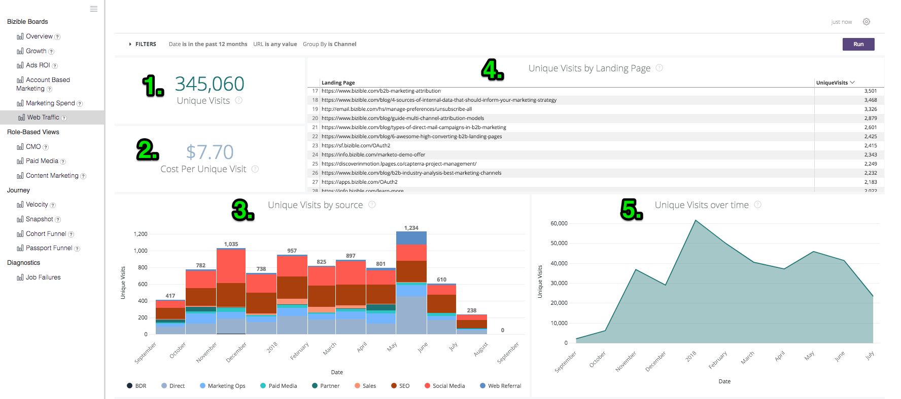
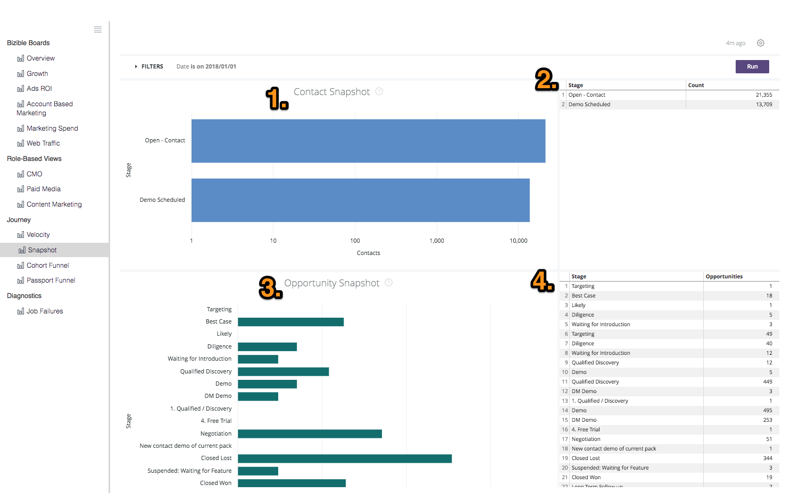
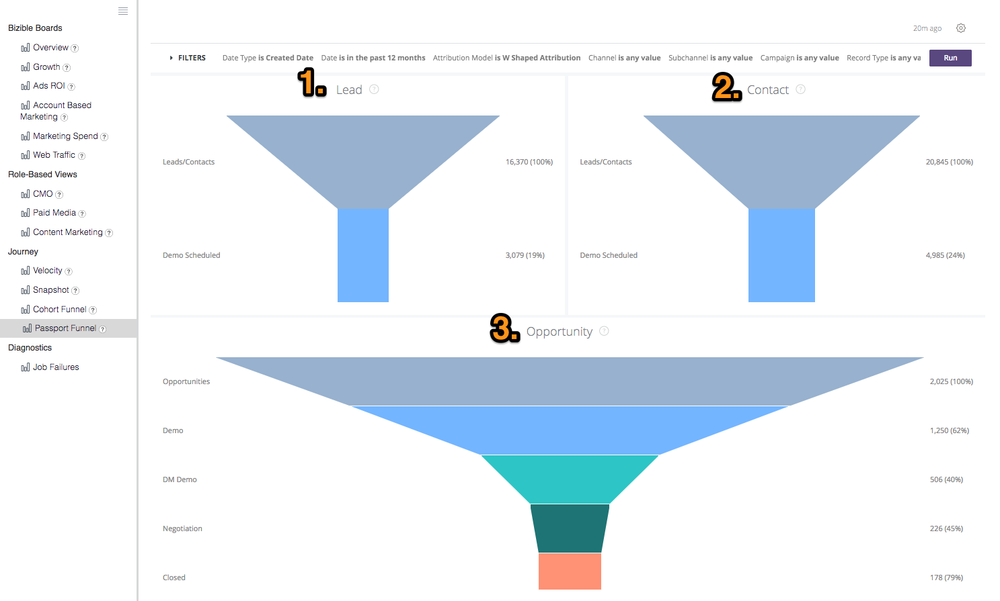

# 정의 및 백과사전 {#definitions-and-encyclopedia}

다음은 검색 플랫폼에 있는 다양한 보드 및 타일과 해당 보드 내의 필터에 대한 개요입니다. 각 보드의 스크린샷에는 몇 개의 타일 수가 있으며, 이 타일 정의는 아래의 해당 보드 섹션에서 찾을 수 있습니다.

**[!DNL Marketo Measure]보드**

개요

성장

광고 ROI

계정 기반 마케팅

마케팅 비용

웹 트래픽

**역할 기반 보기**

CMO

유료 미디어

컨텐츠 마케팅

Marketing Ops

**여정**

속도

스냅샷

여권 깔때기

참여 경로

## [!DNL Marketo Measure] 보드 {#marketo-measure-boards}

### 개요 {#overview}

개요에서는 마케팅 팀이 수익, 지출 및 ROI에 미치는 영향에 대해 어떻게 수행하고 있는지 자세히 살펴봅니다.

**필터**

날짜 유형이 종료 날짜입니다.

날짜는 지난 12개월 동안의 전체 월수입니다

속성 모델이 W자형

지표는 매출입니다

Dimension: 채널

채널은 __

하위 채널은 __

Campaign은 __

범주

**매출**

`1.` 속성 모델을 기반으로 한 마감 원 기회의 총 매출액.

세부 사항 표시 를 클릭하고 시각화 및 표로 보고 데이터를 드릴다운합니다.

**개요**

`2.` 필터 메뉴의 지표 드롭다운을 사용하여 이 차트는 시간에 따라 표시된 각 채널에 속하는 매출 / 파이프라인 매출 / 비용 / 거래 / 기회 / 리드 / 연락처를 표시합니다.

**지출**

`3.` 가장 높은 채널 수준에서 롤업된 API 비용과 자체 보고 비용 모두에서 기록된 총 지출입니다.

세부 사항 표시 를 클릭하고 시각화 및 표로 보고 데이터를 드릴다운합니다.

**ROI**

`4.` 필터 메뉴에서 Dimension 드롭다운을 사용하면 선택한 전체 날짜 범위 동안 속성 모델을 기반으로 각 채널/하위 채널/캠페인/계정/광고 그룹/광고/광고주/광고/광고/키워드/배치/사이트에 귀속되는 ROI를 보여줍니다.

**ROI 요약**

필터 메뉴에서 Dimension 드롭다운을 사용하면 선택한 전체 날짜 범위 동안 속성 모델을 기반으로 각 채널 / 하위 채널 / 캠페인 / 계정 / 광고 그룹 / 광고 / 광고주 / 광고 / 광고 / 키워드 / 배치 / 사이트에 대한 매출, 지출 및 ROI가 얼마나 기여했는지 보여줍니다.

**딜**

`5.` 속성 모델 수를 기반으로 한 총 마감 원 기회 수입니다. 날짜 유형 &quot;터치포인트 날짜&quot;를 선택한 경우 이 날짜 유형을 사용하여 기회 내에서 일부 터치포인트를 제외할 수 있으므로 부분 카운트가 가능합니다.

세부 사항 표시 를 클릭하고 시각화 및 표로 보고 데이터를 드릴다운합니다.

**거래당 비용**

`6.` 총 지출액을 총 거래 수로 나누어서, 한 번의 마감 영업 기회를 얻기 위해 소요되는 평균 비용을 제공합니다.

**파이프라인 매출**

`7.` Open Opportunity에서 발생한 총 잠재적 수익(즉, Closed Lost 또는 Closed Won이 아님). 매출액은 선택한 속성 모델을 기반으로 합니다.

세부 사항 표시 를 클릭하고 시각화 및 표로 보고 데이터를 드릴다운합니다.

**거래 크기**

`8.` 마감 원 기회의 평균 금액입니다.

**채널 요약**

`9`. 필터 메뉴에서 지표 드롭다운을 사용하면 선택한 속성 모델을 기반으로 가장 높은 위치에 따라 정렬된 각 채널에 귀속된 매출 / 파이프라인 매출 / 지출 / 거래 / 기회 / 리드 / 연락처를 기반으로 하는 채널 목록입니다.

**하위 채널 요약**

`10.` 필터 메뉴에서 지표 드롭다운을 사용하면 선택한 속성 모델을 기반으로 가장 높은 위치에 따라 정렬된 각 하위 채널에 속하는 매출 / 파이프라인 매출 / 지출 / 거래 / 기회 / 리드 / 연락처의 수를 기반으로 한 하위 채널 목록입니다.

**캠페인 요약**

`11.` 필터 메뉴에서 지표 드롭다운을 사용하는 이 목록은 각 캠페인에 귀속된 매출 / 파이프라인 매출 / 지출 / 거래 / 기회 / 리드 / 연락처의 수를 기반으로 하여 선택한 속성 모델을 기반으로 가장 높은 위치에 따라 정렬된 캠페인 목록입니다.

### 성장 {#growth}

성장을 통해 마케터는 리드, 영업 기회, 매출 등에 이르기까지 전체 시장에서 발생한 성과를 파악할 수 있습니다. 모든 파이프라인과 시간이 지남에 따라 이러한 파이프라인이 어떻게 수행되었는지 간단히 볼 수 있습니다.

**필터**

날짜 유형이 터치포인트 날짜입니다.

날짜는 지난 12개월 동안의 전체 월수입니다

속성 모델이 W자형

없음으로 그룹화

채널은 __

하위 채널은 __

Campaign은 __

범주

**매출**

`1.` 속성 모델을 기반으로 한 마감 원 기회의 총 매출액.

세부 사항 표시 를 클릭하고 시각화 및 표로 보고 데이터를 드릴다운합니다.

**시간 경과에 따른 매출**

`2.` 특정 기간 동안의 트렌드를 보여주는 속성 모델을 기반으로 한 마감 원 기회의 총 매출액. 그룹별 필터를 사용하여 채널, 하위 채널, 캠페인, 계정, 광고 그룹, 광고, 광고주, 크리에이티브, 키워드, 배치, 사이트별로 스택을 변경합니다.

더 작은 날짜 차원에서 데이터를 보려면 드릴다운하십시오.

**딜**

`3.` 속성 모델 수를 기반으로 한 총 마감 원 기회 수입니다.

세부 사항 표시 를 클릭하고 시각화 및 표로 보고 데이터를 드릴다운합니다.

**시간에 따른 거래**

`4.` 특정 기간 동안의 트렌드를 보여주는 속성 모델을 기반으로 한 총 마감 원 기회 수입니다. 그룹별 필터를 사용하여 채널, 하위 채널, 캠페인, 계정, 광고 그룹, 광고, 광고주, 크리에이티브, 키워드, 배치, 사이트별로 스택을 변경합니다.

더 작은 날짜 차원에서 데이터를 보려면 드릴다운하십시오.

**파이프라인 매출**

`5.` Open Opportunity에서 발생한 총 잠재적 수익(즉, Closed Lost 또는 Closed Won이 아님). 매출액은 선택한 속성 모델을 기반으로 합니다.

세부 사항 표시 를 클릭하고 시각화 및 표로 보고 데이터를 드릴다운합니다.

**시간 경과에 따른 파이프라인 매출**

`6.` 특정 기간 동안의 트렌드를 보여주는 속성 모델을 기반으로 모든 Open Opportunity의 잠재적 총 매출입니다. 그룹별 필터를 사용하여 채널, 하위 채널, 캠페인, 계정, 광고 그룹, 광고, 광고주, 크리에이티브, 키워드, 배치, 사이트별로 스택을 변경합니다.

더 작은 날짜 차원에서 데이터를 보려면 드릴다운하십시오.

**리드**

`7.` 속성 모델을 기반으로 한 총 리드 수입니다. 날짜 유형 &quot;터치포인트 날짜&quot;를 선택한 경우 이 날짜 유형을 사용하여 리드 레코드 내에서 일부 터치포인트를 제외할 수 있으므로 부분 카운트가 가능합니다. U자형 이외의 속성 모델이 적용되는 경우 U자형 개수는 W자형, W자형 및 사용자 정의 모델에 사용됩니다.

세부 사항 표시 를 클릭하고 시각화 및 표로 보고 데이터를 드릴다운합니다.

**시간에 따른 리드**

`8.` 특정 기간의 트렌드를 보여주는 속성 모델을 기반으로 한 총 리드 수입니다. 그룹별 필터를 사용하여 채널, 하위 채널, 캠페인, 계정, 광고 그룹, 광고, 광고주, 크리에이티브, 키워드, 배치, 사이트별로 스택을 변경합니다.

더 작은 날짜 차원에서 데이터를 보려면 드릴다운하십시오.

**연락처**

`9.` 속성 모델을 기반으로 한 총 연락처 수입니다. 날짜 유형 &quot;터치포인트 날짜&quot;를 선택한 경우 이 날짜 유형을 사용하여 연락처 레코드 내에서 일부 터치포인트를 제외할 수 있으므로 부분 카운트가 가능합니다. U자형 이외의 속성 모델이 적용되는 경우 U자형 개수는 W자형, W자형 및 사용자 정의 모델에 사용됩니다.

세부 사항 표시 를 클릭하고 시각화 및 표로 보고 데이터를 드릴다운합니다.

**시간 경과에 따른 연락처**

`10.` 특정 기간 동안의 트렌드를 보여주는 속성 모델을 기반으로 한 총 연락처 수입니다. 그룹별 필터를 사용하여 채널, 하위 채널, 캠페인, 계정, 광고 그룹, 광고, 광고주, 크리에이티브, 키워드, 배치, 사이트별로 스택을 변경합니다.

더 작은 날짜 차원에서 데이터를 보려면 드릴다운하십시오.

**기회**

`11.` 속성 모델을 기반으로 한 총 Opportunity 수입니다. 날짜 유형 &quot;Touchpoint 날짜&quot;를 선택한 경우 이 날짜 유형을 사용하여 Opportunity 레코드 내에서 일부 터치포인트를 제외할 수 있으므로 부분 카운트가 가능합니다.

세부 사항 표시 를 클릭하고 시각화 및 표로 보고 데이터를 드릴다운합니다.

**시간 경과에 따른 기회**

`12.` 특정 기간 동안의 트렌드를 보여주는 속성 모델을 기반으로 한 총 기회 수입니다. 그룹별 필터를 사용하여 채널, 하위 채널, 캠페인, 계정, 광고 그룹, 광고, 광고주, 크리에이티브, 키워드, 배치, 사이트별로 스택을 변경합니다.

더 작은 날짜 차원에서 데이터를 보려면 드릴다운하십시오.

**방문 횟수**

`13.` 모든 알려진 방문자와 익명의 방문자에 대해 추적된 총 사이트 방문 수입니다.

세부 사항 표시 를 클릭하고 시각화 및 표로 보고 데이터를 드릴다운합니다.

이 기능은 비활성화된 경우 0으로 표시됩니다.

**시간 경과에 따른 방문**

`14.` 추적된 총 사이트 방문 수는 특정 기간 동안의 트렌드를 표시합니다. 그룹별 필터를 사용하여 채널, 하위 채널, 캠페인, 계정, 광고 그룹, 광고, 광고주, 크리에이티브, 키워드, 배치, 사이트별로 스택을 변경합니다.

더 작은 날짜 차원에서 데이터를 보려면 드릴다운하십시오.

이 기능을 사용하지 않도록 설정하면 비어 있는 것으로 나타납니다.

**고유 방문 횟수**

`15.` 모든 알려진 방문자와 익명의 방문자에 대해 추적된 총 고유 사이트 방문 수입니다.

세부 사항 표시 를 클릭하고 시각화 및 표로 보고 데이터를 드릴다운합니다.

이 기능은 비활성화된 경우 0으로 표시됩니다.

**시간에 따른 고유 방문 수**

`16.` 특정 기간 동안의 트렌드를 보여주는 추적된 총 고유 사이트 방문 수입니다. 그룹별 필터를 사용하여 채널, 하위 채널, 캠페인, 계정, 광고 그룹, 광고, 광고주, 크리에이티브, 키워드, 배치, 사이트별로 스택을 변경합니다.

더 작은 날짜 차원에서 데이터를 보려면 드릴다운하십시오.

이 기능을 사용하지 않도록 설정하면 비어 있는 것으로 나타납니다.

**Forms**

`17.` 모든 알려진 방문자와 익명의 방문자에 대해 제출된 총 양식 수입니다.

세부 사항 표시 를 클릭하고 시각화 및 표로 보고 데이터를 드릴다운합니다.

이 기능은 비활성화된 경우 0으로 표시됩니다.

**Forms**

`18.` 제출된 총 양식 수로 특정 기간의 트렌드를 표시합니다. 그룹별 필터를 사용하여 채널, 하위 채널, 캠페인, 계정, 광고 그룹, 광고, 광고주, 크리에이티브, 키워드, 배치, 사이트별로 스택을 변경합니다.

더 작은 날짜 차원에서 데이터를 보려면 드릴다운하십시오.

이 기능을 사용하지 않도록 설정하면 비어 있는 것으로 나타납니다.

### 광고 ROI {#ads-roi}

광고 ROI를 통해 유료 미디어 관리자에게 마케팅 활동에 대한 보기를 제공하여 캠페인 성과에 대한 통찰력을 키워드 성과에 제공합니다.

**필터**

날짜 유형이 종료 날짜입니다.

날짜는 지난 12개월 동안의 전체 월수입니다

속성 모델이 W자형

채널은 __

하위 채널은 __

Campaign은 __

범주

**캠페인 ROI 요약**

`1.` 선택한 속성 모델을 기반으로 가장 높은 매출액으로 정렬한 각 캠페인에 속하는 매출액, 비용 및 ROI를 기반으로 한 캠페인 목록입니다.

**광고 ROI 요약**

`2.` 선택한 속성 모델을 기반으로 하여 가장 높은 매출액을 기준으로 정렬된 각 크리에이티브에 속하는 매출액, 지출 및 ROI를 기반으로 한 크리에이티브 목록입니다.

**키워드 ROI 요약**

`3.` 선택한 속성 모델을 기반으로 가장 높은 매출액으로 정렬한 각 키워드에 속하는 매출액, 비용 및 ROI를 기반으로 하는 키워드 목록입니다.

### 계정 기반 마케팅 {#account-based-marketing}

계정 기반 마케팅은 ABM을 사용하는 회사가 타겟 계정에서 이룬 노력과 마케팅에서 본 참여도를 추적할 수 있는 기능을 제공합니다.

**필터**

날짜 유형이 터치포인트 날짜입니다.

날짜는 지난 12개월 동안의 전체 월수입니다

속성 모델이 W자형 기여도 분석

그룹화 기준: 채널

계정은 __

**매출**

속성 모델을 기반으로 한 마감 원 기회의 총 매출액.

세부 사항 표시 를 클릭하고 시각화 및 표로 보고 데이터를 드릴다운합니다.

**파이프라인 매출**

Open Opportunity에서 발생한 총 잠재적 수익(즉, Closed Lost 또는 Closed Won이 아님). 매출액은 선택한 속성 모델을 기반으로 합니다.

**계정당 평균 터치 수**

계정 ID별로 각 CRM 계정에서 생성된 평균 터치포인트 수입니다.

**일치하는 리드**

를 사용하여 계정에 성공적으로 대응한 총 리드 수 [!DNL Marketo Measure] 웹 사이트, 회사 이름 및 이메일 도메인 일치 알고리즘을 사용하는 Lead-to-Account 기능.

**참여 계정**

터치 포인트를 받은 총 계정 수입니다. 대상 계정 목록을 사용하는 경우 해당 대상 계정 목록의 계정 하위 집합입니다.

**참여 기회**

터치 포인트를 받은 총 기회 수. 대상 계정 목록을 사용하는 경우 해당 대상 계정 목록의 기회의 하위 집합입니다.

**개인 사용자 참여**

터치 포인트를 받은 총 개인(이메일 주소별 리드 및 연락처) 수입니다. 대상 계정 목록을 사용하는 경우 해당 대상 계정 목록의 개인 하위 집합입니다.

**시간에 따른 터치포인트**

지정된 기간 동안 기록된 총 터치포인트 수입니다. 대상 계정 목록을 사용하는 경우 해당 대상 계정 목록의 계정 하위 집합입니다.

**시간 경과에 따른 계정(차트)**

채널, 하위 채널, 캠페인, 계정, 광고 그룹, 광고, 광고주, 크리에이티브, 키워드, 배치 또는 사이트별로 결과를 그룹화하는 옵션을 사용하여 지정된 기간 동안 월별 모든 터치포인트를 받은 총 계정 수입니다. 대상 계정 목록을 사용하는 경우 해당 대상 계정 목록의 계정 하위 집합입니다.

**터치 포인트 카운트별 계정**

계정 ID 및 계정 이름별로, 각 계정의 총 터치포인트 수입니다.

**터치 포인트 수**

각 차원에 속하는 터치포인트의 수입니다. 여기에는 다음과 같이 그룹 기준 필터에 의해 차원을 변경할 수 있습니다. 없음 / 채널 / 하위 채널 / 캠페인 / 계정 / 광고주 / 광고 / 광고 그룹 / 키워드 / 배치 / 사이트

### 마케팅 비용 {#marketing-spend}

마케팅 지출은 마케터가 일정 시간 동안 지출한 금액을 보여주므로 월별 및 채널별로 비용을 추적할 수 있습니다.

**필터**

날짜 유형이 터치포인트 날짜입니다.

날짜는 지난 12개월 동안의 전체 월수입니다

속성 모델

Group By는 채널과 같습니다

채널은 __

하위 채널은 __

Campaign은 __

**매출**

속성 모델을 기반으로 한 마감 원 기회의 총 매출액.

세부 사항 표시 를 클릭하고 시각화 및 표로 보고 데이터를 드릴다운합니다.

**지출**

가장 높은 채널 수준에서 롤업된 API 비용과 자체 보고 비용 모두에서 기록된 총 지출입니다.

세부 사항 표시 를 클릭하고 시각화 및 표로 보고 데이터를 드릴다운합니다.

**ROI**

선택한 속성 모델에서 총 매출액 및 총 지출에서 계산된 ROI(투자수익률)입니다.

**지출(차트)**

특정 기간 동안의 트렌드를 보여주는 총 기록된 지출 금액입니다. 그룹별 필터를 사용하여 스택을 없음, 채널, 하위 채널, 캠페인, 계정, 광고 그룹, 광고, 광고주, 크리에이티브, 키워드, 배치, 사이트별로 변경할 수 있습니다.

지출 은 모든 수준에서 기록되지 않으므로 합계가 각 &quot;그룹화 기준&quot; 선택 항목과 같지 않을 수 있습니다. 예를 들어, 모든 캠페인의 합계는 모든 하위 채널의 합계와 같지 않습니다.

**지출 + ROI**

오른쪽 y축에 ROI와 함께 월별 마케팅 지출 금액을 표시합니다.

**채널별 비용**

가장 높은 비용을 기준으로 정렬한 각 채널에 대해 보고된 양을 기반으로 한 채널 목록입니다.

**하위 채널별 비용**

가장 높은 비용을 기준으로 정렬된 각 하위 채널에 대해 보고된 양을 기반으로 한 하위 채널 목록입니다.

**캠페인별 비용**

가장 높은 비용을 기준으로 정렬된 각 캠페인에 대해 보고된 금액을 기반으로 한 캠페인 목록입니다. 캠페인은 페이지 보기 수의 utm_campaign 값을 포함하는 전체 캠페인 목록으로 구성됩니다.

### 웹 트래픽 {#web-traffic}

웹 트래픽 보기를 사용하면 마케터가 웹 사이트에서 활동을 추적하여 알려진 사이트 방문자와 익명의 사이트 방문자 모두의 트래픽을 측정할 수 있습니다.

**필터**

날짜 유형이 터치포인트 날짜입니다.

날짜는 지난 12개월 동안의 전체 월수입니다

속성 모델이 W자형 기여도 분석

URL은 __

그룹화 기준 없음

지표는 방문 수입니다

채널은 __

하위 채널은 __

Campaign은 __

**고유 방문 횟수**

모든 알려진 방문자와 익명의 방문자에 대해 추적된 총 고유 사이트 방문 수입니다.

세부 사항 표시 를 클릭하고 시각화 및 표로 보고 데이터를 드릴다운합니다.

**방문 횟수**

모든 알려진 방문자와 익명의 방문자에 대해 추적된 총 사이트 방문 수입니다.

세부 사항 표시 를 클릭하고 시각화 및 표로 보고 데이터를 드릴다운합니다.

**고유 방문당 비용**

총 시간을 총 고유 방문 수로 나눈 값으로, 고유 방문당 비용을 제공합니다.

**방문당 비용**

총 체류 시간을 총 방문 수로 나누어 방문당 비용을 제공합니다.

**고유 방문당 수입**

알려진 방문자와 익명의 방문자의 고유 사이트 방문당 마감된 매출액의 계산된 평균입니다.

**방문당 수입**

알려진 방문자와 익명의 방문자의 사이트 방문당 마감된 매출액의 계산된 평균입니다.

**페이지 보기 수**

모든 알려진 방문자와 익명의 방문자에 대해 추적된 총 페이지 보기 수입니다.

세부 사항 표시 를 클릭하고 시각화 및 표로 보고 데이터를 드릴다운합니다.

**Forms**

모든 알려진 방문자와 익명의 방문자에 대해 제출된 총 양식 수입니다.

세부 사항 표시 를 클릭하고 시각화 및 표로 보고 데이터를 드릴다운합니다.

**개요**

필터 메뉴의 지표 드롭다운을 사용하여 이 차트는 시간에 따라 표시된 각 차원에 속하는 매출 / 파이프라인 매출 / 지출 / 거래 / 기회 / 리드 / 연락처 / 클릭 수 / 노출 횟수 / 방문 횟수 / 페이지 보기 수 / 양식을 보여줍니다. Dimension을 없음(None)에서 채널 / 하위 채널 / 캠페인 / 계정 / 광고주 / 광고 / 광고 / 광고 그룹 / 키워드 / 배치 / 사이트로 변경할 수 있습니다.

**웹 트래픽 요약**

URL을 기준으로 각 페이지 보기 수, 방문 횟수, 고유한 방문 횟수 및 각 방문 횟수가 반영됩니다.

**레퍼러 요약**

각 참조 URL에서 발생한 페이지 방문 횟수 및 고유 방문 수입니다.

**소스별 고유 방문 수**

필터 메뉴에서 그룹화 기준 드롭다운을 사용하여 사이트에 대한 고유 방문자 소스를 봅니다. 다음 방법으로 그룹 변경: 채널, 하위 채널, 캠페인, 계정, 광고 그룹, 광고, 광고주, 크리에이티브, 키워드, 배치, 사이트.

**소스별 방문 수**

필터 메뉴에서 그룹화 기준 드롭다운을 사용하여 사이트 방문자의 소스를 봅니다. 다음 방법으로 그룹 변경: 채널, 하위 채널, 캠페인, 계정, 광고 그룹, 광고, 광고주, 크리에이티브, 키워드, 배치, 사이트.

**랜딩 페이지별 리드**

각 랜딩 페이지에서 생성된 리드의 수를 기반으로 하는 랜딩 페이지 목록으로서, 리드의 수를 기준으로 정렬합니다.

**양식 URL별 리드**

각 URL에서 생성된 리드의 수를 기반으로 하는 양식 URL의 목록을 가장 많은 리드 수로 정렬합니다.

## 역할 기반 보기 {#role-based-views}

### CMO {#cmo}

CMO 보기에서는 마케팅 팀이 매출, 지출 및 ROI에 미치는 영향에 대해 어떻게 수행하고 있는지를 개괄적으로 볼 수 있습니다.

**필터**

날짜 유형이 종료 날짜입니다.

날짜는 지난 12개월 동안의 전체 월수입니다

속성 모델이 W자형

채널은 __

하위 채널은 __

Campaign은 __

지표는 매출입니다

범주

**매출**

`1.` 속성 모델을 기반으로 한 마감 원 기회의 총 매출액.

세부 사항 표시 를 클릭하고 시각화 및 표로 보고 데이터를 드릴다운합니다.

**개요**

`2.` 필터 메뉴의 지표 드롭다운을 사용하여 이 차트는 시간에 따라 표시된 각 채널에 속하는 매출 / 파이프라인 매출 / 비용 / 거래 / 기회 / 리드 / 연락처를 표시합니다.

**지출**

`3.` 가장 높은 채널 수준에서 롤업된 API 비용과 자체 보고 비용 모두에서 기록된 총 지출입니다.

세부 사항 표시 를 클릭하고 시각화 및 표로 보고 데이터를 드릴다운합니다.

**ROI**

`4.` 선택한 속성 모델에서 총 매출액 및 총 지출에서 계산된 ROI(투자수익률)입니다.

**딜**

`5.` 속성 모델 수를 기반으로 한 총 마감 원 기회 수입니다. 날짜 유형 &quot;터치포인트 날짜&quot;를 선택한 경우 이 날짜 유형을 사용하여 기회 내에서 일부 터치포인트를 제외할 수 있으므로 부분 카운트가 가능합니다.

세부 사항 표시 를 클릭하고 시각화 및 표로 보고 데이터를 드릴다운합니다.

**거래당 비용**

`6.` 총 지출액을 총 거래 수로 나누어서, 한 번의 마감 영업 기회를 얻기 위해 소요되는 평균 비용을 제공합니다.

**파이프라인 매출**

`7.` Open Opportunity에서 발생한 총 잠재적 수익(즉, Closed Lost 또는 Closed Won이 아님). 매출액은 선택한 속성 모델을 기반으로 합니다.

세부 사항 표시 를 클릭하고 시각화 및 표로 보고 데이터를 드릴다운합니다.

**거래 크기**

`8.` 마감 원 기회의 평균 금액입니다.

**채널 요약**

`9.` 필터 메뉴에서 지표 드롭다운을 사용하면 선택한 속성 모델을 기반으로 가장 높은 위치에 따라 정렬된 각 채널에 귀속된 매출 / 파이프라인 매출 / 지출 / 거래 / 기회 / 리드 / 연락처를 기반으로 하는 채널 목록입니다.

**하위 채널 요약**

`10.` 필터 메뉴에서 지표 드롭다운을 사용하면 선택한 속성 모델을 기반으로 가장 높은 위치에 따라 정렬된 각 하위 채널에 속하는 매출 / 파이프라인 매출 / 지출 / 거래 / 기회 / 리드 / 연락처의 수를 기반으로 한 하위 채널 목록입니다.

**캠페인 요약**

`11.` 필터 메뉴에서 지표 드롭다운을 사용하는 이 목록은 각 캠페인에 귀속된 매출 / 파이프라인 매출 / 지출 / 거래 / 기회 / 리드 / 연락처의 수를 기반으로 하여 선택한 속성 모델을 기반으로 가장 높은 위치에 따라 정렬된 캠페인 목록입니다.

### 유료 미디어 {#paid-media}

유료 미디어 대시보드는 유료 미디어 관리자(또는 유사한) 가 유료 미디어 성과를 엿볼 수 있도록 해줍니다. 관련 채널에서 제공되는 서비스 양과 노력에서 생성된 수요를 확인할 수 있습니다. 모든 지표는 유료 미디어 통합에서 가져옵니다.

**필터**

날짜 유형이 터치포인트 날짜입니다.

날짜는 지난 12개월 동안의 전체 월수입니다

속성 모델이 W자형

지표는 매출입니다

Dimension: 채널

채널은 __

하위 채널은 __

Campaign은 __

범주

**매출**

`1.` 속성 모델을 기반으로 한 마감 원 기회의 총 매출액.

세부 사항 표시 를 클릭하고 시각화 및 표로 보고 데이터를 드릴다운합니다.

**지출**

`2.` 가장 높은 채널 수준에서 롤업된 API 비용과 자체 보고 비용 모두에서 기록된 총 지출입니다.

세부 사항 표시 를 클릭하고 시각화 및 표로 보고 데이터를 드릴다운합니다.

**ROI**

`3.` 선택한 속성 모델에서 총 매출액 및 총 지출에서 계산된 ROI(투자수익률)입니다.

**파이프라인 매출**

`4.` Open Opportunity에서 발생한 총 잠재적 수익(즉, Closed Lost 또는 Closed Won이 아님). 매출액은 선택한 속성 모델을 기반으로 합니다.

세부 사항 표시 를 클릭하고 시각화 및 표로 보고 데이터를 드릴다운합니다.

**개요**

`5.` 필터 메뉴의 지표 드롭다운을 사용하여 이 차트는 시간에 따른 매출 / 파이프라인 매출 / 지출 / 거래 / 기회 / 리드 / 연락처 / 방문 횟수 / 고유한 방문 횟수 / 노출 횟수 / 클릭 수 / 양식을 보여줍니다.

**노출 횟수**

`6.` 연결된 모든 광고 계정에서 제공된 총 노출 횟수입니다.

세부 사항 표시 를 클릭하고 시각화 및 표로 보고 데이터를 드릴다운합니다.

**CPM**

`7.` 제공된 노출에서 총 노출 수(1000으로 나누기)로 나눈 총 지출으로서 CPM 비율을 제공합니다.

**클릭 수**

`8.` 연결된 모든 광고 계정에서 추적된 총 클릭 수입니다.

세부 사항 표시 를 클릭하고 시각화 및 표로 보고 데이터를 드릴다운합니다.

**CPC**

`9.` 총 클릭 수를 총 클릭 수로 나눈 총 지출로 CPC 요금이 제공됩니다.

**리드**

`10.` CRM에서 생성된 총 리드 수입니다.

**리드당 비용**

`11.` 총 클릭으로 생성된 리드의 총 지출액을 나누어 CPL 비율을 제공합니다.

**방문 횟수**

`12.` 모든 알려진 방문자와 익명의 방문자에 대해 추적된 총 사이트 방문 수입니다.

세부 사항 표시 를 클릭하고 시각화 및 표로 보고 데이터를 드릴다운합니다.

**고유 방문 횟수**

`13.` 모든 알려진 방문자와 익명의 방문자에 대해 추적된 총 고유 사이트 방문 수입니다.

세부 사항 표시 를 클릭하고 시각화 및 표로 보고 데이터를 드릴다운합니다.

**웹 트래픽 요약**

필터 메뉴에서 차원 선택기를 사용하여 채널, 하위 채널, 캠페인, 계정, 광고 그룹, 광고, 광고주, 크리에이티브, 키워드, 배치, 사이트 간을 전환하고 각 항목에 반영되는 페이지 보기, 방문 수, 고유 방문 수 및 양식 제출의 수를 봅니다.

**리드 파이프라인 요약**

필터 메뉴에서 차원 선택기를 사용하여 채널, 하위 채널, 캠페인, 계정, 광고 그룹, 광고, 광고주, 크리에이티브, 키워드, 배치, 사이트 간을 전환하고 선택한 속성 모델을 기반으로 각 항목에 속하는 리드 또는 연락처의 수를 확인합니다.

**기회 파이프라인 요약**

필터 메뉴에서 차원 선택기를 사용하여 채널, 하위 채널, 캠페인, 계정, 광고 그룹, 광고, 광고주, 크리에이티브, 키워드, 배치, 사이트 간을 전환하고 선택한 속성 모델을 기반으로 각각 할당된 Opportunity, Deals, Pipeline Revenue, Spend, ROI 및 Revenue의 수를 확인합니다.

### 컨텐츠 마케팅 {#content-marketing}

컨텐츠 마케팅 대시보드는 컨텐츠 마케터에게 마케팅 컨텐츠가 얼마나 잘 수행되었는지, 생성된 방문 횟수에서 종료된 수입까지 파악할 수 있는 기능을 제공합니다. 모든 콘텐츠별로 보거나 특정 콘텐츠 또는 페이지로 좁힐 수 있습니다.

필터

날짜 유형이 터치포인트 날짜입니다.

날짜는 지난 12개월 동안의 전체 월수입니다

속성 모델이 W자형

랜딩 페이지는 __

채널은 __

하위 채널은 __

Campaign은 __

범주

**총 매출액**

`1.` 기여도 분석 모델을 기반으로 디지털 소스에서만 Closed Won Opportunity 의 총 매출액 금액입니다.

세부 사항 표시 를 클릭하고 시각화 및 표로 보고 데이터를 드릴다운합니다.

**매출별 랜딩 페이지**

`2.` 선택한 속성 모델을 기반으로 하여 가장 높은 매출액으로 정렬된 각 랜딩 페이지에 속하는 수입을 기반으로 한 랜딩 페이지 목록입니다.

**총 파이프라인 매출**

`3.` Open Opportunity에서 발생한 총 잠재적 수익으로, 즉 Closed Lost 또는 Closed Won이 아닙니다. 매출액은 선택한 속성 모델을 기반으로 합니다.

세부 사항 표시 를 클릭하고 시각화 및 표로 보고 데이터를 드릴다운합니다.

**파이프라인 수익별 랜딩 페이지**

`4.` 선택한 속성 모델을 기반으로 가장 많은 파이프라인 수입별로 정렬된 각 랜딩 페이지에 기여한 파이프라인 매출액을 기반으로 한 랜딩 페이지 목록입니다.

**총 영업 기회**

`5.` 기여도 분석 모델을 기반으로 한 디지털 소스의 총 Opportunity 수

세부 사항 표시 를 클릭하고 시각화 및 표로 보고 데이터를 드릴다운합니다.

**기회별 랜딩 페이지 수**

`6.` 선택한 속성 모델을 기반으로 가장 많은 수의 기회를 기준으로 정렬된 각 랜딩 페이지에 기여한 기회를 기반으로 한 랜딩 페이지 목록입니다.

**Forms**

`7.` 추적된 모든 페이지 전체에 걸쳐 제출된 총 양식 수입니다.

**양식 제출별 상위 양식 URL**

`8.` 각 URL에 제출된 양식 수를 기반으로 한 양식 URL 목록은 페이지에 제출된 양식 중 가장 많은 수를 기준으로 정렬됩니다.

**채널별 양식 URL**

`9.` 상위 10개 양식 URL은 방문을 유도하는 채널별로 그룹화됩니다.

세부 사항 표시 를 클릭하고 시각화 및 표로 보고 데이터를 드릴다운합니다.

**고유 방문 횟수**

`10.` 모든 알려진 방문자와 익명의 방문자에 대해 추적된 총 고유 사이트 방문 수입니다.

월별로 추적된 고유한 사이트 방문 횟수를 보려면 드릴다운하십시오.

**고유 방문별 상위 랜딩 페이지**

`11.` 각 랜딩 페이지에 대한 고유 방문 수를 기반으로 하며 고유한 방문 수가 가장 많은 페이지별로 정렬된 랜딩 페이지 목록입니다.

선택한 URL에 대한 월별 고유 방문을 보려면 드릴다운합니다.

**방문 횟수**

`12.` 모든 알려진 방문자와 익명의 방문자에 대해 추적된 총 사이트 방문 수입니다.

**방문별 상위 랜딩 페이지**

`13.` 각 랜딩 페이지에 대한 초기 방문 횟수를 기반으로 한 랜딩 페이지 목록으로서, 방문 횟수가 가장 많은 페이지별로 정렬됩니다.

**리드**

`14.` 속성 모델을 기반으로 한 총 리드 수입니다. 날짜 유형 &quot;터치포인트 날짜&quot;를 선택한 경우 이 날짜 유형을 사용하여 리드 레코드 내에서 일부 터치포인트를 제외할 수 있으므로 부분 카운트가 가능합니다. U자형 이외의 속성 모델이 적용되는 경우 U자형 개수는 W자형, W자형 및 사용자 정의 모델에 사용됩니다.

세부 사항 표시 를 클릭하고 시각화 및 표로 보고 데이터를 드릴다운합니다.

**리드별 랜딩 페이지 수**

`15.` 각 URL에서 만든 리드 수를 기반으로 리드가 가장 많은 페이지별로 정렬된 페이지 URL 목록입니다.

### Marketing Ops {#marketing-ops}

유효성 검사 및 진단 [!DNL Marketo Measure] 개별 터치포인트에 대한 완벽한 가시성이 있는 데이터.

**필터**

계정 ID

계정 이름

영업 기회 ID

리드 또는 연락처 ID

리드 또는 연락처 이메일

캠페인 ID

영업 기회 원(Y/N)

기회 생성 날짜

영업 기회 종료 날짜

터치 포인트 날짜

속성 모델

**드릴 다운**

기회 세부 정보

연락처 정보

리드 세부 정보

속성 터치 포인트 세부 사항

터치 포인트 세부 사항

**계정**

`1.` 터치포인트를 사용하는 모든 계정 목록입니다. 각 계정에 대한 정보에는 참여 등급, 기회 수, 연락처 수, 리드 수, 기여도 분석 터치포인트 수 및 터치포인트 수가 포함됩니다.

기본 데이터 세부 정보에 대해 드릴다운하려면 집계된 숫자를 누릅니다.

**기회**

`2.` 속성 터치포인트를 사용하는 모든 기회 목록 각 영업 기회에 대한 정보에는 영업 기회 금액, 연락처 수 및 속성 접점 수가 포함됩니다.

기본 데이터 세부 정보에 대해 드릴다운하려면 집계된 숫자를 누릅니다.

**연락처**

`3.` 터치포인트가 있는 모든 연락처 목록입니다. 각 연락처에 대한 정보에는 속성 터치포인트 수와 터치포인트 수가 포함됩니다

기본 데이터 세부 정보에 대해 드릴다운하려면 집계된 숫자를 누릅니다.

**리드**

`4.` 터치포인트를 사용하는 모든 리드 목록. 각 리드에 대한 정보에는 터치포인트 수가 포함됩니다.

기본 데이터 세부 정보에 대해 드릴다운하려면 집계된 숫자를 누릅니다.

**캠페인**

`5.` 터치포인트를 사용하는 모든 캠페인 목록. 각 캠페인에 대한 정보에는 캠페인 비용, 속성 금액, 속성 터치포인트 수 및 터치포인트 수가 포함됩니다.

기본 데이터 세부 정보에 대해 드릴다운하려면 집계된 숫자를 누릅니다.

**Marketing Ops FAQ**

**Q: &#39;계정 ID&#39;와 &#39;계정 이름&#39; 필터가 모두 있는 이유는 무엇입니까?**

A: 계정 ID가 고유하지만 계정 이름은 고유할 필요가 없습니다. 예를 들어 기업 회사 내의 각 비즈니스 단위에 대해 여러 개의 서로 다른 계정을 생성할 수 있습니다. 계정 이름을 사용하는 것이 더 직관적일 수 있지만, 특정 계정에 대해 필터링하려면 계정 ID를 사용할 수 있습니다.

**Q: 계정 ID로 필터링하면 모든 테이블을 필터링합니까?**

A: 예, 보드의 모든 타일에 필터가 적용됩니다. 예를 들어 고객이 &#39;Microsoft&#39;에 대한 계정 필터를 적용하는 경우 &#39;Opportunities&#39; 타일에서는 Microsoft과 관련된 기회만 표시됩니다.

**Q: 참여 등급 열은 무엇입니까?**

A: 참여 등급이 [!DNL Marketo Measure] 에서 사용할 수 있는 예측 계정 참여 점수 [!DNL Marketo Measure] 계층 2. 이 필드가 없으면 이 필드가 null로 표시됩니다.

**Q: 테이블 정렬 방법을 바꿀 수 있습니까?**

A: 예. 열 헤더를 클릭하면 테이블이 정렬됩니다. 동일한 헤더를 다시 클릭하면 테이블이 정렬되는 방식이 반대됩니다.

**Q: 데이터를 내보낼 수 있습니까?**

A: 예. 타일 제목(예: &#39;계정&#39;) 위로 마우스를 가져가면 오른쪽 위 모서리에 있는 세 개의 세로 점을 클릭합니다. 이렇게 하면 해당 타일에 대한 데이터를 다음 형식으로 다운로드할 수 있습니다. TXT, CSV, XLS, JSON, HTML 및 Markdown.

**Q: 500개 이상의 데이터 행을 볼 수 있습니까?**

A: 타일은 한 번에 500개의 행을 표시하도록 제한되지만, 데이터를 내보내고 &#39;모든 결과&#39;를 선택하여 500개 이상의 행을 볼 수 있습니다.

## 여정 {#journey}

### 판매 속도 {#sales-velocity}

Sales Velocity를 통해 마케터와 영업 담당자는 잠재 고객이 단계를 통해 얼마나 빨리 이동하고 있는지 확인하고 전환 시간이 더 빠른 채널을 파악할 수 있습니다.

**필터**

날짜는 지난 12개월 동안의 전체 월수입니다

원은예이다

스테이지는 __

채널은 __

하위 채널은 __

**속도(일)**

`1.` Opportunity 가 영업 주기에 있는 평균 일 수(첫 번째 익명 터치 부터 영업 기회 종료)입니다.

**활성 기회**

`2.` Open Opportunity에서 발생한 총 기회 수, 즉 Closed Lost 또는 Closed Won이 아닙니다.

**평균 거래 크기**

`3.` 마감 원 기회의 평균 금액입니다.

**승률**

`4.` 총 마감 원 영업 기회 수를 마감 손실 및 마감 원 영업 기회 수로 나누어서 승률을 표시합니다.

**채널별 영업 기회 속도**

`5.` Opportunity 가 스테이지당 주기인 평균 일 수로 마케팅 채널별로 그룹화되고 다음 단계로 진행하는 데 걸리는 시간을 표시합니다. 여기에 나타나는 단계는 이정표 단계(FT, LC, OC)와 사용자 정의 단계입니다.

**채널별 리드 속도**

`6.` Lead 가 Contact/Opportunity/Account 로 변환되기 전에 Stage당 주기를 통해 Marketing Channel 로 그룹화되고 다음 단계로 진행하는 데 걸리는 시간을 표시하는 평균 일 수입니다. 여기에 표시되는 단계는 이정표 단계(FT, LC) 및 사용자 정의 단계입니다.

**평균 영업 기회 속도**

`7.` Opportunity 가 스테이지당 주기인 평균 일 수로, 다음 단계로 진행하는 데 걸리는 시간을 표시합니다. 여기에 나타나는 단계는 이정표 단계(FT, LC, OC)와 사용자 정의 단계입니다. 여기서 숫자는 위의 채널별 Opportunity Velocity 차트에 스테이지당 시간을 반영합니다.

**평균 리드 속도**

`8.` Lead 가 Contact/Opportunity/Account 로 변환되기 전에 Stage당 주기를 수행하는 평균 일 수를 표시함으로써 다음 단계로 이동하는 데 걸리는 시간을 보여줍니다. 여기에 표시되는 단계는 이정표 단계(FT, LC) 및 사용자 정의 단계입니다. 여기서 숫자는 위의 채널별 리드 타임에 스테이지당 시간을 반영합니다.

**시간 경과에 따른 영업 기회 속도**

`9.` Opportunity 가 시간 경과에 따른 트렌드와 함께 스테이지당 주기를 갖는 평균 일 수입니다.

**시간에 따른 리드 속도**

`10.` Lead 가 시간별 트렌드가 있는 스테이지당 주기를 갖는 평균 일 수입니다.

### 스냅샷 {#snapshot}

스냅샷을 통해 마케터는 주어진 시점의 전체 파이프라인을 볼 수 있습니다. 파이프라인의 상태가 해당 날짜에서 어떻게 표시되는지 보여주는 단일 날짜가 필터에 추가됩니다.

필터

날짜가 2018-01-01

리드 또는 연락처

**리드/연락처 스냅샷**

`1.` 선택한 날짜의 각 단계에 있었던 리드 또는 연락처 레코드 수입니다.

**리드/연락처 스냅샷(테이블)**

`2.` 선택한 날짜의 각 단계에 있었던 리드 또는 연락처 레코드 수입니다.

**영업 기회 스냅샷**

`3.` 선택한 날짜의 각 단계에 있었던 Opportunity 레코드 수입니다.

**영업 기회 스냅샷(테이블)**

`4.` 선택한 날짜의 각 단계에 있었던 Opportunity 레코드 수입니다.

### 여권 {#passport}

여권은 새로운 수요 폭포의 경치다 [!DNL Marketo Measure] ROI 대시보드 - 각 단계에서 각 단계의 레코드 수와 각 단계를 통과한 총 레코드 수를 표시합니다.

**필터**

날짜 유형이 터치포인트 날짜입니다.

날짜는 지난 12개월 동안의 전체 월수입니다

속성 모델이 W자형

채널은 __

하위 채널은 __

Campaign은 __

범주

**리드/연락처 여권**

`1.` &amp; `2.` 각 단계에는 각 리드 상태 또는 연락처 단계의 레코드 수와 각 단계를 통과한 레코드의 합계가 표시됩니다.

**기회 여권**

`3.` 각 단계는 각 Opportunity Stage의 레코드 수와 각 단계를 통과한 전체 레코드 수를 표시합니다.

### 참여 경로 {#engagement-path}

리드, 연락처, 기회 및 계정이 첫 번째 터치로 종료되는 방식을 이해합니다.

**필터**

계정 이름/ID

리드 ID / 이메일

연락처 ID / 이메일

속성 모델

이벤트 유형

구매자 터치포인트 위치

구매자 속성 터치포인트 위치

터치 포인트 날짜

사용자 터치포인트 이메일

마케팅 터치 유형

채널

미디엄

웹 소스

개인과의 첫 번째 상호 작용(Y/N)

귀속 수입

**이벤트 여정**

연결된 터치 포인트 세부 사항 및 속성 매출이 있는 모든 이벤트 목록.

이벤트 세부 사항을 보려면 이벤트 유형 을 눌러 드릴다운합니다.

**참여 경로 FAQ**

**Q: 한 사람의 여정을 보려면 어떻게 해야 합니까?**

A: &#39;리드 ID/이메일&#39; 또는 &#39;연락처 ID/이메일&#39; 필터를 사용하여 필터를 &#39;포함&#39;으로 설정합니다 [이메일 주소]&#39;을(를) 클릭한 다음 &#39;실행&#39;을 클릭합니다.

**Q: 속성 모델 필터는 어떤 영향을 줍니까?**

A: 속성 모델 필터는 &#39;속성 수입&#39; 열에 영향을 줍니다

**Q: 마케팅 터치 유형 필터는 무엇입니까?**

A: 마케팅 터치 유형은 웹 방문, 웹 양식, 웹 채팅, 이메일, 호출, 왼쪽 메시지 또는 CRM(즉, 오프라인 채널의 캠페인 멤버십)을 포함할 수 있는 참여 유형입니다

**Q: 여정에서 모든 웹 세션을 필터링하려면 어떻게 합니까?**

A: 마케팅 터치 유형 필터를 사용하여 필터를 &#39;웹 방문이 포함되지 않음&#39; 또는 &#39;포함&#39;으로 설정합니다 [웹 방문을 제외한 모든 터치 유형]를 클릭한 다음 &#39;실행&#39;을 클릭합니다

**Q: 데이터를 내보낼 수 있습니까?**

A: 예. &#39;이벤트 여정&#39; 테이블 위로 마우스를 가져간 경우 오른쪽 위 모서리에 있는 세 개의 세로 점을 클릭합니다. 이렇게 하면 데이터를 다음 형식으로 다운로드할 수 있습니다. TXT, CSV, XLS, JSON, HTML 및 Markdown.

**Q: 테이블 정렬 방법을 바꿀 수 있습니까?**

A: 예. 열 헤더를 클릭하면 테이블이 정렬됩니다. 동일한 헤더를 다시 클릭하면 테이블이 정렬되는 방식이 반대됩니다. 기본적으로 테이블은 가장 오래된 날짜부터 시작하여 터치 포인트 날짜별로 정렬됩니다.

**Q: 500개 이상의 데이터 행을 볼 수 있습니까?**

A: 타일은 한 번에 500개의 행을 표시하도록 제한되지만, 데이터를 내보내고 &#39;모든 결과&#39;를 선택하여 500개 이상의 행을 볼 수 있습니다.
