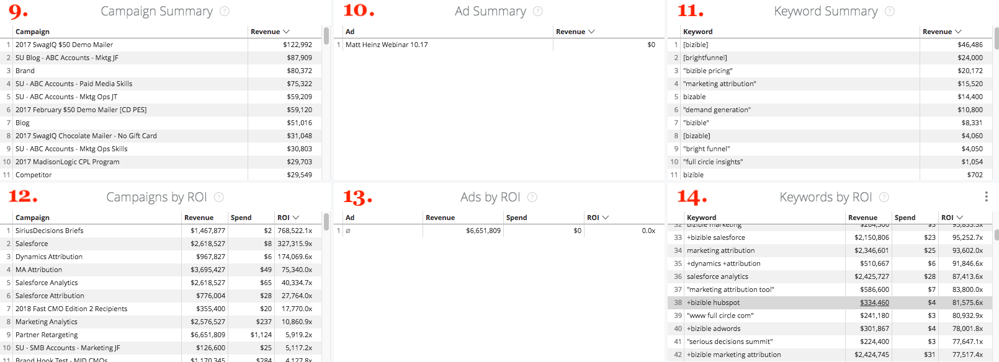

# 드릴스루 {#drill-throughs}

다음 [!DNL Marketo Measure Discover] 경험을 통해 고객은 가장 중요한 데이터 세트로 드릴다운할 수 있습니다. 전체에 걸쳐 특정 조치에 대해 [!DNL Marketo Measure Discover], 고객이 타일을 클릭하여 해당 지표에 대해 자세히 알아볼 수 있습니다.

다음은 드릴스루와 사용자가 드릴스루할 때 예상해야 하는 경험이 포함된 대시보드 및 타일 목록입니다. 드릴스루할 때 대시보드의 전역 필터가 유지된다는 점을 기억하십시오.

## 개요 {#overview}

**매출**

정의: 막대 차트 및 테이블을 통한 월별 총 수익. 거기에서 한 달로 드릴다운하거나 주·일·시간별로 한 달 단위로 이탈하는 것이 가능하다.

**수익(차트)**

정의: 막대 차트 및 테이블을 통한 월별 총 수익. 상위 타일은 이미 막대 차트이므로 세부 정보 표시로 드릴다운하면 한 달만 표시됩니다.

_자세히 알아보기: 주 또는 날짜별로 분류된 월별 총 수익._

**지출**

정의: 막대 차트 및 테이블을 통한 월별 총 지출 거기에서 한 달로 드릴다운하거나 주·일·시간별로 한 달 단위로 이탈하는 것이 가능하다.

**거래**

정의: 막대 차트 및 테이블을 통한 월별 총 거래 수 거기에서 한 달로 드릴다운하거나 주·일·시간별로 한 달 단위로 이탈하는 것이 가능하다.

**파이프라인 수익**

정의: 막대 차트 및 테이블을 통한 월별 총 파이프라인 수익. 거기에서 한 달로 드릴다운하거나 주·일·시간별로 한 달 단위로 이탈하는 것이 가능하다.

**ROI 요약**

정의: 막대 차트 및 테이블을 통해 매월 각 채널의 총 수익 또는 지출 여기에서 한 달 동안 해당 행으로 드릴다운하거나 주, 일 또는 시간별로 월별로 분류할 수 있습니다.

**거래당 비용**

정의: 총 지출을 총 거래 수로 나누어 마감된 성공 기회를 획득하는 데 필요한 평균 비용을 제공합니다. 여기에서 한 달 동안 해당 행으로 드릴다운하거나 주, 일 또는 시간별로 월별로 분류할 수 있습니다.

**수입별 채널**

정의: 막대 차트 및 테이블을 통한 월별 각 채널의 총 수익 여기에서 한 달 동안 해당 행으로 드릴다운하거나 주, 일 또는 시간별로 월별로 분류할 수 있습니다.

**수입별 하위 채널**

정의: 막대 차트 및 테이블을 통한 월별 각 하위 채널의 총 수익 여기에서 한 달 동안 해당 행으로 드릴다운하거나 주, 일 또는 시간별로 월별로 분류할 수 있습니다.

**매출별 캠페인**

정의: 막대 차트 및 테이블을 통한 월별 각 캠페인의 총 수익 여기에서 한 달 동안 해당 행으로 드릴다운하거나 주, 일 또는 시간별로 월별로 분류할 수 있습니다.

**거래 요약**

정의: 막대 차트 및 테이블을 통해 월별 각 채널의 총 지출 또는 거래 수. 여기에서 한 달 동안 해당 행으로 드릴다운하거나 주, 일 또는 시간별로 월별로 분류할 수 있습니다.

## 성장 {#growth}

**총 수익**

정의: 막대 차트 및 테이블을 통한 월별 총 수익. 거기에서 한 달로 드릴다운하거나 주·일·시간별로 한 달 단위로 이탈하는 것이 가능하다.

**시간 경과에 따른 매출**

정의: 막대 차트 및 테이블을 통한 월별 총 수익. 상위 타일은 이미 차트이므로 세부 정보 표시로 드릴다운하면 한 달만 표시됩니다.

_주 또는 날짜별로 분류된 월별 총 수익._

**총 거래 수**

정의: 막대 차트 및 테이블을 통한 월별 총 거래 수 거기에서 한 달로 드릴다운하거나 주·일·시간별로 한 달 단위로 이탈하는 것이 가능하다.

**시간 경과에 따른 거래**

정의: 막대 차트 및 테이블을 통한 월별 총 거래 수 상위 타일은 이미 차트이므로 세부 정보 표시로 드릴다운하면 한 달만 표시됩니다.

_주 또는 날짜별로 분류된 월별 총 거래 수._

**총 파이프라인 수익**

정의: 막대 차트 및 테이블을 통한 월별 총 파이프라인 수익. 거기에서 한 달로 드릴다운하거나 주·일·시간별로 한 달 단위로 이탈하는 것이 가능하다.

**시간 경과에 따른 파이프라인 수익**

정의: 막대 차트 및 테이블을 통한 월별 총 파이프라인 수익. 상위 타일은 이미 차트이므로 세부 정보 표시로 드릴다운하면 한 달만 표시됩니다.

_주별 또는 날짜별로 분류된 월별 총 파이프라인 수익._

**총 리드 수**

정의: 막대 차트 및 테이블을 통한 월별 가망 고객 합계. 거기에서 한 달로 드릴다운하거나 주·일·시간별로 한 달 단위로 이탈하는 것이 가능하다.

**시간 경과에 따른 리드**

정의: 막대 차트 및 테이블을 통한 월별 가망 고객 합계. 상위 타일은 이미 차트이므로 세부 정보 표시로 드릴다운하면 한 달만 표시됩니다.

_주별 또는 일자별로 분류된 월별 가망 고객 합계._

**총 연락처 수**

정의: 막대 차트 및 테이블을 통한 월별 총 연락처 수 거기에서 한 달로 드릴다운하거나 주·일·시간별로 한 달 단위로 이탈하는 것이 가능하다.

**시간에 따른 연락처**

정의: 막대 차트 및 테이블을 통한 월별 총 연락처 수 상위 타일은 이미 차트이므로 세부 정보 표시로 드릴다운하면 한 달만 표시됩니다.

_주별 또는 날짜별로 분류된 월별 총 연락처 수_

**총 영업 기회**

정의: 막대 차트 및 테이블을 통한 월별 총 기회. 거기에서 한 달로 드릴다운하거나 주·일·시간별로 한 달 단위로 이탈하는 것이 가능하다.

**시간 경과에 따른 기회**

정의: 막대 차트 및 테이블을 통한 월별 총 기회. 상위 타일은 이미 차트이므로 세부 정보 표시로 드릴다운하면 한 달만 표시됩니다.

_주 또는 날짜별로 분류된 월별 총 영업 기회._

**고유 방문 횟수**

정의: 막대 차트 및 테이블을 통한 월별 총 페이지 보기 수 거기에서 한 달로 드릴다운하거나 주·일·시간별로 한 달 단위로 이탈하는 것이 가능하다.

**시간에 따른 고유 방문 횟수**

정의: 특정 기간 동안의 트렌드를 보여주는 총 고유 방문 수입니다. [그룹별] 필터를 사용하여 채널, 하위 채널, 캠페인, 계정, 광고 그룹, 광고, 광고주, 크리에이티브, 키워드, 배치 및 사이트별로 스택을 변경합니다. 이 기능이 비활성화되면 비어 있습니다.

**방문 횟수**

정의: 막대 차트 및 테이블을 통한 월별 총 사이트 방문 수 거기에서 한 달로 드릴다운하거나 주·일·시간별로 한 달 단위로 이탈하는 것이 가능하다.

**시간 경과에 따른 방문**

정의: 특정 기간 동안의 트렌드를 보여 주는 추적된 총 사이트 방문 수입니다. [그룹별] 필터를 사용하여 채널, 하위 채널, 캠페인, 계정, 광고 그룹, 광고, 광고주, 크리에이티브, 키워드, 배치 및 사이트별로 스택을 변경합니다. 이 기능이 비활성화되면 비어 있습니다.

**Forms**

정의: 막대 차트 및 테이블을 통한 월별 양식 제출의 총 수입니다. 거기에서 한 달로 드릴다운하거나 주·일·시간별로 한 달 단위로 이탈하는 것이 가능하다.

**시간 경과에 따른 Forms**

정의: 특정 기간 동안의 추세를 보여주는 제출된 총 양식 수입니다. [그룹별] 필터를 사용하여 채널, 하위 채널, 캠페인, 계정, 광고 그룹, 광고, 광고주, 크리에이티브, 키워드, 배치 및 사이트별로 스택을 변경합니다. 이 기능이 비활성화되면 비어 있습니다.

## 지출 {#spend}

**지출**

정의: 막대 차트 및 테이블을 통한 월별 총 지출 거기에서 한 달로 드릴다운하거나 주·일·시간별로 한 달 단위로 이탈하는 것이 가능하다.

**지출(차트)**

정의: 막대 차트 및 테이블을 통한 월별 총 지출 상위 타일은 이미 차트이므로 세부 정보 표시로 드릴다운하면 한 달만 표시됩니다.

_주, 날짜 또는 시간별로 분류된 월별 총 지출 다음 이후 체류 시간 가능 [!DNL Marketo Measure] 는 광고 연결에서 실제 지출을 분 단위로 다운로드합니다._

**채널별 소비**

정의: 막대 차트 및 테이블을 통한 월별 각 채널의 총 지출 여기에서 한 달 동안 해당 행으로 드릴다운하거나 주, 일 또는 시간별로 월별로 분류할 수 있습니다.

**하위 채널별 지출**

정의: 막대 차트 및 테이블을 통한 월별 각 하위 채널의 총 지출 여기에서 한 달 동안 해당 행으로 드릴다운하거나 주, 일 또는 시간별로 월별로 분류할 수 있습니다.

**캠페인별 지출**

정의: 막대 차트 및 테이블을 통한 월별 각 캠페인의 총 지출 여기에서 한 달 동안 해당 행으로 드릴다운하거나 주, 일 또는 시간별로 월별로 분류할 수 있습니다.

## 판매 속도 {#sales-velocity}

**속도(일)**

정의: 첫 번째 익명 터치부터 영업 기회 마감까지 영업 기회의 평균 영업 주기 기간(일)입니다.

**활성 영업 기회**

정의: 개설 기회의 총 기회 수. 즉, 마감된 손실 또는 마감된 원화가 아닙니다.

**거래 크기**

정의: 마감된 Won 기회의 평균 금액.

**승률**

정의: 마감된 Won 기회의 총 수를 마감된 손실 및 마감된 Won 기회의 총 수로 나눈 값입니다.

**채널별 영업 기회 속도**

정의: 마케팅 채널별로 그룹화되고 다음 단계로 진행되는 데 걸리는 시간을 보여 주는 Opportunity 가 단계당 주기에 있는 평균 일 수입니다. 여기에 나타나는 단계는 이정표 단계(FT, LC, OC)와 사용자 정의 단계이다.

**채널별 잠재 고객 속도**

정의: Lead 가 Contact/Opportunity/Amount 로 Convert 되기 전에 Stage 당 Cycle에 있는 평균 일 수로, 마케팅 채널별로 Grouping 되어 다음 Stage 로 진행하는 데 걸리는 시간을 표시합니다. 여기에 나타나는 스테이지는 마일스톤 스테이지(FT, LC) 및 맞춤형 스테이지입니다.

**평균 영업 기회 속도**

정의: Opportunity 가 다음 단계로 진행되는 데 걸리는 시간을 보여 주는 단계당 주기의 평균 일 수입니다. 여기에 나타나는 단계는 이정표 단계(FT, LC, OC)와 사용자 정의 단계이다. 이 숫자는 채널 차트에 따른 Opportunity Velocity 의 단계당 시간을 반영합니다.

**평균 리드 속도**

정의: Lead 가 Contact/Opportunity/Amount 로 Convert 되기 전의 Stage 당 Cycle에 있는 평균 일수로, 다음 Stage 로 진행하는 데 걸리는 시간을 나타냅니다. 여기에 나타나는 스테이지는 마일스톤 스테이지(FT, LC) 및 맞춤형 스테이지입니다. 여기에 있는 숫자는 채널 차트의 잠재 고객 속도에 단계당 시간을 반영합니다.

**시간 경과에 따른 영업 기회 속도**

정의: 시간 경과에 따른 트렌드를 통해 Opportunity 가 단계당 주기에 있는 평균 일 수입니다.

**시간에 따른 리드 속도**

정의: 시간 경과에 따른 트렌드를 통해 리드들이 단계당 사이클에 있는 평균 일 수입니다.

## 계정 기반 마케팅 {#account-based-marketing}

**총 수익**

정의: 막대 차트 및 테이블을 통한 월별 총 수익. 거기에서 한 달로 드릴다운하거나 주·일·시간별로 한 달 단위로 이탈하는 것이 가능하다.

**총 파이프라인 수익**

정의: 막대 차트 및 테이블을 통한 월별 총 파이프라인 수익. 거기에서 한 달로 드릴다운하거나 주·일·시간별로 한 달 단위로 이탈하는 것이 가능하다.

**일치하는 잠재 고객**

정의: 계정에 성공적으로 대응된 총 가망 고객 수

**계정 터치됨**

정의: 접점을 받은 총 계정 수입니다.

**터치된 기회**

정의: 해당 계정 ID가 있는 Opportunity ID 목록

**터치된 연락처**

정의: 해당 계정 ID가 있는 연락처 ID 목록

**시간 경과에 따른 터치포인트(차트)**

정의: 선택한 월의 터치포인트 목록입니다.

_터치된 터치포인트의 수를 주, 날짜 또는 시간별로 분류합니다._

**시간 경과에 따라 터치된 계정(차트)**

정의: 선택한 월의 계정 ID 목록입니다.

_터치된 계정 수를 주, 날짜 또는 시간별로 분류합니다._

## 웹 분석 {#web-analytics}

**고유 방문 횟수**

정의: 막대 차트 및 테이블을 통한 월별 고유 사이트 방문의 총 수입니다. 거기에서 한 달로 드릴다운하거나 주·일·시간별로 한 달 단위로 이탈하는 것이 가능하다.

**고유 방문당 비용**

정의: 총 지출을 총 고유 방문 수로 나눈 값입니다. 거기에서 한 달로 드릴다운하거나 주·일·시간별로 한 달 단위로 이탈하는 것이 가능하다.

**랜딩 페이지별 고유 방문 수**

정의: 각 URL의 고유 방문자 수를 기반으로 한 랜딩 페이지 목록입니다.

**소스별 고유 방문 수**

정의: 사이트 고유 방문자 소스에 대한 보기.

**시간 경과에 따른 고유 방문**

정의: 특정 기간에 대한 트렌드를 보여 주는 추적된 총 고유 방문 수입니다.

**방문 횟수**

정의: 막대 차트 및 테이블을 통한 월별 총 사이트 방문 수 거기에서 한 달로 드릴다운하거나 주·일·시간별로 한 달 단위로 이탈하는 것이 가능하다.

**방문당 비용**

정의: 총 지출을 총 방문 횟수로 나눈 값입니다.

**랜딩 페이지별 방문 수**

정의: 각 URL에 대한 방문 횟수를 기반으로 하는 랜딩 페이지 목록입니다.

**소스별 방문**

정의: 사이트 방문자의 소스. 채널, 하위 채널, 캠페인, 계정, 광고 그룹, 광고, 광고주, 크리에이티브, 키워드, 배치 및 사이트별로 변경할 수 있습니다.

**시간 경과에 따른 방문**

정의: 특정 기간 동안의 트렌드를 보여 주는 추적된 총 방문 수입니다. 거기에서 한 달로 드릴다운하거나 주·일·시간별로 한 달 단위로 이탈하는 것이 가능하다.

**페이지 보기 수**

정의: 막대 차트 및 테이블을 통한 월별 총 페이지 보기 수 거기에서 한 달로 드릴다운하거나 주·일·시간별로 한 달 단위로 이탈하는 것이 가능하다.

**페이지 조회당 비용**

정의: 총 지출을 추적된 총 페이지 보기 수로 나눈 값입니다.

**URL별 페이지 보기 수**

정의: 각 URL의 페이지 보기 수를 기반으로 하는 페이지 URL 목록입니다.

**시간 경과에 따른 페이지 보기**

정의: 막대 차트 및 테이블을 통한 월별 총 페이지 보기 수 상위 타일은 이미 차트이므로 세부 정보 표시로 드릴다운하면 한 달만 표시됩니다.

_주, 날짜 또는 시간별로 분류된 월별 총 페이지 보기 수입니다._

**시간 경과에 따른 Forms**

정의: 특정 기간 동안의 추세를 보여 주는 추적된 총 양식 수입니다.

**Forms**

정의: 막대 차트 및 테이블을 통한 월별 양식 제출의 총 수입니다. 거기에서 한 달로 드릴다운하거나 주·일·시간별로 한 달 단위로 이탈하는 것이 가능하다.

**양식당 비용**

정의: 총 지출을 제출된 총 화면으로 나눈 값입니다.

**양식 URL로 양식 제출**

정의: 각 URL에 제출된 번호를 기반으로 한 양식 URL 목록.

**랜딩 페이지별 리드**

정의: 각 랜딩 페이지에서 생성된 리드 수를 기반으로 한 랜딩 페이지 목록입니다.

**양식 URL로 리드**

정의: 각 URL에서 생성된 리드 수를 기반으로 한 양식 URL 목록입니다.

## CMO {#cmo}

**매출**

정의: 막대 차트 및 테이블을 통한 월별 총 수익. 거기에서 한 달로 드릴다운하거나 주·일·시간별로 한 달 단위로 이탈하는 것이 가능하다.

**수익(차트)**

정의: 막대 차트 및 테이블을 통한 월별 총 수익. 상위 타일은 이미 막대 차트이므로 세부 정보 표시로 드릴다운하면 한 달만 표시됩니다.

_주 또는 날짜별로 분류된 월별 총 수익._

**지출**

정의: 막대 차트 및 테이블을 통한 월별 총 지출 거기에서 한 달로 드릴다운하거나 주·일·시간별로 한 달 단위로 이탈하는 것이 가능하다.

**ROI**

정의: 총 수익 및 총 지출에서 계산된 투자 수익률(속성 모델에 따라 다름)

**거래**

정의: 막대 차트 및 테이블을 통한 월별 총 거래 수 거기에서 한 달로 드릴다운하거나 주·일·시간별로 한 달 단위로 이탈하는 것이 가능하다.

**거래당 비용**

정의: 총 지출을 총 거래 수로 나누어 마감된 원화가치 영업 기회 1개를 획득하는 데 소요되는 평균 비용을 제공합니다.

**파이프라인 수익**

정의: 막대 차트 및 테이블을 통한 월별 총 파이프라인 수익. 거기에서 한 달로 드릴다운하거나 주·일·시간별로 한 달 단위로 이탈하는 것이 가능하다.

**거래 크기**

정의: 마감된 성공 기회의 평균 금액.

**수입별 채널**

정의: 막대 차트 및 테이블을 통한 월별 각 채널의 총 수익 여기에서 한 달 동안 해당 행으로 드릴다운하거나 주, 일 또는 시간별로 월별로 분류할 수 있습니다.

**수입별 하위 채널**

정의: 막대 차트 및 테이블을 통한 월별 각 하위 채널의 총 수익 여기에서 한 달 동안 해당 행으로 드릴다운하거나 주, 일 또는 시간별로 월별로 분류할 수 있습니다.

**매출별 캠페인**

정의: 막대 차트 및 테이블을 통한 월별 각 캠페인의 총 수익 여기에서 한 달 동안 해당 행으로 드릴다운하거나 주, 일 또는 시간별로 월별로 분류할 수 있습니다.

**ROI 요약**

정의: 막대 차트 및 테이블을 통해 매월 각 채널의 총 수익 또는 지출 여기에서 한 달 동안 해당 행으로 드릴다운하거나 주, 일 또는 시간별로 월별로 분류할 수 있습니다.

**거래 요약**

정의: 막대 차트 및 테이블을 통해 월별 각 채널의 총 지출 또는 거래 수. 여기에서 한 달 동안 해당 행으로 드릴다운하거나 주, 일 또는 시간별로 월별로 분류할 수 있습니다.

## 콘텐츠 마케팅 {#content-marketing}

**총 수익**

정의: 막대 차트 및 테이블을 통한 월별 총 수익. 거기에서 한 달로 드릴다운하거나 주·일·시간별로 한 달 단위로 이탈하는 것이 가능하다.

**매출별 랜딩 페이지**

정의: 막대 차트 및 테이블을 통한 각 랜딩 페이지의 총 매출액 여기에서 한 달 동안 해당 행으로 드릴다운하거나 주, 일 또는 시간별로 월별로 분류할 수 있습니다.

**총 파이프라인 수익**

정의: 막대 차트 및 테이블을 통한 월별 총 파이프라인 수익. 거기에서 한 달로 드릴다운하거나 주·일·시간별로 한 달 단위로 이탈하는 것이 가능하다.

**파이프라인 매출별 랜딩 페이지**

정의: 막대 차트 및 테이블을 통한 각 랜딩 페이지의 총 파이프라인 수익. 여기에서 한 달 동안 해당 행으로 드릴다운하거나 주, 일 또는 시간별로 월별로 분류할 수 있습니다.

**총 영업 기회**

정의: 막대 차트 및 테이블을 통한 월별 총 기회 수 거기에서 한 달로 드릴다운하거나 주·일·시간별로 한 달 단위로 이탈하는 것이 가능하다.

**영업 기회 개수별 랜딩 페이지**

정의: 막대 차트 및 테이블을 통한 각 랜딩 페이지의 총 기회 수 여기에서 한 달 동안 해당 행으로 드릴다운하거나 주, 일 또는 시간별로 월별로 분류할 수 있습니다.

**총 Forms**

정의: 막대 차트 및 테이블을 통한 월별 총 양식 수 거기에서 한 달로 드릴다운하거나 주·일·시간별로 한 달 단위로 이탈하는 것이 가능하다.

**양식 제출로 상위 양식 URL**

정의: 막대 차트 및 테이블을 통한 각 양식 URL의 총 양식 수입니다. 여기에서 한 달 동안 해당 행으로 드릴다운하거나 주, 일 또는 시간별로 월별로 분류할 수 있습니다.

**채널별 양식 URL**

정의: 양식 URL에서 막대 차트 및 테이블을 통해 월별로 제출된 총 양식 수입니다. 여기에서 한 달 동안 해당 행으로 드릴다운하거나 주, 일 또는 시간별로 월별로 분류할 수 있습니다.

**고유 방문 횟수**

정의: 알려진 모든 방문자와 익명의 방문자에 대해 추적된 총 고유 사이트 방문 수입니다. 월별로 추적된 고유 사이트 방문 횟수를 보려면 드릴인하십시오.

**고유 방문 횟수별 상위 랜딩 페이지**

정의: 각 랜딩 페이지에 대한 고유 방문 수를 기반으로 하는 랜딩 페이지 목록입니다. 드릴인하여 선택한 URL에 대한 월별 고유 방문 수를 확인합니다.

**방문 횟수**

정의: 알려진 모든 방문자와 익명의 방문자에 대해 추적된 총 사이트 방문 수입니다. 월별로 추적된 사이트 방문 횟수를 보려면 드릴인하십시오.

**방문 횟수별 상위 랜딩 페이지**

정의: 각 랜딩 페이지에 대한 초기 방문 수를 기반으로 하는 랜딩 페이지 목록입니다. 드릴인하면 선택한 URL의 월별 방문 횟수를 볼 수 있습니다.

**총 리드 수**

정의: 막대 차트 및 테이블을 통한 월별 총 잠재 고객 수 거기에서 한 달로 드릴다운하거나 주·일·시간별로 한 달 단위로 이탈하는 것이 가능하다.

**리드 개수별 랜딩 페이지**

정의: 막대 차트 및 테이블을 통한 각 랜딩 페이지의 총 리드 수 여기에서 한 달 동안 해당 행으로 드릴다운하거나 주, 일 또는 시간별로 월별로 분류할 수 있습니다.

## 유료 미디어 {#paid-media}

**노출 횟수**

정의: 막대 차트 및 테이블을 통한 월별 총 노출 횟수입니다. 거기에서 한 달로 드릴다운하거나 주·일·시간별로 한 달 단위로 이탈하는 것이 가능하다.

**CPM**

정의: 제공된 노출 횟수의 총 지출을 총 노출 횟수로 나눈 값입니다.

**클릭 수**

정의: 막대 차트 및 테이블을 통한 월별 총 클릭 수입니다. 거기에서 한 달로 드릴다운하거나 주·일·시간별로 한 달 단위로 이탈하는 것이 가능하다.

**CPC**

정의: 추적된 클릭의 총 지출을 총 클릭으로 나눈 값입니다.

**잠재 고객**

정의: 속성 모델을 기반으로 하는 총 리드 수.

**CPL**

정의: 생성된 리드의 총 지출을 총 클릭수로 나누어 CPL 비율을 제공합니다.

**방문 횟수**

정의: 막대 차트 및 테이블을 통한 월별 총 사이트 방문 수 거기에서 한 달로 드릴다운하거나 주·일·시간별로 한 달 단위로 이탈하는 것이 가능하다.

**페이지 보기 수**

정의: 막대 차트 및 테이블을 통한 월별 총 페이지 보기 수 거기에서 한 달로 드릴다운하거나 주·일·시간별로 한 달 단위로 이탈하는 것이 가능하다.

**캠페인 요약**

정의: 수익/지출/거래/기회가 각 캠페인에 기여한 정도를 기반으로 하는 캠페인 목록이며, 선택한 속성 모델에 따라 가장 높게 정렬됩니다.

**광고 요약**

정의: 선택한 속성 모델을 기반으로 각 광고에 귀속된 매출/파이프라인 매출/지출/거래/기회에 따른 광고 목록입니다.

**키워드 요약**

정의: 선택한 속성 모델을 기반으로 각 키워드에 기여한 매출/파이프라인 매출/지출/거래/기회의 양을 기반으로 하는 키워드 목록입니다.

**ROI별 캠페인**

정의: 각 캠페인에 대해 계산된 ROI를 기반으로 가장 높은 ROI로 정렬된 캠페인 목록. 드릴인하여 선택한 캠페인에 대한 월별 수입 또는 지출을 확인합니다.

**ROI별 광고**

정의: 각 광고의 계산된 ROI를 기반으로 가장 높은 ROI로 정렬된 광고 목록입니다. 드릴인하여 선택한 광고에 대한 월별 수입 또는 지출을 확인합니다.

**ROI별 키워드**

정의: 각 키워드에 대해 계산된 ROI를 기반으로 하고 가장 높은 ROI로 정렬된 키워드 목록입니다. 드릴인하여 선택한 키워드에 대한 월별 수입 또는 지출을 확인합니다.
