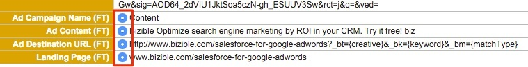

# 리드 병합에 대한 우수 사례 {#best-practices-for-merging-leads}

[!DNL Salesforce]에서 Lead를 병합할 때는 데이터가 손실되지 않도록 항상 주의하는 것이 좋습니다.

[&#x200B; 지원에서 &#x200B;](https://help.salesforce.com/s/articleView?id=leads_merge.htm&language=en_US&type=5)잠재 고객 병합 방법[!DNL Salesforce]에 대해 설명합니다.

[!DNL Marketo Measure]이(가) 들어오는 위치는 병합된 레코드에서 채워지는 필드를 선택할 때입니다. 기본 레코드를 선택하면 [!DNL Marketo Measure] 필드가 새 레코드로 전달되도록 선택되었는지 확인합니다.

데이터가 [!DNL Marketo Measure]인 레코드가 여러 개 있는 경우 기본 레코드에 먼저 만들어진 잠재 고객에 대해 선택한 필드가 있는지 확인하십시오. 추가 [!DNL Marketo Measure] 데이터가 Insights 섹션 내에 표시됩니다. 또한 추적된 잠재 고객의 이메일 주소가 유지된 이메일 주소인지 확인합니다. 이를 통해 해당 잠재 고객을 계속 새로운 속성 데이터로 업데이트할 수 있습니다.

여기에서 가망 고객을 자유롭게 병합할 수 있으며 [!DNL Marketo Measure] 데이터가 새 레코드로 전달됩니다.

질문이 있는 경우 주저하지 말고 Adobe 계정 팀(계정 관리자) 또는 [Marketo 지원](https://nation.marketo.com/t5/support/ct-p/Support){target="_blank"}에 문의하십시오.

