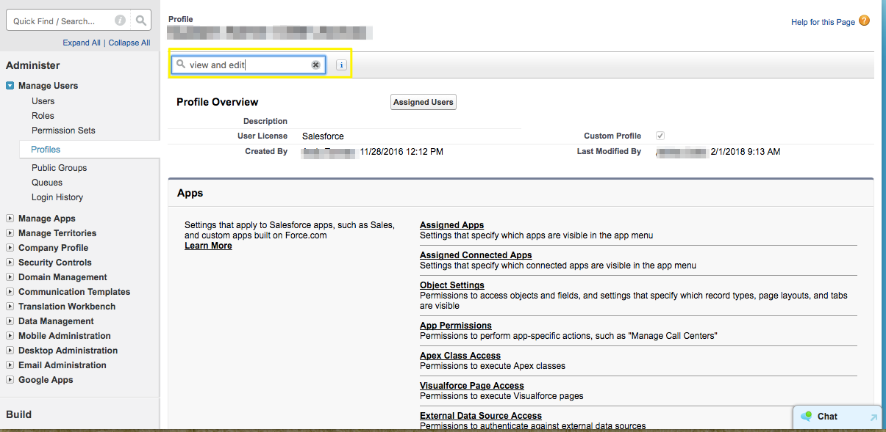

# 변환된 리드 편집 권한 활성화 {#enabling-the-permission-to-edit-converted-leads}

에서 변환된 리드 레코드를 편집할 수 있는 권한을 활성화하는 방법을 알아봅니다. [!DNL Salesforce]. [!DNL Marketo Measure] 는 Salesforce에서 다양한 개체에 데이터를 푸시할 수 있는 기능을 제공합니다. 리드를 푸시할 때 일부 시나리오에서 이미 변환된 리드 레코드로 다시 푸시해야 할 수도 있습니다. 데이터를 해당 레코드에 푸시하려면 Adobe를 통해 연결된 사용자에게 프로필 수준에서 변환된 리드를 보고 편집할 수 있는 권한이 있어야 합니다.

1. 이동 [!UICONTROL Setup] 를 확장하고 [!UICONTROL Manage Users] 그룹화하여 프로파일을 선택합니다.

   

1. 연결된 사용자의 프로필을 선택합니다.

1. 변환된 리드를 보고 편집할 권한을 검색합니다.

   

1. 변환된 리드를 보고 편집할 수 있는 권한을 활성화하려면 상자를 선택합니다.

   

넌 끝났어!
