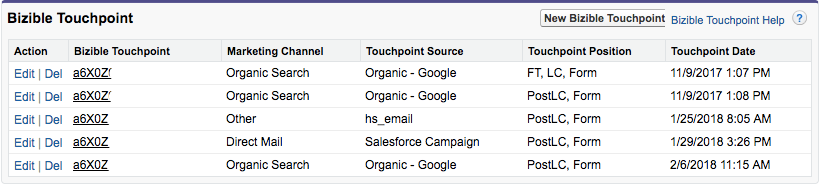

# PostLC 접점 및 리드 참여 {#postlc-touchpoints-and-lead-engagement}

[!DNL Marketo Measure] PostLC(잠재 고객 생성 후) 터치포인트는 멀티 터치 속성 모델(W자형 이상)을 사용하는 고객에게 제공됩니다. 잠재 고객 또는 연락처가 웹 사이트로 돌아가 양식을 계속 작성하면 이러한 양식 제출이 PostLC 터치포인트로 등록됩니다. 이러한 터치포인트를 사용하면 리드가 첫 번째 전환 후 한참 동안 사이트에 계속 참여하도록 유도하는 콘텐츠를 확인할 수 있습니다. PostLC 터치포인트는 Opportunity 내의 모든 중개 터치포인트와 속성 크레딧을 공유합니다. 10% 속성 크레딧은 중개 터치포인트에 할당되며 모든 터치 간에 균등하게 분배됩니다.

표시되는 PostLC 터치포인트의 수를 조정할 수 있습니다 [!DNL SFDC]. 일반적으로 최대 5개의 PostLC 터치포인트를 푸시하는 것이 좋습니다. 각 터치포인트는 1KB 정도 소요됩니다 [!DNL SFDC].

>[!NOTE]
>
>PostLC 터치포인트 설정을 조정하는 방법에 대한 지침은 이 문서의 끝에 있습니다.

PostLC 터치포인트는 동적입니다. 잠재 고객 또는 담당자가 PostLC 양식을 계속 제출하면 [!DNL Marketo Measure] crm의 PostLC 터치포인트를 업데이트하여 최신 양식 제출을 표시합니다. 특히 PostLC 터치포인트 5개로 제한을 설정한 경우 [!DNL Marketo Measure] 항상 5를 밀어라 _가장 최근_ CRM에 대한 터치포인트.  이 예에서는 이 계정이 PostLC 제한을 4개의 터치포인트로 설정했습니다. 이 리드는 이미 CRM에 포함할 수 있는 PostLC 터치포인트의 최대 수에 도달했습니다. 마지막 PostLC 터치는 2018년 2월 6일이었습니다. 만약 이 사람이 다음 날 다른 서류를 작성한다면 [!DNL Marketo Measure] 은(는) 2017/11/9에서 첫 번째 PostLC 터치포인트를 제거하여 2018/2/7에 최신 터치포인트를 추가합니다.

>[!NOTE]
>
>[!DNL Marketo Measure] 잠재 고객 또는 연락처에서 PostLC 터치포인트만 업데이트하고 영업 기회에서 PostLC 속성 터치포인트는 업데이트하지 않습니다. 연락처의 모든 관련 PostLC 접점은 Opportunity에 포함됩니다.

## PostLC 터치포인트 설정을 변경하는 방법 {#how-to-change-postlc-touchpoint-settings}

리드 또는 연락처에 대한 PostLC 터치포인트 설정을 조정하려면 아래 지침을 따르십시오.

**잠재 고객**

1. 에 로그인 [!DNL Marketo Measure] 계정 위치: [experience.adobe.com/marketo-measure](https://experience.adobe.com/marketo-measure){target="_blank"} 다음으로 이동 [!UICONTROL Settings].

1. CRM에서 **[!UICONTROL Leads]**.

1. 리드에 푸시할 postLC 터치포인트의 수를 입력하고 클릭 **[!UICONTROL Save]**.

   

**연락처**

1. 에 로그인 [!DNL Marketo Measure] 계정 위치: [experience.adobe.com/marketo-measure](https://experience.adobe.com/marketo-measure){target="_blank"} 다음으로 이동 [!UICONTROL Settings].

1. CRM에서 **[!UICONTROL Contacts]**.

1. 연락처에 푸시할 postLC 터치포인트의 수를 입력하고 클릭 **[!UICONTROL Save]**.

   
