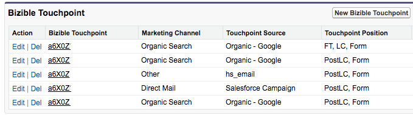

# PostLC 터치포인트 및 리드 참여 {#postlc-touchpoints-and-lead-engagement}

[!DNL Marketo Measure] 다중 터치 속성 모델(W-모양 등)을 사용하는 고객은 PostLC(Post-Lead Creation) 터치포인트를 사용할 수 있습니다. 리드 또는 연락처가 웹 사이트로 돌아가 양식을 계속 작성하면 이러한 양식 제출이 PostLC 터치포인트로 등록됩니다. 이러한 터치포인트를 사용하면 첫 번째 전환 후에도 리드가 사이트를 계속 참여하도록 유도하는 콘텐츠를 확인할 수 있습니다. PostLC 터치포인트는 기회 내의 모든 중간 터치포인트와 속성 크레딧을 공유합니다. 10% 속성 크레딧은 중간 터치포인트에 할당되고 모든 터치 간에 균등하게 배포됩니다.

에 표시할 PostLC 터치포인트 수를 조정할 수 있습니다 [!DNL SFDC]. 일반적으로 최대 5개의 PostLC 터치포인트를 푸시하는 것이 좋습니다. 각 터치 포인트에서 1KB 사용 [!DNL SFDC].

>[!NOTE]
>
>PostLC 터치 포인트 설정 조정 방법에 대한 지침은 이 문서의 끝에 있습니다.

PostLC 터치포인트는 동적입니다. 잠재 고객 또는 연락처가 PostLC 양식을 계속 제출함에 따라 [!DNL Marketo Measure] 은(는) CRM의 PostLC 터치포인트를 업데이트하여 가장 최근 양식 제출을 표시합니다. 특히, 5개의 PostLC 터치포인트 제한을 설정한 경우, [!DNL Marketo Measure] 항상 5 _가장 최근_ 터치포인트를 CRM에 연결합니다.  이 예에서 이 계정은 PostLC 제한을 4개의 터치포인트로 설정했습니다. 이 리드는 이미 CRM에 포함할 수 있는 최대 PostLC 터치포인트 수에 도달했습니다. 마지막 PostLC 터치가 2/6/2018. 만약 그 사람이 다음 날 다른 서류를 작성한다면 [!DNL Marketo Measure] 에서 최신 터치포인트를 추가하기 위해 11/9/2017에서 첫 번째 PostLC 터치포인트를 제거합니다2/7/2018.

>[!NOTE]
>
>[!DNL Marketo Measure] 는 Lead 또는 Contact의 PostLC 터치포인트만 업데이트하며 Opportunity의 PostLC 속성 터치포인트를 업데이트하지 않습니다. 연락처의 모든 관련 PostLC 터치포인트는 Opportunity에 포함됩니다.

## PostLC 터치포인트 설정을 변경하는 방법 {#how-to-change-postlc-touchpoint-settings}

리드 또는 연락처에 대한 PostLC 터치포인트 설정을 조정하려면 아래 지침을 따르십시오.

**리드**

1. 에 로그인합니다. [!DNL Marketo Measure] 계정 [experience.adobe.com/marketo-measure](https://experience.adobe.com/marketo-measure){target=&quot;_blank&quot;} (으)로 이동하고 [!UICONTROL Settings].

1. CRM에서 **[!UICONTROL Leads]**.

1. 리드에 푸시할 postLC 터치포인트 수를 입력하고 를 클릭합니다. **[!UICONTROL Save]**.

   

**연락처**

1. 에 로그인합니다. [!DNL Marketo Measure] 계정 [experience.adobe.com/marketo-measure](https://experience.adobe.com/marketo-measure){target=&quot;_blank&quot;} (으)로 이동하고 [!UICONTROL Settings].

1. CRM에서 **[!UICONTROL Contacts]**.

1. 연락처에 푸시할 postLC 터치포인트 수를 입력하고 를 클릭합니다 **[!UICONTROL Save]**.

   
