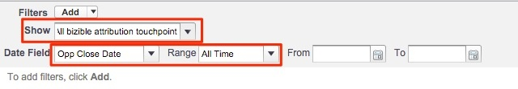

# 마케팅 채널별 영업 기회 상실 {#closed-lost-opportunities-by-marketing-channel}

이 보고서는 영업 기회 단계에 따라 달라질 수 있지만, 이 보고서는 영업 기회에 기여한 마케팅 채널을 공개하며, 이 영업 채널은 종료되지 않은 영업 기회에 기여합니다.

1. 을(를) 클릭합니다. **[!UICONTROL Reports]** Salesforce에서 탭을 선택하고 을(를) 선택합니다 **[!UICONTROL New Report]**.

   

1. &quot;Bizible Attribution&quot;의 빠른 찾기 유형에서 **[!UICONTROL Bizible Attribution Touchpoint with Opportunity]** 보고서 유형을 선택한 다음 **[!UICONTROL Create]**.

   

1. 보고서 상단에서 시작하여 &quot; 를 표시합니다.[!UICONTROL All Bizible Attribution Touchpoints]보고하려는 기간에 따라 날짜 필드를 조정합니다. 이 예제에서는 All Time을 살펴보겠습니다. 또한 보고서 형식을 테이블 형식에서 요약으로 변경합니다.

   

   

1. 이제 보고서에 필드를 추가할 예정입니다. 왼쪽의 빠른 찾기를 &quot;마케팅 채널&quot;에 입력하고 보고서의 요약 그룹에 추가합니다.

   

1. 다음으로, 필터에 추가하여 닫힌 드롭만 확인합니다. 왼쪽의 빠른 찾기에서 &quot;단계&quot; 필드를 검색하여 필터 영역으로 드래그합니다.

   

1. 여기에서 &quot;미결 손실&quot; 영업 기회에 사용하는 단계를 선택하려면 확대경을 선택합니다. 여기서는 표준 &quot;닫힌 분실물&quot; 이름을 사용합니다.

   

1. 자, 어서 보고서를 실행해!

   이 보고서는 마케팅 채널에서 채널 전반에서 닫힌 영업 기회 측정에 의해 요약된 영업 기회 보고서입니다. 이 보고서를 통해 성과가 낮은 채널을 파악할 수 있습니다. 보고할 필터 또는 필드에 자유롭게 추가할 수 있습니다.

>[!MORELIKETHIS]
>
>[[!DNL Marketo Measure] 대학: 추가 SFDC 보고서](https://universityonline.marketo.com/courses/bizible-fundamentals-bizible-102/#/page/5c5cb68dfb384d0c9fb96cd0)
