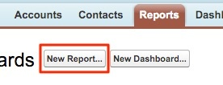
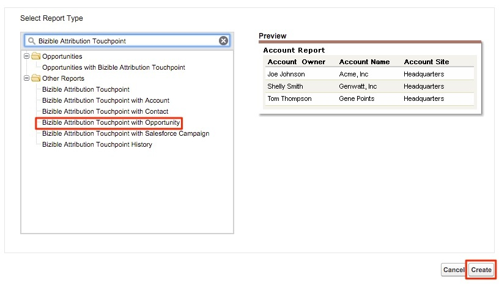
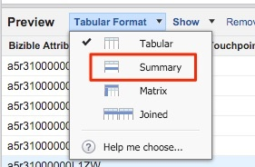

# 마케팅 채널별 영업 기회 손실 마감 {#closed-lost-opportunities-by-marketing-channel}

이 보고서는 영업 기회 단계에 따라 달라질 수 있지만, 이 보고서는 마감되지 않은 기회에 기여한 마케팅 채널을 공개합니다.

1. Salesforce에서 **[!UICONTROL Reports]** 탭을 클릭하고 **[!UICONTROL New Report]**&#x200B;을(를) 선택합니다.

   새 보고서 단추가 강조 표시된 

1. &quot;Bizible 속성&quot;의 빠른 찾기 유형에서 **[!UICONTROL Bizible Attribution Touchpoint with Opportunity]** 보고서 유형을 선택한 다음 **[!UICONTROL Create]**&#x200B;을(를) 선택합니다.

   

1. 보고서 맨 위부터 &quot;[!UICONTROL All Bizible Attribution Touchpoints]&quot;을(를) 표시하고 보고할 일정에 따라 날짜 필드를 조정합니다. 이 예제에서는 All Time을 살펴보겠습니다. 또한 보고서 형식을 테이블 형식에서 요약으로 변경합니다.

   

   

1. 이제 보고서에 필드를 추가하겠습니다. 왼쪽의 빠른 찾기에 &quot;마케팅 채널&quot;을 입력하고 보고서의 요약 그룹화에 추가합니다.

   

1. 다음으로, 닫힌 Lost Opps만 볼 수 있도록 필터를 추가합니다. 왼쪽의 빠른 찾기에서 필드 &quot;단계&quot;를 검색하고 필터 영역으로 끌어서 놓습니다.

   

1. 거기에서 &quot;Closed Lost&quot; Opportunities에 사용하는 스테이지를 선택하기 위해 돋보기를 선택합니다. 이 예제에서는 표준 &quot;Closed Lost&quot; 이름을 사용합니다.

   ![스테이지 필터 선택기에서 [닫힘 손실 스테이지 선택] 옵션 표시](assets/7.jpg)

1. 자, 어서 보고서를 실행해 보세요!

   채널 전반에서 종결된 영업 기회 손실 을 측정하는 마케팅 채널별로 요약된 영업 기회 보고서입니다. 이 보고서를 통해 성과가 낮은 채널이 무엇인지 파악할 수 있습니다. 보고할 필터 또는 필드를 언제든지 추가할 수 있습니다.

>[!MORELIKETHIS]
>[[!DNL Marketo Measure] 자습서: 추가 SFDC 보고서](https://experienceleague.adobe.com/en/docs/marketo-measure-learn/tutorials/onboarding/marketo-measure-102/addtional-salesforce-reports)
