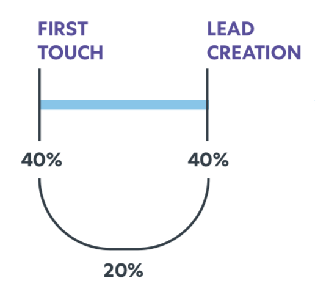

# [!DNL Marketo Measure] 보고 안내서 {#marketo-measure-reporting-guide}

>[!NOTE]
>
>&quot; &quot;을 지정하는 지침이 표시될 수 있습니다.[!DNL Marketo Measure]설명서에는 &quot;가 있지만 CRM에는 &quot;Bizible&quot;이 표시됩니다. 이를 업데이트하고 리브랜딩이 곧 CRM에 반영되도록 노력하고 있습니다.

를 작성하기 전에 [!DNL Marketo Measure] 보고, 다음을 확인하는 것이 가장 중요합니다. [!DNL Marketo Measure] 보고서 내의 데이터가 정확하고 비즈니스 특성을 반영하도록 계정 설정 을 검토하고 구성했습니다. 또한 보고 프로젝트는 구조화된 프로세스를 따를 때 가장 잘 작동합니다. 저스틴 노리스 [!DNL Marketo Measure] 의 파워 유저, 지지자 및 파트너 [페르쿠토](https://perkuto.com/) 전문적으로 요약됨 [에서 보고 접근 방법 [!DNL Marketo Measure]](https://perkuto.com/blog/turning-attribution-data-into-actionable-insights/):

**목표 수립**: &quot;가장 먼저 묻는 질문은 &#39;왜 측정합니까?&#39;입니다. 로리 위즈도 [Forrester 연구](https://go.forrester.com/) 그것을 다음과 같이 근사하게 요약했다. [Marketo 웨비나](https://www.marketo.com/webinars/beyond-revenue-performance-real-kpis-of-b2b-marketing/). 그녀에 따르면, &#39;우리는 의사 결정 또는 마케팅의 가치를 증명하거나 검증하거나 더 나은 (프로세스 개선) 얻을 수 있도록 측정합니다.&#39; 좋은 측정의 통찰력은 마케팅 계획 프로세스에 대한 입력과 지침도 제공한다는 점을 추가할 것입니다.

따라서 시작하기 전에, 자신의 목표, 답하려고 하는 질문 또는 해결하려고 하는 문제들에 대해 명확히 하는 것이 필수적입니다. 어떤 이야기를 하고 싶으세요? 그 결과 어떤 결정을 내릴까요? 너무 자주 이러한 기본 사항들은 잘못 생각되어 관련된 모든 사람들에게 좌절감을 안겨준다.&quot;

**보고서 디자인**: &quot;그런 다음 보고서를 디자인하고 보고서에 포함될 특정 차원, 지표 및 데이터 세트를 결정해야 합니다. 일반적인 경험은 비즈니스 사용자에게 필요한 것을 정확히 제공하고 비즈니스 사용자가 요구 사항이 충족되지 않았다고 느낄 수 있도록 하는 것입니다. 비즈니스 사용자가 실제로 찾고 있는 통찰력이 사용자가 요청하는 보고서에 항상 포함되어 있는 것은 아니기 때문입니다. 훌륭한 분석가(또는 분석가 모자가 있는 MOPS 직원)는 명확한 질문을 하고, 일반적인 정의(&quot;그래서, 리드는 정말 무엇을 의미합니까?&quot;)를 확립하며, 심지어 정렬이 있는지 확인하기 위해 최종 보고서의 시각적 이미지를 스케치할 수도 있습니다. 그런 다음에야 확실한 요구 사항 세트가 있다는 것을 알고 보고서를 작성할 수 있습니다.&quot;

**보고서 빌드**: &quot;일단 여러분이 건설하러 가면, 장애물이나 막다른 골목에 부딪치는 것은 드물지 않습니다. 예를 들어, 필수 데이터 포인트가 없거나 개체가 필요한 방식으로 연결되어 있지 않다는 것을 발견할 수 있습니다. 이러한 문제를 해결하기 위해 보고 &quot;기계&quot;에서 &quot;내부&quot;에서 일어나고 있는 일을 이해하는 것이 중요하다고 생각합니다. 이 유창성을 통해 보고 요청의 크기를 신속하게 조정하고 달성 가능 여부를 평가할 수 있습니다(그리고 달성이 불가능한 경우 보다 쉽게 창의적인 솔루션을 고안할 수 있음).&quot;

무엇이 을 만드는지 더 잘 이해하기 위해 &quot;내부&quot;를 살펴봅시다. [!DNL Marketo Measure] 속성 보고 컴퓨터가 실행됩니다.

## 구매자 접점 오브젝트(CRM) {#buyer-touchpoint-objects-crm}

가장 높은 수준에는 두 개의 서로 다른 구매자 접점 객체에 따른 두 개의 보고 범주가 있습니다. 이러한 범주는 의 유형을 결정합니다. [!DNL Marketo Measure] 보고할 데이터: 다음 항목에 관련된 데이터 _개인_&#x200B;또는 와 관련된 데이터 _기회_.

1. **구매자 접점** (BT) / 개인 / 총 참여

   * 관련 &quot;단계 상단&quot;(TOFU) 지표 및 보고에 일반적으로 사용됨 _개인 사용자_ (잠재 고객, 연락처, [!DNL Marketo Measure] 사용자)
   * BT는 와 관련된 모든 마케팅 상호 작용을 이해하는 데 사용됩니다. **사람**: 각 사용자에 대한 전체 터치포인트 기록이 포함됩니다. 다시 말해서 이러한 터치포인트는 익명 첫 번째 터치, 리드 만들기 터치 및 오프라인 캠페인이나 활동에서 동기화하도록 선택한 후속 양식 제출 또는 터치포인트용 CRM에서 만들어집니다.

1. **구매자 기여도 분석 접점** (BAT) / 영업 기회 / 계정 수준 / 매출

   * 관련된 &quot;단계 중 중간 및/또는 하단&quot;(MOFU 및 BOFU) 지표 및 보고에 일반적으로 사용됩니다. _영업 기회_.
   * BAT는 연결된 모든 사용자의 관련 터치포인트를 나타냅니다. **기회** ( 설정에 따라 Opportunity Contact Roles 를 통해 또는 Shared Account ID 를 통해 ). 사람에게만 관련성이 있는 BT와 달리 BAT도 관련성이 있다. **매출**. 이와 같이 BAT를 사용하여 열려 있거나 닫은 기회 수 또는 파이프라인 가치 및 수익 등 기회와 관련된 질문에 답변할 수 있습니다.

>[!NOTE]
>
>BAT는 BT에서 만들어집니다. 본질적으로, 추적은 BT들을 통해 개별 레벨에서 시작된다. 계정에서 Opportunity 가 생성되면 동일한 계정 아래에 있는 연락처의 모든 BT 가 참조되어 Opportunity 와 관련된 BAT 를 생성할 수 있으므로 답하려는 질문에 따라 하나씩 또는 다른 항목을 사용할 수 있습니다. &#39;People&#39; 지표 (BT 보고서) 관련 질문 또는 &#39;Opportunity&#39; 지표 (BAT 보고서) 관련 질문

지원 문서: [구매자 접점 및 구매자 속성 접점 간의 차이](/help/configuration-and-setup/getting-started-with-marketo-measure/difference-between-buyer-touchpoints-and-buyer-attribution-touchpoints.md#configuration-and-setup)

## 구매자 접점(BT) {#buyer-touchpoint-bt}

구매자 접점(BT)은 누군가 마케팅 자료에 대해 갖는 모든 마케팅 상호 작용을 추적하는 데 사용되는 객체입니다. 각 개인의 (잠재 고객/연락처/[!DNL Marketo Measure] 사용자) 여정은 관련 BT로 표시됩니다. 위치 [!DNL Marketo Measure], 개인의 여정은 다음과 같이 구성됩니다.

1. 이 사람이 어떻게 우리 브랜드와 처음 상호 작용했습니까? (첫 번째 터치 또는 _FT_)
1. 이 사람은 어떻게 전환하거나/알려지거나/잠재 고객이 되었습니까? (잠재 고객 생성 또는 _LC_)
1. 이 사람이 리드가 된 이후 우리의 브랜드 및 마케팅 자료와 어떻게 상호 작용했습니까? (_PostLC_)

구매자 접점은 다음과 관련된 질문에 답변하는 데 사용됩니다. _사람_ 영업 기회 관련 지표가 아닌 리드/연락처 생성 또는 획득 지표와 같은 (&quot;사용자&quot;는 CRM 내의 리드 또는 연락처로 표시됨). For example:

* 가장 많은 리드를 제공하는 채널은 무엇입니까?
* 새로운 Lead 를 만드는 데 다소 많은 비용이 드는 채널은 무엇입니까?
* 내 잠재 고객/연락처가 참여하는 콘텐츠는 무엇입니까?
* 특정 타이틀, 역할, 성향에 대한 마케팅 스토리는 무엇입니까?
* MQL 또는 기타 리드/연락처 상태를 유도하는 채널은 무엇입니까?

기본적으로 회사에서는 &quot;내 잠재 고객/연락처는 어디에서 오는가?&quot;를 알고 있어야 합니다. 지금까지 이를 단일 차원 값 (예: 리드 소스)으로 응답했습니다. 그러나 위의 설명과 #1에 #2 대로 Lead 가 Lead 가 되는 여정 동안 여러 터치포인트를 가질 수 있습니다. 구매자 접점을 통해 잠재 고객 생성 방법을 나타내는 가장 중요한 두 가지 상호 작용 (첫 번째 접점 및 잠재 고객 생성 접점)에 대한 통찰력을 얻을 수 있습니다. 구매자 터치포인트도 _다차원_ 는 주로 개인이 어디에서 왔는지(마케팅 채널), 그리고 개인이 종사했던 것(컨텐츠) 등 마케팅 데이터를 많이 나른다는 의미입니다.

다음 [속성 모델](/help/introduction-to-marketo-measure/overview-resources/marketo-measure-attribution-models.md) 사용자 기반 지표에 대한 최상의 통찰력을 제공하는 것은 다음과 같습니다.

* **첫 번째 터치** - 리드의 첫 번째 터치(FT)에 대한 100% 속성 크레딧
* **잠재 고객 생성** - 잠재 고객의 리드 생성 터치(LC)에 대한 100% 속성 크레딧
* **U자형** - 멀티 터치 방식, FT 40% 크레딧, LC 40% 크레딧

<table> 
 <tbody>
  <tr>
   <td></td> 
   <td>U자형 모델은 리드가 리드가 된 방법을 요약하는 모든 구매자 접점에 크레딧을 제공하도록 설계되었습니다. 이러한 리드의 후속 터치포인트는 추가 참여(Post LC)를 이해하는 데 보고될 수 있지만 의 일부가 아닙니다 <strong>잠재 고객 생성 여정</strong> 따라서 FT, LC 또는 U자형 모델에서는 기여도 분석 크레딧을 받지 않습니다.

&#42;가장 일반적으로 U자형 속성은 FT와 LC 간의 50/50 분할을 반영합니다. 리드가 첫 번째 터치와 동일한 세션에서 전환되는 경우 단일 터치포인트가 FT 및 LC 터치포인트 위치를 모두 나타냅니다. 따라서 속성의 100%가 단일 접점에 부여됩니다.</td>
</tr>
 </tbody>
</table>

이러한 모델은 초기 단계의 상호 작용과 단계 참여의 상단에 중점을 둡니다. U자형 기여도 분석은 FT 및 LC 접점에 모두 포함되어 리드에 영향을 준 모든 터치에 크레딧이 제공되므로 권장되는 모델입니다. 그러나 리드 여정의 특정 부분을 더 자세히 이해하고자 하는 경우 첫 번째 터치 및 리드 생성 터치 모델을 통해 추가적인 통찰력을 얻을 수 있습니다.

## 구매자 접점(BT)을 사용한 권장 보고서 {#recommended-reports-using-the-buyer-touchpoint-bt}

1. **구매자 터치포인트로 리드**

**1.1 | 마케팅 채널을 통한 새 리드**

리드의 구매자 접점 데이터를 &#39;마케팅 채널&#39; 필드로 요약하면 새로운 리드를 생성하는 데 영향을 주는 채널/전략을 나타내는 가장 높은 수준의 보기입니다. 이 보고서를 &#39;날짜 유형&#39; = &quot;생성된 날짜&quot;로 구조화하면 보고서에 &#39;net new Leads&#39; 집단(CRM에서 잠재 고객이 생성된 경우)이 설정됩니다.

<table> 
 <tbody>
  <tr>
   <td>질문</td> 
   <td>어떤 마케팅 채널이 리드를 창조하는 데 영향을 미칩니까?</td> 
  </tr>
  <tr>
   <td>보고서 유형</td> 
   <td>리드 및 구매자 접점(CRM) 
   지표: 잠재 고객 ([!DNL Marketo Measure] Discover)</td> 
  </tr>
  <tr>
   <td>날짜 필드/날짜 유형</td> 
   <td>잠재 고객 생성 날짜(CRM) / 생성 날짜(검색)</td> 
  </tr>
  <tr>
   <td>날짜 범위</td> 
   <td><i>원하는 날짜 범위 선택</i></td> 
  </tr>
  <tr>
   <td>그룹 / Dimension</td> 
   <td>마케팅 채널</td> 
  </tr>
  <tr>
   <td>최적 모델</td> 
   <td>첫 번째 터치, 리드 생성, <strong>U자형</strong> 
   *CRM 보고서의 '개수' 필드를 합합니다(개수 - 첫 번째 터치, 개수 - 리드 만들기, 개수 - U자형).</td> 
  </tr>
 </tbody>
</table>

>[!TIP]
>
>&#39;구매자 접점을 가진 잠재 고객&#39; 보고서 유형의 경우 &#39;&#39;라는 제목으로 미리 작성된 보고서를 사용자 지정하는 것부터 시작하십시오.[!DNL Marketo Measure] 101 | 채널을 통한 리드&#39;. 이 보고서는 즉시 사용할 수 있으며 위의 표에 설명된 대로 사전 빌드된 훌륭한 샌드박스이며 보다 구체적인 보고 요구 사항에 맞게 신속하게 사용자 정의할 수 있습니다.

**1.2 | Campaign의 새 잠재 고객(또는 보다 세부적인 통찰력)**

&#39;마케팅 채널별 새 잠재 고객&#39; 보고서(1.1)에 요약된 데이터에 대한 보다 세분화된 통찰력을 얻으려면 캠페인 수준에서 추가 요약을 추가하십시오. 이를 통해 새로운 잠재 고객을 창출하는 데 도움이 되는 &#39;마케팅 채널&#39;이 무엇인지 이해할 수 있을 뿐만 아니라, 보다 구체적으로 해당 채널 내에서 가장 성과가 좋은 캠페인이 무엇인지 파악할 수 있습니다.

<table> 
 <tbody>
  <tr>
   <td>질문</td> 
   <td>내용 <i>캠페인</i> 잠재 고객을 생성하는 데 영향을 미치고 있습니까?</td> 
  </tr>
  <tr>
   <td>보고서 유형</td> 
   <td>리드 및 구매자 접점(CRM) 
   지표: 잠재 고객 ([!DNL Marketo Measure] Discover)</td> 
  </tr>
  <tr>
   <td>날짜 필드/날짜 유형</td> 
   <td>잠재 고객 생성 날짜(CRM) / 생성 날짜(검색)</td> 
  </tr>
  <tr>
   <td>날짜 범위</td> 
   <td><i>원하는 날짜 범위 선택</i></td> 
  </tr>
  <tr>
   <td>그룹 / Dimension</td> 
   <td>광고 캠페인 이름(CRM)</td> 
  </tr>
  <tr>
   <td>최적 모델</td> 
   <td>첫 번째 터치, 리드 생성, <strong>U자형</strong> 
   *CRM 보고서의 '개수' 필드를 합합니다(개수 - 첫 번째 터치, 개수 - 리드 만들기, 개수 - U자형).</td> 
  </tr>
 </tbody>
</table>

>[!TIP]
>
>구매자 접점 개체에서 사용 가능한 다른 필드와 보고서를 요약하여 보다 세부적인 통찰력을 얻으십시오. 추가 그룹화(CRM) 또는 차원(검색)을 설정하여 이 작업을 수행합니다. 채널(역할을 대표할 수 있음)에 따라 통찰력을 얻으려는 캠페인 수준 이상의 추가 세부 정보가 있을 수 있습니다. 예를 들어 아래 표에서 &#39;유료 검색&#39;으로 드릴다운하겠습니다.

<table> 
 <tbody>
  <tr>
   <td>질문</td> 
   <td>내용 <i>키워드</i> 잠재 고객을 생성하는 데 영향을 미치고 있습니까?</td> 
  </tr>
  <tr>
   <td>보고서 유형</td> 
   <td>리드 및 구매자 접점(CRM) 
   지표: 잠재 고객 ([!DNL Marketo Measure] Discover)</td> 
  </tr>
  <tr>
   <td>필터</td> 
   <td>마케팅 채널 = 유료 검색</td> 
  </tr>
  <tr>
   <td>날짜 필드/날짜 유형</td> 
   <td>잠재 고객 생성 날짜(CRM) / 생성 날짜(검색)</td> 
  </tr>
  <tr>
   <td>날짜 범위</td> 
   <td><i>원하는 날짜 범위 선택</i></td> 
  </tr>
  <tr>
   <td>그룹 / Dimension</td> 
   <td>키워드 텍스트(CRM)/키워드(검색)</td> 
  </tr>
  <tr>
   <td>최적 모델</td> 
   <td>첫 번째 터치, 리드 생성, <strong>U자형</strong> 
   *CRM 보고서의 '개수' 필드를 합합니다(개수 - 첫 번째 터치, 개수 - 리드 만들기, 개수 - U자형).</td> 
  </tr>
 </tbody>
</table>

세부 기간 수준은 채널별로 다를 수 있습니다. 권장 접근 방법은 자신에게 &quot;내가 더 자세히 이해하고자 하는 &#39;채널 X&#39;는 어때?&quot;라고 묻는 것입니다. 유료 검색 관리자는 다음과 같은 추가 차원에도 관심이 있을 수 있습니다.

* 광고 캠페인 이름
* 광고 콘텐츠
* 광고 그룹

그러나 이벤트 관리자는 어떤 특정 이벤트나 어떤 유형의 이벤트가 가장 많은 리드 작성 영향을 주는지에 더 관심이 있을 수 있습니다.

* 광고 캠페인 이름 / Salesforce 캠페인 = 특정 이벤트
* 매체 = 캠페인 &#39;유형&#39;

**알림 메시지**: 위 또는 아래에 요약된 보고서 변형에 추가 필터를 추가해야 할 수 있습니다. 이러한 필터는 조직에 따라 다르며 마케팅 운영 또는 영업 운영 팀에서 조언할 수 있는 항목일 수 있습니다. 조직이 모든 보고서에서 동일한 필터를 실행하여 보고서를 최대한 깔끔하고 정확하게 유지하는 것은 드문 일이 아닙니다. 일반적인 예는 다음과 같습니다.

* 일반적으로 이메일 주소로 테스트에서 내부 레코드 필터링
* 비즈니스 단위에 특정할 수 있는 특정 &#39;레코드 유형&#39;을 기반으로 필터링

**1.3 | 콘텐츠별 새 리드(CRM 보고서만 해당)**

<table> 
 <tbody>
  <tr>
   <td>질문</td> 
   <td>내용 <i>콘텐츠</i> 잠재 고객을 생성하는 데 영향을 미치고 있습니까?</td> 
  </tr>
  <tr>
   <td>보고서 유형</td> 
   <td>리드 및 구매자 접점(CRM)</td> 
  </tr>
  <tr>
   <td>날짜 필드</td> 
   <td>잠재 고객 생성 일자</td> 
  </tr>
  <tr>
   <td>날짜 범위</td> 
   <td><i>원하는 날짜 범위 선택</i></td> 
  </tr>
  <tr>
   <td>그룹 / Dimension</td> 
   <td>랜딩 페이지  
   양식 URL</td> 
  </tr>
  <tr>
   <td>최적 모델</td> 
   <td>첫 번째 터치, 리드 생성, <strong>U자형</strong> </td> 
  </tr>
 </tbody>
</table>

**알림 메시지**: 디지털 콘텐츠/에셋에 대한 보고를 위한 두 가지 기본 필드는 &#39;랜딩 페이지&#39;와 &#39;양식 URL&#39;입니다. 이 두 값은 잠재 고객이 &quot;랜딩 페이지&quot;와 동일한 페이지에서 전환(양식 제출)하는 경우 동일할 수 있습니다. _그러나_, 경우에 따라 이러한 값이 다릅니다. 예를 들어 잠재 고객이 웹 사이트의 페이지(&#39;랜딩 페이지&#39; 값)로 이동하는 Facebook의 링크를 클릭할 수 있습니다. 그런 다음 잠재 고객은 해당 페이지에서 벗어나 사이트에서 세션을 계속하고 다른 페이지에서 양식을 제출할 수 있습니다(양식 URL). 이는 잠재 고객의 출처(마케팅 채널), 방문자를 사이트로 가져온 콘텐츠(랜딩 페이지), 다운로드한 콘텐츠(양식 URL)를 나타내는 단일 접점으로 요약될 수 있습니다. &quot;양식 URL&quot;은 &quot;문의처&quot; 또는 &quot;데모 요청&quot; 양식과 같은 다운로드 가능한 콘텐츠와 연결되지 않은 다른 양식에 대한 보고를 위한 이동 필드이기도 합니다.

>[!TIP]
>
>추가 필터를 사용하여 특정 &#39;콘텐츠&#39;에 대한 통찰력 확보
>
>* 필터링 기준: &#39;랜딩 페이지&#39;에 포함(예:):
>   * /blog
>   * /ebook
>   * /웨비나
>
>* 또는 &#39;양식 URL&#39;에 포함(예:)
>   * /contact
>   * /demo

&#39;컨텐츠&#39; 기반 보고서는 단계의 모든 부분에 대해 보고할 때 큰 가치를 제공하지만, 리드 초기 참여에 대한 추가적인 통찰력을 제공하기 위해 단계의 맨 위에서 가장 일반적으로 사용됩니다. &#39;Organic Search&#39;가 초기 참여(FT)를 구동할 때 가장 강력한 채널인 경향을 고려하면 &#39;캠페인&#39; 수준의 데이터는 많지 않다.

&#39;콘텐츠&#39; 기반 보고서는 상위 수준 마케팅 채널 내에서 잠재 고객을 구체적으로 유도하는 것이 무엇인지 통찰력을 얻는 데 유용합니다(이 경우 &quot;유기 검색&quot;).

**1.4 | 해당 일자 범위의 총 가망 고객 참여**

<table> 
 <tbody>
  <tr>
   <td>질문</td> 
   <td>어떤 마케팅 채널이 가장 많았습니까 <i>총 잠재 고객 참여</i> 지난(주/월/분기)?</td> 
  </tr>
  <tr>
   <td>보고서 유형</td> 
   <td>리드 및 구매자 접점(CRM)  
   지표: 잠재 고객 ([!DNL Marketo Measure] Discover)</td> 
  </tr>
  <tr>
   <td>날짜 필드/날짜 유형</td> 
   <td>접점 날짜</td> 
  </tr>
  <tr>
   <td>날짜 범위</td> 
   <td><i>원하는 날짜 범위 선택</i></td> 
  </tr>
  <tr>
   <td>그룹 / Dimension</td> 
   <td>마케팅 채널(또는 더 세분화된)</td> 
  </tr>
  <tr>
   <td>최적 모델*</td> 
   <td>*이 보고서는 기여도 분석 모델을 통해 잠재 고객이 발생하는 위치를 측정하는 것이 아니라 <i>총 터치포인트 수(참여 금액)</i>: 리드 생성 터치 이후의 항목을 포함합니다. 접점의 총 기록 수는 가장 많은 잠재 고객 참여를 본 채널을 반영합니다.</td> 
  </tr>
 </tbody>
</table>

**알림 메시지**: &#39;터치포인트 날짜&#39;에 대한 보고서의 기본은 특정 날짜 범위 동안의 마케팅 성과를 이해하는 가장 반영적인 방법입니다. &#39;접점 날짜&#39;는 속성이 채널, 캠페인 또는 콘텐츠와 관련이 있을 뿐만 아니라, 접점 날짜가 언제 발생했는지도 보여 주는 방식으로 보고서를 구조화합니다. 이는 특정 시점에 발생한 마케팅 참여를 이해하는 데 가장 효과적인 방법이며, 동시에 투자된 마케팅 지출과 비교하여 마케팅의 영향을 측정하는 데 권장되는 방법입니다. 마케팅 지출 또는 ROI 분석을 수행할 때 권장됩니다(5.1 참조).

**2. 구매자 접점이 있는 마케팅 적격 리드**

가장 일반적인 보고서 중 하나는 새로운 잠재 고객 또는 잠재 고객 수준 참여뿐만 아니라 보다 구체적으로 &#39;마케팅 적격 잠재 고객&#39;(MQL)에 중점을 둡니다. MQL에 대한 보고와 관련하여 다음에 따라 두 가지 접근 방식이 있습니다. [!DNL Marketo Measure] 액세스 권한이 있는 기능.

**2.1 | 채널별 마케팅 적격 리드(다중 터치)**

MQL에 영향을 미치는 마케팅 효과를 측정하는 이 접근 방식은 기본적으로 &#39;마케팅 채널을 통한 새로운 리드&#39;(1.1) 보고서의 연속이지만 측정 중인 리드의 추가 기준은 더 구체적인 MQL입니다. 여기에서는 여전히 U자형 속성 모델을 사용하여 어떤 마케팅 채널 및 콘텐츠가 그 다음 Lead 를 생성하는지 식별하는 것이 좋습니다 _가능성 있음_ mql이 되려면

<table> 
 <tbody>
  <tr>
   <td>질문</td> 
   <td>다음과 같은 새로운 잠재 고객을 생성하는 데 가장 적합한 마케팅 채널 <i>MQL</i>?</td> 
  </tr>
  <tr>
   <td>보고서 유형</td> 
   <td>리드 및 구매자 접점(CRM)  
   지표: 잠재 고객 ([!DNL Marketo Measure] Discover)</td> 
  </tr>
  <tr>
   <td>필터</td> 
   <td>MQL = true* 
   *<i>MQL은 조직마다 다르게 정의할 수 있습니다. 다음을 확인합니다. [!DNL Marketo Measure] 보고서는 다른 MQL 기반 보고서와 동일한 필드를 사용하여 MQL에 대해 필터링됩니다. 의 MQL에 대한 보고와 동일한 방식으로 세그먼트 필터를 만들어야 합니다. [!DNL Marketo Measure] 발견.</i></td> 
  </tr>
  <tr>
   <td>날짜 필드/날짜 유형</td> 
   <td>MQL 날짜(또는 동등) / 생성 날짜([!DNL Marketo Measure] Discover)  <i>'MQL 날짜'가 CRM의 옵션이 아닌 경우 CRM 보고에 리드 생성 날짜를 사용할 수 있습니다. 이때 사용 중인 날짜 필드에서 코호트된 데이터 세트를 정의할 때 유의해야 합니다.</i></td> 
  </tr>
  <tr>
   <td>날짜 범위</td> 
   <td><i>원하는 날짜 범위 선택</i></td> 
  </tr>
  <tr>
   <td>그룹 / Dimension</td> 
   <td>마케팅 채널</td> 
  </tr>
  <tr>
   <td>최적 모델</td> 
   <td>첫 번째 터치, 리드 생성, <strong>U자형</strong>  
   CRM 보고서의 '개수' 필드 합계(개수 - 첫 번째 터치, 개수 - 리드 만들기, 개수 - U자형)</td> 
  </tr>
 </tbody>
</table>

**2.2 | 채널별 마케팅 적격 리드(단일 터치, CRM만 해당)**

MQL에 영향을 주는 데 미치는 마케팅의 영향을 측정하는 이 접근 방식은 보다 구체적으로 어떤 것이 _단일 접점_ 잠재 고객이 MQL에 도달하기 전 마지막 터치였습니다.

>[!NOTE]
>
>이 보고서를 실행하려면 추적 목적으로 MQL 단계(단계)를 정의하는 데 &#39;MQL&#39;의 &#39;리드 상태&#39; 값이 필요합니다. &#39;리드 상태&#39; 필드를 통해 MQL이 추적되지 않는 경우 의 사용자 지정 &#39;MQL&#39; 단계를 빌드하려면 사용자 지정 단계가 있는 사용자 지정 속성 모델 기능이 필요합니다. [!DNL Marketo Measure] 계정 설정.

<table> 
 <tbody>
  <tr>
   <td>질문</td> 
   <td>MQL 상태에 도달하기 위해 리드를 푸시할 때 가장 강력한 마케팅 채널은 무엇입니까?</td> 
  </tr>
  <tr>
   <td>보고서 유형</td> 
   <td>리드 및 구매자 접점(CRM) 
   <i>이 보고서는 CRM 보고 내에서만 가능합니다. 에서 특정 '터치포인트 위치' 값을 필터링할 수 없습니다. [!DNL Marketo Measure] 검색</i></td> 
  </tr>
  <tr>
   <td>필터</td> 
   <td><strong>접점 위치에 "MQL"이 포함됨</strong></td> 
  </tr>
  <tr>
   <td>날짜 필드/날짜 유형</td> 
   <td>MQL 날짜(또는 동등)</td> 
  </tr>
  <tr>
   <td>날짜 범위</td> 
   <td><i>원하는 날짜 범위 선택</i></td> 
  </tr>
  <tr>
   <td>그룹 / Dimension</td> 
   <td>마케팅 채널</td> 
  </tr>
  <tr>
   <td>최적 모델</td> 
   <td><i>이 보고서는 단일 터치포인트에서 필터링되므로 리드 수준 속성 모델이 관련성이 낮습니다. '리드 참여 보고서'(1.4)와 마찬가지로 여기에서 접점 레코드의 수를 활용하여 가장 강력한 채널을 파악합니다(각 리드에 하나의 MQL 접점만 있음).</i></td> 
  </tr>
 </tbody>
</table>

>[!TIP]
>
>다른 그룹이나 차원을 탐색하여 MQL에 대한 추가 통찰력을 얻으십시오. 다른 &#39;구매자 접점을 가진 리드&#39; 보고서에서 언급했듯이 구매자 접점은 마케팅 채널보다 훨씬 더 세분화된 정보를 제공합니다. &#39;콘텐츠&#39; 기반 보고서는 위의 MQL 보고서와 결합하여 MQL에 가장 큰 영향을 미치는 콘텐츠가 무엇인지 더 잘 이해할 수 있습니다.

**3. [!DNL MARKETO MEASURE] 구매자 터치포인트가 있는 사람**

세 번째 관습이 있습니다 [!DNL Marketo Measure] 직원 관련 지표에 대해 보고할 때 매우 유용할 수 있는 Salesforce의 객체입니다. **다음 [!DNL Marketo Measure] 개인(BP)**. BP는 동일한 보고서에서 가망 고객과 연락처 정보를 모두 표시하는 방법에 대한 오래된 문제를 해결합니다. &quot;개인&quot;(a)과 관련된 모든 BT를 통합합니다 [!DNL Marketo Measure] 개인 ID는 이메일 주소입니다). BP는 잠재 고객이나 연락처에 관계없이 잠재 고객과 연락처에 걸쳐 보고서가 생성되도록 하는 가교 개체 역할을 하며 사람에 대한 보다 정교한 보고서를 생성하는 데 매우 유용합니다.

다음 [!DNL Marketo Measure] 사람은 터치포인트 오브젝트 중 하나인 구매자 터치포인트(BT)에만 관련됩니다. 즉, Opportunity 또는 매출 관련 지표에 활용할 수 없습니다. A &#39;[!DNL Marketo Measure] 사람 및 구매자 터치포인트의 보고서 유형은 이해하기 좋습니다. _총 참여_ 이는 BT가 리드 또는 연락처와 보다 구체적으로 관련되는지 여부에 관계없이 모든 BT를 표면화하므로. 예를 들어 Salesforce Campaign을 사용하여 이벤트를 추적하는 경우 CRM Campaign 내에 잠재 고객 또는 연락처로 존재하는 캠페인 멤버가 있을 수 있습니다. [!DNL Marketo Measure] 은(는) 을(를) 제외하고 캠페인 멤버에 대한 터치포인트를 만듭니다. [!DNL Marketo Measure] 개인, 표준 Salesforce 보고에서는 두 개의 별도 보고서가 있어야 몇 개의 보고서 개수를 파악할 수 있습니다 _합계_ 이벤트에서 보유하고 있는 터치포인트: &#39;구매자 터치포인트와 함께 리드&#39;와 &#39;구매자 터치포인트와 함께 연락처&#39;입니다. 몇 가지 더 [!DNL Marketo Measure] 개인 기반 보고 사용 사례는 아래에 나와 있습니다.

**3.1 [!DNL Marketo Measure] &#39;ebooks&#39; 또는 &#39;whitepapers&#39;를 다운로드한 사람(총 다운로드 수)**

이 보고서는 잠재 고객 수준의 &#39;컨텐츠&#39; 기반 보고서와 동일합니다. 그러나 를 사용하여 각 콘텐츠에 대한 책임 있는 Lead 수를 측정하지 않고 [!DNL Marketo Measure] 개인 보고서는 합계를 이해하는 데 도움이 됩니다. _다운로드 수_ 에셋이 제어된 경우(총 터치포인트 수는 다운로드/양식 제출의 총 수를 나타냄).

<table> 
 <tbody>
  <tr>
   <td>질문</td> 
   <td>특정 에셋을 다운로드한 사람은 몇 명입니까?</td> 
  </tr>
  <tr>
   <td>보고서 유형</td> 
   <td>[!DNL Marketo Measure] 사람 및 구매자 터치포인트(CRM)</td> 
  </tr>
  <tr>
   <td>필터</td> 
   <td>'양식 URL'에 포함(예:) 
   <li>/ebook</li>
   <li>/백서</li>
   <i>위의 필터 값은 예제에 불과합니다. 실제 값은 각 조직의 URL 구조를 기반으로 합니다.</i></td> 
  </tr>
  <tr>
   <td>날짜 필드/날짜 유형</td> 
   <td>접점 날짜 <i>(에셋이 다운로드된 시기)</i></td> 
  </tr>
  <tr>
   <td>날짜 범위</td> 
   <td><i>원하는 날짜 범위 선택</i></td> 
  </tr>
  <tr>
   <td>그룹 / Dimension</td> 
   <td>양식 URL</td> 
  </tr>
  <tr>
   <td>최적 모델</td> 
   <td>이 보고서는 기여도 분석 모델을 사용하여 잠재 고객 또는 연락처가 어디에서 오는지 측정하는 것이 아니라 <i>총 터치포인트 수(참여 금액)</i>: 리드 생성 터치 이후의 항목을 포함합니다. 이 보고서를 통해 다음을 이해할 수 있습니다. <i>총 참여 금액</i>. 터치포인트의 총 레코드 수는 가장 많이 다운로드된 자산을 반영합니다.</td> 
  </tr>
 </tbody>
</table>

>[!TIP]
>
>이 있는 모든 &#39;잠재 고객&#39; [!DNL Marketo Measure] 제목이 인 사전 작성된 보고서를 사용자 지정하는 것부터 시작하는 사람 보고서 유형&#x200B;**[!DNL Marketo Measure]101 | 채널별 리드/연락처**&#39;. 이 보고서는 즉시 사용할 수 있으며 유용합니다 [!DNL Marketo Measure] 사용자 기반 샌드박스. 사전 구축되어 있으며 보다 구체적인 보고 요구 사항에 맞게 신속하게 사용자 정의할 수 있습니다.

>[!TIP]
>
>이 보고서를 사용하면 예제에 제시된 콘텐츠 다운로드뿐만 아니라 구매자 접점 오브젝트에서 마케팅 차원의 총 참여에 대한 통찰력을 얻을 수 있습니다. 대신 보고서를 &#39;마케팅 채널&#39; 또는 &#39;광고 캠페인 이름&#39;과 같은 차원에서 그룹화하거나 필터링하여 데이터베이스에 있는 잠재 고객과 연락처 모두의 총 참여를 가장 잘 이해할 수 있습니다. 보고서 내의 필터 또는 그룹화를 터치포인트 오브젝트의 다른 필드가 나타내는 다른 차원에서 0으로 변경하기만 하면 됩니다.

**3.2 [!DNL Marketo Measure] 이벤트에 등록된 사람(CRM만 해당)**

_이 보고서는 등록 양식이 다음 웹 사이트에서 호스팅되는 경우에만 적용됩니다. [!DNL Marketo Measure] 은 디지털로 추적할 수 있습니다._

<table> 
 <tbody>
  <tr>
   <td>질문</td> 
   <td>내 이벤트 등록을 유도하는 마케팅 채널은 무엇입니까?</td> 
  </tr>
  <tr>
   <td>보고서 유형</td> 
   <td>[!DNL Marketo Measure] 사람 및 구매자 터치포인트(CRM)</td> 
  </tr>
  <tr>
   <td>필터</td> 
   <td>'양식 URL'에 포함(예:) 
   <li>/이벤트</li>
   <i>위의 필터 값은 예제에 불과합니다. 실제 값은 각 조직의 URL 구조를 기반으로 합니다.</i></td> 
  </tr>
  <tr>
   <td>날짜 필드/날짜 유형</td> 
   <td>접점 날짜 <i>(등록 양식을 제출한 경우)</i></td> 
  </tr>
  <tr>
   <td>날짜 범위</td> 
   <td><i>원하는 날짜 범위 선택</i></td> 
  </tr>
  <tr>
   <td>그룹 / Dimension</td> 
   <td>양식 URL 
   마케팅 채널</td> 
  </tr>
  <tr>
   <td>최적 모델</td> 
   <td>이 보고서는 기여도 분석 모델을 사용하여 잠재 고객 또는 연락처가 어디에서 오는지 측정하는 것이 아니라 <i>총 터치포인트 수(등록 수)</i>: 리드 생성 터치 이후의 항목을 포함합니다. 이 보고서를 통해 이벤트 등록을 유도하는 요소에 대한 통찰력을 얻고자 합니다. '마케팅 채널'당 터치포인트의 총 레코드 수는 가장 많은 등록을 유도한 채널을 반영합니다.</td> 
  </tr>
 </tbody>
</table>

이 보고서에서 얻을 수 있는 주요 이점은 구매자 접점 데이터가 마케팅 채널 데이터도 제공한다는 것입니다. 이벤트에 등록한 사람 수에 대한 통찰력을 이미 가지고 있을 수 있지만, 이 보고서는 사람들을 웹 사이트로 유도하여 이벤트에 등록하는 디지털 마케팅 채널, 소스 및/또는 캠페인에 대한 통찰력도 제공합니다.

>[!TIP]
>
>웨비나 등록 또는 온디맨드 웨비나 다운로드(게이티드 에셋인 경우)에 대한 통찰력을 얻으려는 경우에도 동일한 접근 방식을 사용할 수 있습니다. 유일한 차이는 &quot;양식 URL&quot;이 웹 사이트의 고유 페이지에 호스팅되는 경우 해당 &quot;양식 URL&quot;의 필터 값입니다. 그러나 목표는 동일합니다. 이는 &quot;내 마케팅 채널 중 어떤 채널이 가장 많은 등록/온디맨드 웨비나 다운로드를 유도하고 있습니까?&quot;라는 질문에 대한 답을 제공합니다.

**3.3 [!DNL Marketo Measure] 구매자 터치포인트가 있는 사람(터치포인트 유효성 확인)**

다음 사항을 고려함 [!DNL Marketo Measure] 개인을 사용하면 단일 보고서의 모든 터치포인트에 대해 보고할 수 있으며, 데이터의 유효성을 검사할 때 사용하는 것이 이상적인 보고서 유형입니다. 예를 들어 &#39;마케팅 채널&#39;의 구성에 문제가 있는 위치를 알려 줄 수 있는 접점을 간과하지 않도록 하고 싶습니다(&#39;마케팅 채널&#39; 구성에 대한 자세한 내용은 아래 연결된 지원 문서 참조).

* [온라인 사용자 지정 채널 설정](/help/channel-tracking-and-setup/online-channels/online-custom-channel-setup.md)
* [오프라인 사용자 지정 채널 설정](/help/channel-tracking-and-setup/offline-channels/offline-custom-channel-setup.md)

기본적으로 터치포인트 데이터는 다음에 의해 추적된 것을 반영하게 됩니다 [!DNL Marketo Measure] UTM 매개 변수 값, 참조 페이지 또는 캠페인 유형과 같은 항목을 기반으로 한 입력과 구성이 일치하는지 확인하기 위해 감사할 수 있습니다. 터치포인트 데이터가 구성과 일치하지 않으면 조정할 수 있는 데이터가 있습니다. 마케팅 채널 설정 외에도 접점 데이터를 보고 접점이 필요한지 결정할 수 있습니다 [억제됨](/help/advanced-marketo-measure-features/touchpoint-settings/touchpoint-removal-and-touchpoint-suppression.md) 또는 [세그먼트](/help/advanced-marketo-measure-features/segmentation/custom-segmentation.md). 내에서 터치포인트 데이터를 감사하는 것이 좋습니다.[!DNL Marketo Measure] 가능한 경우 매월 또는 분기말에 사람 및 구매자 접점 보고서. 이렇게 하면 속성이 가능한 한 정확해집니다. &#39;[!DNL Marketo Measure] 101 | 채널별 잠재 고객/연락처 보고서를 즉시 사용할 수 있으므로 시작할 수 있습니다. 가장 중요한 구성 일부를 검토하기 위해 다음 필드가 아직 포함되지 않은 경우 다음 필드를 포함하십시오.

* **마케팅 채널** - 경로 = Marketing Channel.Subchannel (값 세트 [!DNL Marketo Measure])
* **접점 소스** = utm_source
* **Medium** = utm_medium(온라인 터치포인트) 또는 CRM 캠페인 유형(오프라인 터치포인트)
* **레퍼러 페이지** (&#39;온라인 채널&#39; 구성 사용)
* **랜딩 페이지 - 원시** (온라인 채널 구성 사용) 또한 설정의 &#39;터치포인트 설정&#39; 탭에서 터치포인트 제외에 대한 일반적인 입력
* **양식 URL** (설정의 &#39;터치포인트 설정&#39; 탭에서 터치포인트 제외에 대한 일반적인 입력)

**구매자 속성 접점(BAT)**

구매자 속성 접점(BAT)은 (설정에 따라, 영업 기회 연락처 역할 또는 공유 계정 ID를 통해) 영업 기회에 연결된 모든 연락처의 관련 접점을 나타냅니다. 주로 사람과 연결되는 BT와 달리 BAT는 매출과 연관될 수 있다. 따라서 BAT를 사용하여 주로 영업 기회와 관련된 질문에 답변할 수 있습니다 _기회/파이프라인 수익_ 및 마감된 원 _영업 기회/거래/매출_. BAT는 Opportunity가 Contact와 동일한 계정 하에 만들어지는 즉시 Contact의 BT 기록을 통해 만들어집니다(BT는 BAT로 변환되지 않음). BT 데이터는 단순히 추가 레코드(해당 영업 기회와 관련된 BAT)를 만들기 위해 참조됩니다.

구매자 속성 터치포인트를 통해 더 깊이 있는 단계에서 마케팅의 영향을 측정할 수 있습니다. _측정하려는 단계의 깊이는 다양한 다중 터치 속성 모델로 나타낼 수 있습니다_.

BAT의 기본 관계가 Opportunity에 있는 경우 다음과 같은 질문에 답변하는 데 사용됩니다.

* 마케팅 활동 중 가장 많은 영업 기회에 영향을 미친 것은 무엇입니까?
* 각 마케팅 채널에 얼마나 많은 새로운 파이프라인 매출을 귀속시킬 수 있습니까?
* 지난 분기에 ROI가 가장 높았던 캠페인은 무엇입니까?

다음 [속성 모델](/help/introduction-to-marketo-measure/overview-resources/marketo-measure-attribution-models.md) Opportunity 기반 지표에 대한 통찰력을 최대한 얻을 수 있는 방법은 다음과 같습니다.

**W자형** - &#39;_파이프라인 모델_&#39;. W자형 모델에는 3개의 이정표 접점이 포함되어 있습니다. 이 모형에서 FT, LC, OC 접점은 각각 속성 크레딧의 30%에 귀속된다. 나머지 10%는 세 개의 이정표 접점 사이에 발생하는 모든 중간 접점에 동일하게 귀속됩니다.

<table> 
 <tbody>
  <tr>
   <td></td> 
   <td>이 모델은 일반적으로 새로운 파이프라인 매출의 생성과 동의어인 새로운 영업 기회의 여정을 기본적으로 요약합니다.

   

   새로운 영업 기회나 생성된 새 파이프라인에 미치는 마케팅의 영향을 측정하려면 W자형 모델을 사용하는 것이 좋습니다.</td> 
  </tr>
 </tbody>
</table>

**전체 경로** - &#39;_마감된 원 모델_&#39;. 이 모델에는 4개의 이정표 접점인 FT, LC, OC 및 Closed가 포함되어 있습니다. 각 사용자에게 Opportunity 크레딧의 22.5%가 주어지며 나머지 10%는 중간 터치 간에 균등하게 분배됩니다.

<table> 
 <tbody>
  <tr>
   <td></td> 
   <td>이 모델은 일반적으로 마감된 원화 매출/예약과 동의어인 마감된 원화 거래의 여정을 기본적으로 요약합니다.

   

   마감된 원화 거래 또는 마감된 원화 매출에 대한 마케팅의 영향을 측정하려면 전체 경로 모델 을 사용하는 것이 좋습니다.</td> 
  </tr>
 </tbody>
</table>

이 모델은 일반적으로 마감된 원화 매출/예약과 동의어인 마감된 원화 거래의 여정을 기본적으로 요약합니다.

마감된 원화 거래 또는 마감된 원화 매출에 대한 마케팅의 영향을 측정하려면 전체 경로 모델 을 사용하는 것이 좋습니다.

**사용자 정의** - [!DNL Marketo Measure] 또한 사용자가 모델에 포함할 터치포인트 또는 사용자 지정 단계를 선택할 수 있는 사용자 지정 속성 모델을 제공합니다. 또한 사용자는 이러한 접점 및 단계에 기인하는 속성 크레딧의 비율을 제어할 수 있습니다. 사용자 지정 모델의 설정에 따라 Opportunity 및 Pipeline OR, Deals 및 Closed Won Revenue 중 하나를 측정하는 데 가장 적절하게 사용할 수 있습니다. 보고서에서 사용할 때는 이 점을 염두에 두십시오.

>[!NOTE]
>
>사용자 지정 속성 모델 은 모든 고객이 사용할 수 없는 추가 기능입니다. 이 기능을 계정에 추가하는 방법에 대한 자세한 내용은 Adobe 계정 팀(계정 관리자)에 문의하십시오.

일반적으로 마케터는 &quot;내 영업 기회는 어디에서 오는가?&quot;를 알고 있어야 합니다. 이 질문은 잠재 고객 수준 보고와 마찬가지로 이전에 단일 1차원 값으로 답변되었습니다(예: 기본 캠페인 소스). 그러나 단일 연락처에서 가져온 단일 터치포인트보다 훨씬 더 많은 것이 Opportunity 개발에 포함된다는 것을 알고 있습니다. 일반적으로 다양한 채널에서 여러 접점이 있으며, 여러 관련자가 이를 통해 Opportunity 를 만들어 내는 데 영향을 줍니다. 포함 [!DNL Marketo Measure], Opportunity 가 어디에서 왔는지를 가장 잘 이해하기 위해 계정의 모든 터치포인트를 살펴볼 수 있습니다. 그러나 그 외에도 Opportunity 가 생성된 후 Opportunity 가 마감된 시점까지 발생한 모든 접점을 계속 표시할 수 있습니다. 이를 통해 Opportunity 가 어디에서 왔는지뿐만 아니라 Opportunity 가 마감된 데 영향을 준 사항을 파악하여 최종적으로 마감된 매출 을 나타낼 수 있습니다. 이렇게 하면 &quot;마감하는 거래에 영향을 주는 마케팅의 영향은 무엇입니까?&quot;, &quot;마감된 원화 매출을 유도하는 마케팅은 무엇입니까?&quot;와 같은 다양한 질문에 대한 통찰력이 제공됩니다. 궁극적으로, &quot;내 마케팅 활동 중 ROI가 가장 높은 성과를 보이는 것은 무엇입니까?&quot;

## 구매자 속성 터치포인트(BAT)를 사용하는 권장 보고서 {#recommended-reports-using-the-buyer-attribution-touchpoint}

**4.1 | 마케팅 채널별 새 영업 기회**

&#39;마케팅 채널&#39; 필드를 기준으로 기회의 구매자 속성 접점 데이터를 요약하면 새로운 기회를 만드는 데 영향을 주는 채널/전략을 나타내는 가장 높은 수준의 보기입니다. 이 보고서를 &#39;날짜 유형&#39; = &quot;영업 기회 생성 날짜&quot;로 구조화하면 영업 기회가 실제로 CRM에서 생성된 시기를 기반으로 보고서를 요약할 수도 있습니다. 접점은 그 이전의 언젠가 있었던 것일 수 있지만, 정의된 날짜 범위 내에서 생성된 영업 기회와 여전히 관련되므로 영업 기회에 영향을 미치는 것으로 인식되면 속성 크레딧을 받게 됩니다.

<table> 
 <tbody>
  <tr>
   <td>질문</td> 
   <td>내용 <i>마케팅 채널</i> 영업 기회에 영향을 미치고 있습니까?</td> 
  </tr>
  <tr>
   <td>보고서 유형</td> 
   <td>기회가 있는 구매자 속성 접점(CRM)  
   지표: 기회 ([!DNL Marketo Measure] Discover)</td> 
  </tr>
  <tr>
   <td>필터</td> 
   <td>
   <li>영업 기회 단계* <i>(보고서에 제한할 특정 영업 기회에 따라 선택 사항입니다. 예를 들어 여전히 '진행 중' 기회에만 연결된 BAT에 대해서만 보고할 수 있습니다.)</i></li>
   <li>영업 기회 유형(특정 영업 기회(예: 와 반대로 '신규 비즈니스'에 대해 필터링하는 것이 일반적임) <i>모두</i> Opportunities)</li> 
   *Opportunity Type에 대한 세그먼트 필터는에서 활용해야 합니다. [!DNL Marketo Measure] 검색</td> 
  </tr>
  <tr>
   <td>날짜 필드/날짜 유형</td> 
   <td>영업 기회 생성 날짜(CRM) / 생성 날짜(Discover)</td> 
  </tr>
  <tr>
   <td>날짜 범위</td> 
   <td><i>원하는 날짜 범위 선택</i></td> 
  </tr>
  <tr>
   <td>그룹 / Dimension</td> 
   <td>마케팅 채널</td> 
  </tr>
  <tr>
   <td>최적 모델</td> 
   <td><strong>W자형</strong> 
   CRM 보고서의 'W자형' 필드 합(개수 - W자형, 매출 - W자형)</td> 
  </tr>
 </tbody>
</table>

>[!TIP]
>
>&#39;기회가 있는 구매자 속성 접점&#39; 보고서 유형의 경우, 제목이 &#39; 인 사전 작성된 보고서를 사용자 지정하는 것부터 시작하십시오.[!DNL Marketo Measure] 101 | 채널별 기회&#39;. 이 보고서는 즉시 사용할 수 있으며 위의 표에 설명된 대로 미리 빌드된 훌륭한 샌드박스이며 보다 구체적인 보고 요구 사항에 맞게 신속하게 사용자 정의할 수 있습니다(보고서는 즉시 사용할 수 있는 전체 경로 모델을 사용하므로 이 경우 W자형 모델과 같은 다른 기여도 분석 모델을 포함하도록 보고서를 사용자 정의해야 함).

>[!TIP]
>
>위에 요약된 보고서는 또한 얼마나 많은 통화가 또한 귀속되어야 하는지를 이해하려 할 때 사용될 것이다. BAT를 사용하여 Opportunity 수준에서 보고할 때 요약되는 두 가지 주요 지표가 있습니다. 통화 (Opportunity 의 금액 ) 와 Opportunity 레코드 자체 입니다. 위의 예에서는 오픈 Opportunity 와 새로운 파이프라인 매출을 보다 구체적으로 측정하고 있습니다.

>[!TIP]
>
>구매자 속성 접점 개체에서 사용 가능한 다른 필드와 보고서를 요약하여 보다 세부적인 통찰력을 얻으십시오. 이는 구매자 접점(1.2)을 사용하여 리드 수준에서 수행된 것과 동일한 방식으로 수행됩니다. 추가 그룹화(CRM) 또는 차원(검색)을 추가하여 이 작업을 수행합니다. 채널(역할을 대표할 수 있음)에 따라 더 많은 통찰력을 얻으려는 캠페인 수준 이상의 추가 세부 정보가 있을 수 있습니다. 아래의 &#39;유료 검색&#39;으로 자세히 살펴보겠습니다.

<table> 
 <tbody>
  <tr>
   <td>질문</td> 
   <td>대상 <i>키워드</i> 내 유료 검색 광고에서 가장 많은 파이프라인 수익을 생성하고 있습니까?
</td> 
  </tr>
  <tr>
   <td>보고서 유형</td> 
   <td>기회가 있는 구매자 속성 접점(CRM)  
   지표: 기회 ([!DNL Marketo Measure] Discover)</td> 
  </tr>
  <tr>
   <td>필터</td> 
   <td>
   <li>마케팅 채널 = 유료 검색</li>
   <li>영업 기회 단계* <i>(보고서에 제한할 특정 영업 기회에 따라 선택 사항입니다. 이 예는에 정의된 파이프라인 매출 을 기반으로 합니다. [!DNL Marketo Measure] 잠재적 매출/오픈 파이프라인을 나타내는 '오픈' 기회 기준)</i></li>
   <li>영업 기회 유형(특정 영업 기회(예: 와 반대로 '신규 비즈니스'에 대해 필터링하는 것이 일반적임) <i>모두</i> Opportunities)</li> 
   *Opportunity Type에 대한 세그먼트 필터는에서 활용해야 합니다. [!DNL Marketo Measure] 검색</td> 
  </tr>
  <tr>
   <td>날짜 필드/날짜 유형</td> 
   <td>영업 기회 생성 날짜</td> 
  </tr>
  <tr>
   <td>날짜 범위</td> 
   <td><i>원하는 날짜 범위 선택</i></td> 
  </tr>
  <tr>
   <td>그룹 / Dimension</td> 
   <td>키워드 텍스트(CRM)  
   키워드(검색)</td> 
  </tr>
  <tr>
   <td>최적 모델</td> 
   <td><strong>W자형</strong> 
   CRM 보고서의 'W자형' 필드 합(개수 - W자형, 매출 - W자형)</td> 
  </tr>
 </tbody>
</table>

**4.2 | 마케팅 채널별 거래**

이 보고서는 지표가 이제 진행 중인 영업 기회에서 마감된 성공 거래로 변경되었다는 점을 제외하고 첫 번째 구매자 속성 접점 예(4.1)와 본질적으로 동일합니다. 지표는 항상 사용할 속성 모델을 알리는 것이어야 합니다. 이제 마감된 원화 거래와 관련 BAT를 살펴본다는 점을 감안하여 구매자 전체의 여정(딜)을 나타내는 모형을 이용해야 할 것이다. 여정 이렇게 하면 구매자가 속성 크레딧을 받는 동안 모든 마케팅 터치 트랙이 보장됩니다.

<table> 
 <tbody>
  <tr>
   <td>질문</td> 
   <td>내용 <i>마케팅 채널</i> 영향을 미치는 거래가 종료됩니까?</td> 
  </tr>
  <tr>
   <td>보고서 유형</td> 
   <td>기회가 있는 구매자 속성 접점(CRM)  
   지표: 거래 ([!DNL Marketo Measure] Discover)</td> 
  </tr>
  <tr>
   <td>필터</td> 
   <td>
   <li>영업 기회 단계 (<i>종료된 기회의 경우에만 보고서에 표시되어야 합니다.</i>) 또는,</li>
   <li>성공한 영업 기회 = True</li>
   <li>영업 기회 유형(특정 영업 기회(예: 모든 영업 기회가 아닌 '새로운 비즈니스')에 대해 필터링하는 것이 일반적임) 
   </td> 
  </tr>
  <tr>
   <td>날짜 필드/날짜 유형</td> 
   <td>영업 기회 종료 날짜</td> 
  </tr>
  <tr>
   <td>날짜 범위</td> 
   <td><i>원하는 날짜 범위 선택</i></td> 
  </tr>
  <tr>
   <td>그룹 / Dimension</td> 
   <td>마케팅 채널</td> 
  </tr>
  <tr>
   <td>최적 모델</td> 
   <td><strong>전체 경로</strong> 
   CRM 보고서의 '전체 경로' 필드를 합합니다(개수 - 전체 경로, 매출 - 전체 경로).</td> 
  </tr>
 </tbody>
</table>

**알림 메시지**: 특히 &#39;미결 기회 및 파이프라인 매출&#39;과 &#39;거래 및 마감된 원화 매출&#39;이 비교하여 BAT 기반 보고에 포함할 특정 기회를 필터링하는 것이 중요합니다. 이 작업은 일반적으로 &#39;영업 기회 단계&#39; 필터를 통해 수행됩니다(여기서 &#39;성공한 영업 기회&#39; = true/false 필터는 매우 유용할 수도 있음).

**5. ROI ([!DNL Marketo Measure] 검색 전용)**

다음 [!DNL Marketo Measure] 대시보드를 통해 다음을 사용하여 마케팅 성과를 자세히 살펴볼 수 있습니다. [!DNL Marketo Measure] 속성 데이터입니다. 이렇게 집계된 대시보드는 CRM 보고에서 사용할 수 없는 주요 마케팅 지출 및 ROI 데이터를 제공합니다. 이 사전 설치된 환경을 사용하면 ROI 데이터에 맞게 마케팅 성과를 볼 수 있으므로 마케팅에 대해 실행 가능한 결정을 내릴 수 있습니다.

>[!TIP]
>
>ROI, 지출 또는 비용과 관련된 질문이 있을 때마다 [!DNL Marketo Measure] Discover가 보고를 위한 가장 좋은 장소가 될 것입니다!

다음 [!DNL Marketo Measure] 검색 대시보드는 구매자 접점 및 구매자 속성 접점 데이터와 주요 CRM 데이터로 구성됩니다. 에서 CRM 보고와 보고의 주요 차이점 [!DNL Marketo Measure] 검색 은 검색 의 터치포인트 데이터가 &quot;집계된&quot; 방식으로 더 많이 표시되고 차원(마케팅 채널, 캠페인 등)별로 요약된다는 것입니다. 개별 터치포인트 레코드와는 대조적으로, 요약할 수 있습니다. [!DNL Marketo Measure] Discover는 잠재 고객, 영업 기회, 딜에 가장 큰 영향을 미치는 작업과 그에 따른 매출 기여도를 대략적으로 파악하는 데 사용됩니다. 다양한 속성 모델(마감된 원화 수익/예약 기여도 분석에 전체 경로 권장)을 통해 계산된 속성 수익이 있으면 동일한 차원(마케팅 채널, 하위 채널 또는 캠페인)에서 사용된 금액에 대해 측정할 수 있습니다. 그러면 다음이 제공됩니다. **ROI**.

>[!TIP]
>
>Discover에서 보고할 때 기억해야 하는 가장 중요한 사항 중 하나는 필터링하는 데 사용 중인 데이터 유형입니다. 날짜 유형은 데이터 세트를 나타냅니다. [!DNL Marketo Measure] 은 다양한 타일에서 을 사용합니다.

* **접점 날짜**: 지정된 일정에 &#39;터치포인트 날짜&#39;가 있는 관련 데이터를 표시합니다
* **만든 날짜**: 지정된 일정에 &#39;만든 날짜&#39;가 있는 관련 데이터를 표시합니다
* **마감일**: 지정된 일정에 &#39;종료 날짜&#39;가 있는 관련 데이터를 표시합니다

에서 ROI 보고 시 [!DNL Marketo Measure] 검색, &#39;날짜 유형&#39; = &quot;터치포인트 날짜&quot;를 사용하는 것이 좋습니다. 투자한 각 달러의 수익률을 결정하려면 수익이 투자한 날짜로 다시 귀속되도록 해야 합니다. &#39;Date Type&#39; = &#39;Touchpoint Date&#39; 는 Opportunity 가 Create Date 또는 Closed (Closed Date) 일 때와 달리 보고서를 이 방식으로 구성하도록 보장합니다. 자세히 살펴보겠습니다.

아래 강조 표시된 필터는 의 ROI 집중 보고서에 중요합니다 [!DNL Marketo Measure] (대부분의 경우 &#39;개요&#39;, &#39;CMO&#39; 또는 &#39;ROI&#39; 보드에서 이러한 필터를 설정합니다.)

**5.1 | &#39;개요&#39; 게시판의 ROI**

&#39;날짜&#39; 범위는 속성을 받는 터치포인트 집단(터치포인트 날짜별)을 설정할 뿐만 아니라 &#39;지출&#39; 타일 또는 열이 나타내는 범위도 정의합니다.
[!DNL Marketo Measure] 총 또는 마케팅 채널, 하위 채널 또는 캠페인 수준에서 소비한 금액을 결정하기 위해 &#39;날짜&#39; 범위를 살펴보기만 하면 됩니다. 아래 참조:

위의 스크린샷은 지난 3개월 동안의 마케팅 지출 데이터를 보여 줍니다. 이 예에서는 모든 채널에 $12,970가 지출되었습니다. 이 숫자는 마케팅 지출 데이터로 구성됩니다 [!DNL Marketo Measure] 은(는) 연결된 광고 계정(Google AdWords, Bing Ads, Facebook Ads, LinkedIn, DoubleClick) 및 계정 내에서 업로드되었거나 CRM의 Campaign 레코드에서 자동으로 가져온 추가 마케팅 지출과의 통합에서 비롯됩니다. 또한 동일한 날짜 범위(녹색 상자) 동안 발생한 터치포인트에 대해 얼마나 많은 환율이 &#39;수입&#39;으로 귀속될 수 있는지 보여 줍니다. ROI는 다음과 같이 계산됩니다. 동일한 날짜 범위의 투자에서 비롯된 접점에 따른 매출은 다음과 같습니다.

**알림 메시지**: [!DNL Marketo Measure] 은 &#39;수입&#39;을 마감 성공 수입 또는 예약으로 정의하고 &#39;파이프라인 수입&#39;을 로 정의합니다. _미결 영업 기회 / 잠재적 영업 기회_.

위의 ROI 보고서에서 얻을 수 있는 또 다른 중요한 이점은 빨간색 상자 내에 표시된 &#39;파이프라인 매출&#39;입니다. 이는 지난 3개월 동안 투자한 $12,970에서 현재 마감된 원화 &#39;수입&#39;의 $705,199를 귀속시키고 있지만 동일한 투자에서 생성된 접점에 미결 잠재적 수입(&#39;파이프라인 수입&#39;)의 $6,905,532도 귀속시키고 있음을 의미합니다. 예상되는 결과는 시간이 지남에 따라 &#39;파이프라인 매출&#39;의 일부이며 &#39;매출&#39; 숫자를 제공하므로 시간이 지남에 따라 ROI 숫자가 증가합니다. 지난 3개월 동안 더 많은 지출을 할 수 있는 시간을 되돌릴 수 없기 때문에 &#39;지출&#39; 숫자는 고정되어 있습니다. ROI 보고 내에서 &quot;터치포인트 날짜&quot;의 &quot;날짜 유형&quot;을 사용하는 것은 중요합니다. 이는 금액(**I**)를 검색하고 ( 의 양을 확인합니다.**R**) 결과는 투자에서 발생한 것과 동일한 접점에 귀속됩니다(지출한 모든 달러에 대해 얼마나 많이 이루어졌습니까?).

>[!TIP]
>
>마케팅 지출 데이터가 완전하고 정확하다는 것을 알고 있는 마케팅 채널, 하위 채널 및/또는 캠페인을 필터링합니다. 위의 예는 모든 마케팅 채널에 대한 것이지만 일부 채널에 관련 마케팅 지출 데이터가 업로드되지 않은 경우 ROI 보고가 부정확할 수 있습니다. 아래 예를 참조하십시오. 이번에는 통합을 통해 매우 세분화된 마케팅 지출 데이터를 가진 채널인 &quot;유료 검색&quot;의 마케팅 채널 내 캠페인에 초점을 맞춘 &#39;ROI&#39; 보드에서 을 참조하십시오.

