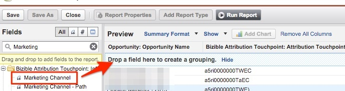

# 마케팅 채널별 기회 {#opportunities-by-marketing-channel}

이 보고서는 마케팅 채널에서 생성된 기회 수를 표시합니다. 여기에는 모든 기회가 포함됩니다. 그러나 이 보고서를 필터링하여 특정 유형의 기회를 분석할 수 있습니다.

1. 을(를) 클릭합니다. **[!UICONTROL Reports]** Salesforce에서 탭을 선택하고 을(를) 선택합니다 **[!UICONTROL New Report]**.

1. &quot;Bizible Attribution&quot;의 빠른 찾기 유형에서 **[!UICONTROL Bizible Attribution Touchpoint with Opportunity]** 보고서 유형 및 선택 **[!UICONTROL Create]**.

   

1. 보고서 상단에서 시작하여 **[!UICONTROL All Bizible Attribution Touchpoints]** 보고하려는 기간에 따라 날짜 필드를 조정합니다. 이 예제에서는 All Time을 살펴보겠습니다. 또한 보고서 형식을 [!UICONTROL Tabular] to **[!UICONTROL Summary]**.

   

1. 이제 보고서에 필드를 추가할 예정입니다. 왼쪽의 빠른 찾기를 &quot;마케팅 채널&quot;에 입력하고 보고서의 요약 그룹에 추가합니다.

   

1. 이제 보고서를 실행하고 분석하십시오!

   마케팅 채널로 요약된 Opportunity 보고서입니다. 이 보고서는 모든 Opp에 중점을 두지만, 기회의 단계/유형을 기반으로 자유롭게 필터링할 수 있습니다. 또한 보고할 필드에 자유롭게 추가할 수 있습니다.

>[!MORELIKETHIS]
>
>[[!DNL Marketo Measure] 대학: 스톡 SFDC 보고서](https://universityonline.marketo.com/courses/bizible-fundamentals-bizible-102/#/page/5c5cb68dfb384d0c9fb96cc4)
