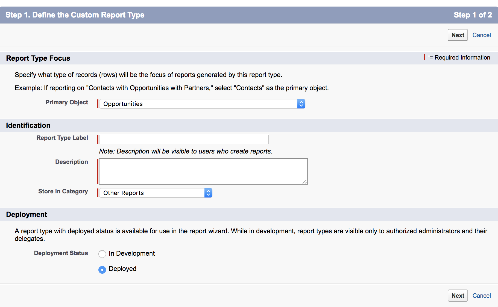

# 영업 기회가 없는 연락처에 대한 보고서 유형 {#report-type-for-contacts-without-opportunities}

>[!NOTE]
>
>설명서에는 &quot;[!DNL Marketo Measure]&quot;을(를) 지정하는 지침이 표시되지만 CRM에는 여전히 &quot;[!DNL Bizible]&quot;이 표시됩니다. 이를 업데이트하고 리브랜딩이 곧 CRM에 반영되도록 노력하고 있습니다.

Opportunity 와 연관되지 않은 Purchaser Touchpoints 가 있는 Contact에 대해 보고하려면 사용자 지정 보고서 유형을 만들어야 합니다.

1. **[!UICONTROL Setup]** > **[!UICONTROL Create]** > **[!UICONTROL Report Types]**(으)로 이동합니다.

   

1. **[!UICONTROL New Custom Report Type]**&#x200B;를 선택합니다.

   

1. [!UICONTROL Primary Object]을(를) &quot;[!UICONTROL Contacts]&quot;(으)로 설정합니다. 보고서 유형 레이블의 이름을 &quot;구매자 터치포인트가 있는 연락처&quot;로 지정합니다. 보고서 유형 이름에 동일한 이름을 사용합니다. 설명 입력 내에서 &quot;구매자 터치포인트와 연락처&quot;가 표시됩니다. 보고서를 &quot;[!UICONTROL Other]&quot; 내에 저장하고 &quot;[!UICONTROL Deployed]&quot;(으)로 설정하십시오.

   

1. 여기에서 연락처 객체를 구매자 터치포인트 객체에 연결합니다. &quot;각 &quot;A&quot; 레코드에는 하나 이상의 관련 &quot;B&quot; 레코드가 있어야 합니다.&quot; 버튼을 선택해야 합니다.

   에게 연결합니다.

1. **[!UICONTROL Save]**&#x200B;을(를) 클릭하면 완료됩니다!
