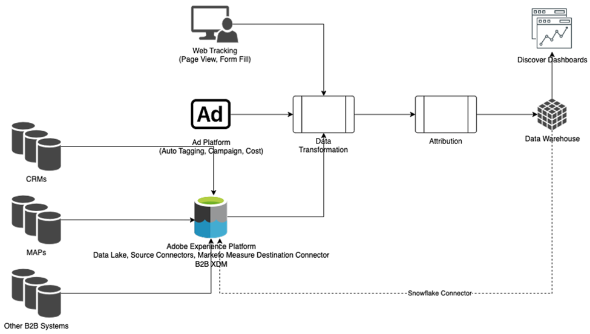

# [!DNL Marketo Measure] Ultimate 개요 {#marketo-measure-ultimate-overview}

[!DNL Marketo Measure](이전의 Bizible)는 마케터에게 매출을 늘리고 기업 투자 수익률을 증대시키는 데 가장 효과적인 마케팅 활동을 파악하는 인사이트를 제공합니다. [!DNL Marketo Measure]은(는) 채널 성과를 자동으로 추적 및 보고하여 가장 고객 참여를 유도하는 채널에 대한 가시성을 제공하고 그에 따라 마케팅 지출을 최적화할 수 있는 마케팅 속성 솔루션입니다.

[!DNL Marketo Measure Ultimate]에 추가 기능이 포함되어 있습니다.

* 거의 모든 데이터 소스 및 동일한 유형의 여러 데이터 소스에서 수집하여 속성을 위해 모든 데이터를 가져옵니다.
   * Salesforce 및 Dynamics뿐만 아니라 거의 모든 CRM에 사용할 수 있습니다.
   * 여러 CRM 인스턴스 및/또는 MAP 인스턴스를 하나의 [!DNL Marketo Measure] 인스턴스에 연결합니다.
   * 타사 웨비나 등록 및 참가 데이터를 가져옵니다.

* 필드 매핑 및 변환 기능을 통해 데이터를 유연하게 변환하여 올바른 데이터 모양을 확보할 수 있습니다.

* 포함된 데이터 웨어하우스를 통해 외부 애플리케이션에서 속성 인사이트를 사용할 수 있도록 하여 해당 인사이트를 워크플로우에 통합합니다. 세분화된 결과 데이터에 대한 액세스 권한을 제공하고 분석 및 보고를 위해 BI 도구를 사용하는 기능을 제공하는 Snowflake Data Warehouse을 포함하여 보다 세분화된 결과 데이터 및 BI 기반 보고.

* RTCDP(B2B 또는 B2P 에디션)와 통합하여 RTCDP 및 [!DNL Marketo Measure]로서 RTCDP 고객을 위한 통합 B2B 속성 솔루션을 제공하면 모두 AEP(중앙 집중식 Adobe Experience Platform) 데이터에서 작동합니다.

**[!DNL Marketo Measure]계층 1-3**

**[!DNL Marketo Measure Ultimate]**

## [!DNL Marketo Measure Ultimate]의 새로운 기능 {#whats-new-in-marketo-measure-ultimate}

**AEP를 통해 B2B 데이터 가져오기**

마케터는 AEP를 통해 B2B 데이터(예: 계정, 영업 기회, 연락처, 잠재 고객, 캠페인, 캠페인 멤버, 활동)를 가져와야 합니다. Ultimate에서는 더 이상 직접 CRM 및 Marketo Engage 연결을 사용할 수 없습니다. 마케터는 직접 연결을 통해 Ad Platform 데이터를 계속 가져오고 [!DNL Marketo Measure] Javascript를 통해 웹 활동을 추적합니다.

**기본 통화 설정**

[!DNL Marketo Measure Ultimate]은(는) 사용자가 변경할 때까지 기본 통화를 USD로 설정합니다. 새 기본 통화를 설정하면 재처리 없이 데이터가 업데이트됩니다. 선택한 통화가 대상 ISO 코드로 존재하는 한 전환율을 제출할 필요가 없습니다.

**[!DNL Marketo Measure Ultimate]샌드박스**

AEP에서 [!DNL Marketo Measure] 대상 데이터 흐름을 만들기 전에 [!DNL Marketo Measure Ultimate] 인스턴스를 AEP 샌드박스에 매핑해야 합니다.

>[!NOTE]
>
>[!DNL Marketo Measure Ultimate] 프로덕션 인스턴스는 AEP 프로덕션 샌드박스에 매핑되어야 하며 [!DNL Marketo Measure Ultimate] 개발자 인스턴스는 AEP 개발자 샌드박스에 매핑되어야 합니다.

샌드박스 매핑 선택 사항이 저장되면 애플리케이션에서 변경할 수 없습니다. 변경하려면 [Marketo 지원](https://nation.marketo.com/t5/support/ct-p/Support){target="_blank"}에 문의하세요.

지정된 데이터 소스의 지정된 엔티티(예: 계정)에 대한 데이터는 하나의 데이터 세트에만 들어갈 수 있습니다. 각 데이터 세트는 하나의 데이터 흐름에만 포함될 수 있습니다. 위반은 런타임에 데이터 흐름을 중지합니다.

**스테이지 매핑**

모든 [!DNL Marketo Measure Ultimate] 규칙은 데이터 세트별로 다릅니다. 모든 데이터 세트 및 선택한 모든 단계에 대해 스테이지 매핑 규칙을 만들어야 합니다.

6개의 기본 단계가 있습니다.

* 리드 손실
* 리드 열기
* 전환된 잠재 고객
* 영업 기회 손실
* 영업 기회 공개
* 기회 획득

[분실], [성사] 및 [변환된] 섹션에서는 사용자 정의 단계를 허용하지 않습니다. 그러나 매핑 규칙을 업데이트하여 Source 데이터를 내장 손실/평가/변환된 단계에 매핑할 수 있습니다.

열린 섹션에 대해서만 사용자 정의 단계를 정의할 수 있습니다.
단계 매핑에 더 이상 CRM 단계가 자동으로 포함되지 않습니다.

4개의 기본 제공 단계는 규칙으로 매핑해야 합니다(나머지 두 단계인 잠재 고객 손실 및 전환된 잠재 고객에 대한 매핑 규칙은 선택 사항).

* 리드 열기
* 영업 기회 손실
* 영업 기회 공개
* 기회 획득

규칙 조건은 데이터 세트별로 다릅니다. 단계 매핑 규칙은 잠재 고객 손실 및 전환된 잠재 고객을 제외한 모든 데이터 세트 및 모든 단계에 대해 만들어야 합니다.

단계 및 부메랑과 사용자 지정 모델에 대한 선택 사항이 없습니다. 단계, 부메랑 및 사용자 지정 모델에 대해 모든 단계가 선택됩니다. 지원하는 단계 수는 사용자 지정 단계 15개와 기본 제공 단계 6개로 제한됩니다.

캠페인 멤버 접점 규칙 및 활동 접점 규칙은 데이터 세트에 따라 다릅니다.

Ultimate에는 직접 CRM 연결이 없으므로 속성 터치포인트는 CRM에 작성되지 않습니다.

[!DNL Marketo Measure] ABM ML 서비스(리드-계정 일치 및 예측 참여 점수)를 [!DNL Marketo Measure Ultimate]에 사용할 수 없습니다. 이러한 서비스는 RT-CDP B2B 에디션에 무료로 포함되어 있습니다.

## 제한 사항 {#limitations}

* 데이터 변환 규칙에 대해 제한된 필드를 사용할 수 있습니다.
* 기존 Tier 1/2/3 사용자를 위한 마이그레이션 경로가 없습니다. 새 구현이 필요하지만 추적된 웹 활동 데이터를 기존 인스턴스에서 마이그레이션하는 데 도움이 됩니다.

>[!MORELIKETHIS]
>
>* [Marketo Measure Ultimate 대상](https://experienceleague.adobe.com/docs/experience-platform/destinations/catalog/adobe/marketo-measure-ultimate.html?lang=en){target="_blank"}
>
>* [비디오: Marketo Measure Ultimate 개요](https://experienceleague.adobe.com/en/docs/marketo-measure-learn/tutorials/marketo-measure-ultimate/overview){target="_blank"}
