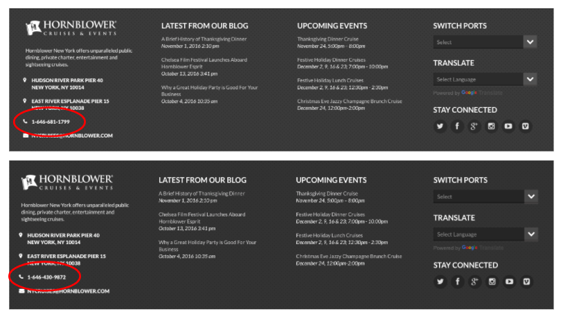

# 호출 추적 통합 {#call-tracking-integration}

과 통합 [!DNL CallTrackingMetrics] 웹 세션을 전화와 병합하기 위한 것입니다. 전화를 다음에 대한 양식 제출로 처리합니다. [!DNL Marketo Measure]. 실제 양식 제출이 없었기 때문에 웹 방문으로만 간주되었을 웹 세션에 크레딧을 제공합니다.

## 호출 추적 설명 {#call-tracking-explained}

일반적인 의미의 &quot;Call Tracking&quot;은 다음과 같은 회사의 제품입니다. [!DNL CallTrackingMetrics], [!DNL DiaglogTech], [!DNL Invoca], 또는 [!DNL CallRail]를 참조하십시오. 고유한 전화 번호는 서로 다른 마케팅 채널 또는 캠페인에 따라 사용자에게 표시됩니다. 이를 통해 마케터는 해당 채널 또는 캠페인의 성과를 확인할 수 있습니다.

## 이전 및 이후 {#before-and-after}

아래 순서도를 참조하여 방법을 확인하십시오. [!DNL Marketo Measure] CallTrackingMetrics와 통합하지 않고 전화 통화를 처리하는 데 사용됩니다. 발생한 전화 통화가 추적 해제되어 웹 세션으로 보여지며 이에 대한 터치포인트가 만들어지지 않았습니다. 사용자가 양식을 완료한 다음 방문이 되어서야 터치포인트가 채워졌습니다.

통합하면 웹 세션이 실제로 전화에 연결되어 있었음을 알 수 있습니다. 다음 양식 채우기는 PostLC 터치로 끝나고 계속 여정의 일부로 추적됩니다.

## 작동 방법 {#how-it-works}

CallTrackingMetrics는 이 기능이 작동하려면 개발 작업을 수행해야 합니다. 사이트에 배치하는 JavaScript를 사용하여 CallTrackingMetrics는 [!DNL Marketo Measure] 쿠키. 이 &quot;[!DNL BizibleId]그런 다음 CallTrackingMetrics에 의해 저장됩니다.

방문자가 사이트에 방문하여 전화를 걸면 해당 데이터를 로 푸시하는 것은 CallTrackingMetrics의 일입니다 [!DNL Salesforce].  일반적으로 [!DNL Salesforce Task] 전화번호, 제목, 유형 등의 데이터를 채우는 가 만들어집니다. [!DNL BizibleId]

다음 [!DNL BizibleId] 는 버전 6.7 이상에서 설치된 필드입니다. [!DNL Marketo Measure] 마케팅 속성 패키지.

다음은 를 사용하는 작업 레코드의 예입니다. [!DNL BizibleId] 채워짐.

날짜 [!DNL Marketo Measure] 은(는) 알려진 로 작업 레코드를 찾습니다. [!DNL BizibleId] 값을 입력했습니다. [!DNL Marketo Measure] 를 사용하여 해당 사용자를 웹 세션에 매핑할 수 있습니다 [!DNL BizibleId] 그리고 해당 세션을 웹 방문 대신 전화에 연결합니다.

## 터치포인트 {#the-touchpoint}

날짜 [!DNL Marketo Measure] 작업을 가져오거나 다운로드할 수 있습니다. 웹 세션과 함께 해당 세부 사항을 처리합니다. 일반적으로 레퍼러 또는 광고와 병합될 수 있습니다. 아래 예에서는 방문자가 유료 Google 광고를 통해 사업을 찾은 후 전화를 걸었습니다.

다음 [!UICONTROL Touchpoint] 유형 &quot;Call&quot;은 Task에서 가져오며 위의 스크린샷은 Task 생성 시 CallTrackingMetrics에도 채워집니다.

## 보고 {#reporting}

접점 유형 값 [!DNL Marketo Measure] 일반적으로 푸시는 웹 방문, 웹 폼 또는 웹 채팅이지만, CallTrackingMetrics 터치포인트의 경우 터치포인트 유형은 전화 호출입니다. 이렇게 하면 마케터가 가장 많은 전화를 건 채널을 확인하고 조직의 매출을 생성하는 데 도움이 됩니다.

## FAQ {#faq}

**내 터치포인트 유형이 웹 방문인 이유는 무엇입니까?**

접점 유형은 Task.Type 필드에서 채워집니다. Task.Type 필드가 비어 있으면 [!DNL Marketo Measure] 은 터치포인트 유형을 웹 방문으로 자동 설정합니다. Task.Type 필드가 채워지면 [!DNL Marketo Measure] 은 해당 값을 읽고 그에 따라 터치포인트 유형을 채웁니다.

**전화에서 터치포인트가 채우는 다른 필드는 무엇입니까?**

터치포인트 유형과 미디어 모두 Task.Type에서 가져온 데이터를 포함합니다. 다른 모든 데이터 포인트는 웹 추적 및 JavaScript 데이터에서 가져옵니다.

**이 전화가 웹 세션에 연결되지 않는 이유는 무엇입니까?**

먼저 작업을 확인하여 [!DNL BizibleId] 채워짐. 값이 없으면 터치포인트를 만들 수 없습니다. CallTrackingMetrics를 사용하여 이를 에스컬레이션해야 합니다.

값이 있는 경우 모든 웹 세션은 30분으로만 간주됩니다. 오후 12시 17분(웹 사이트에서 세션 시작)에 Google 광고를 클릭했지만 오후 1시 5분이 되어서야 통화가 이루어진 경우, 웹 세션과 전화를 병합하지 않습니다. 오히려, [!DNL Marketo Measure] 는 별개 만들기 [!DNL Salesforce Task] 터치포인트로 전화를 추적하지만 웹 세션 데이터는 없습니다.

## 파트너십 {#partnerships}

[!DNL Marketo Measure] 현재 당사와 &quot;공식&quot; 통합 프로세스를 거친 공식 Call Tracking 파트너는 한 명이며, 여기에는 공동 마케팅 및 제품 교육이 포함되었습니다. 이 파트너는 CallTrackingMetrics입니다.
