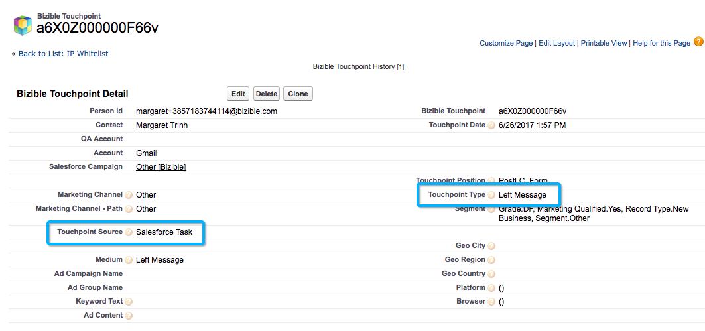

# 호출 추적 통합 {#call-tracking-integration}

Adobe와의 통합 [!DNL CallTrackingMetrics] 는 웹 세션을 전화 호출에 병합하기 위한 것입니다. 전화는 다음에 제출하는 양식 제출으로 처리됩니다 [!DNL Marketo Measure]. 실제 양식 제출이 없으므로 웹 방문으로만 간주될 수 있었던 웹 세션에 크레딧을 제공합니다.

## 호출 추적 설명 {#call-tracking-explained}

일반적으로 &quot;호출 추적&quot;은 다음과 같은 회사의 제품입니다 [!DNL CallTrackingMetrics], [!DNL DiaglogTech], [!DNL Invoca], 또는 [!DNL CallRail]: 몇 가지 이름을 지정합니다. 고유한 전화 번호는 다양한 마케팅 채널 또는 캠페인을 기반으로 사용자에게 표시됩니다. 이를 통해 마케터는 그러한 채널 또는 캠페인이 어떻게 작동하는지 확인할 수 있습니다.

## 이전 및 이후 {#before-and-after}

아래 순서도를 보고 방법을 알아보십시오 [!DNL Marketo Measure] CallTrackingMetrics와의 통합 없이 전화 호출을 처리하는 데 사용됩니다. 발생한 전화 통화가 추적되지 않았으므로 웹 세션으로 간주되었고 이에 대한 터치포인트가 만들어지지 않았습니다. 사용자가 터치포인트가 최종적으로 채워지는 양식을 완료한 다음 방문이 될 때까지 이어지지 않았습니다.

통합을 통해 웹 세션이 실제로 전화 호출에 연결되어 있음을 확인할 수 있습니다. 다음 양식 채우기는 PostLC 터치로 끝나고 여정의 일부로 계속 추적됩니다.

## 작동 방법 {#how-it-works}

CallTrackingMetrics가 제대로 작동하려면 끝에 약간의 개발 작업을 수행해야 합니다. CallTrackingMetrics는 사이트에 배치된 Javascript를 사용하여 [!DNL Marketo Measure] 쿠키 . 이 &quot;[!DNL BizibleId]그런 다음 CallTrackingMetrics에 의해 저장됩니다.

방문자가 사이트에 방문하여 전화를 걸 때 해당 데이터를 로 푸시하는 것은 CallTrackingMetrics의 작업입니다 [!DNL Salesforce]  일반적으로 [!DNL Salesforce Task] 전화 번호, 제목, 유형 및 현재, [!DNL BizibleId]

다음 [!DNL BizibleId] 는 버전 6.7+와 함께 설치되는 필드입니다 [!DNL Marketo Measure] 마케팅 기여도 분석 패키지

다음은 작업 레코드의 예입니다. [!DNL BizibleId] 채워집니다.

When [!DNL Marketo Measure] 작업 레코드를 [!DNL BizibleId] 값이 입력됨, [!DNL Marketo Measure] 해당 사용자를 동일한 웹 세션에 매핑할 수 있습니다 [!DNL BizibleId] 그리고 해당 세션을 웹 방문 대신 전화 호출에 연결하게 합니다.

## 터치포인트 {#the-touchpoint}

When [!DNL Marketo Measure] 작업을 가져오거나 다운로드할 수 있으며 웹 세션과 함께 해당 세부 정보를 처리합니다. 대부분의 경우 레퍼러 또는 광고와 병합할 수 있습니다. 아래 예에서는 방문자가 유료 Google 광고를 통해 비즈니스를 발견하고 전화를 했습니다.

다음 [!UICONTROL Touchpoint] Task에서 &quot;Call&quot; 유형을 가져옵니다. 위의 스크린샷에서는 작업을 만들 때 CallTrackingMetrics로도 채워집니다.

## 보고 {#reporting}

다음과 같은 터치 포인트 유형 값 [!DNL Marketo Measure] 일반적으로 푸시는 웹 방문, 웹 양식 또는 웹 채팅이지만 CallTrackingMetrics 터치포인트의 경우 터치포인트 유형은 전화 통화입니다. 이를 통해 마케터는 가장 많은 전화 통화에서 어떤 채널을 도출하고 조직의 매출을 생성하는지 확인할 수 있습니다.

## FAQ {#faq}

**터치 포인트 유형 웹 방문이 있는 이유는 무엇입니까?**

터치 포인트 유형은 Task.Type 필드에서 채워집니다. Task.Type 필드가 비어 있으면 [!DNL Marketo Measure] 터치 포인트 유형을 자동으로 웹 방문으로 설정합니다. Task.Type 필드가 채워지면 [!DNL Marketo Measure] 이 값을 읽고 터치 포인트 유형을 적절하게 채웁니다.

**Touchpoint가 통화 시 채우는 다른 필드는 무엇입니까?**

터치 포인트 유형 및 미디어 모두 Task.Type에서 가져온 데이터를 포함합니다. 다른 모든 데이터 포인트는 웹 추적 및 Javascript 데이터에서 가져옵니다.

**이 전화 통화가 웹 세션에 연결되어 있지 않은 이유는 무엇입니까?**

먼저 작업을 확인하여 [!DNL BizibleId] 채워집니다. 값이 없으면 이에 대한 터치포인트를 만들지 않고 만들 수 없습니다. 이 문제는 CallTrackingMetrics를 사용하여 에스컬레이션해야 합니다.

값이 있는 경우 모든 웹 세션은 30분으로 간주합니다. Google 광고를 오후 12:17에(웹 사이트에서 세션 시작) 클릭했지만, 오후 1:05까지 전화 호출이 발생하지 않은 경우 웹 세션 및 전화 통화를 병합하지 않습니다. 오히려, [!DNL Marketo Measure] 이(가) 별도의 [!DNL Salesforce Task] 터치포인트를 사용하여 전화 통화를 추적하지만 웹 세션 데이터는 없습니다.

## 파트너십 {#partnerships}

[!DNL Marketo Measure] 현재 에는 공동 마케팅 및 제품 교육을 포함한 adobe와 &quot;공식적인&quot; 통합 프로세스를 거친 하나의 공식 통화 추적 파트너가 있습니다. 이 한 파트너는 CallTrackingMetrics입니다.
