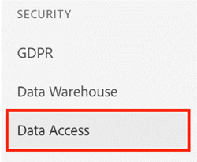

# [!UICONTROL Discover Data Download] 액세스 제어 {#discover-data-download-access-control}

[!UICONTROL Discover Data Download] 제어 사용 [!DNL Marketo Measure] 관리자는 사용자의 역할을 기반으로 검색 대시보드에 대한 데이터 다운로드 정책을 설정합니다. 이 컨트롤은 Discover 대시보드의 모든 데이터 다운로드 작업을 다룹니다.

1. 클릭 **[!UICONTROL Data Access]** 아래에 [!UICONTROL Security].

   

1. 드롭다운을 클릭하고 콘솔에 적합한 옵션을 선택합니다.

   

   <table>
    <tr>
     <td><strong>모든 사용자</strong></td>
     <td>모든 사용자는 PDF 및 CSV 형식을 모두 포함한 데이터를 다운로드할 수 있습니다.</td>
    </tr>
    <tr>
     <td><strong>관리자 전용</strong></td>
     <td>관리자 사용자만 PDF 및 CSV 형식을 모두 포함한 데이터를 다운로드할 수 있습니다.</td>
    </tr>
    <tr>
     <td><strong>없음</strong></td>
     <td>PDF 및 CSV 형식을 모두 포함한 데이터는 다운로드할 수 없습니다.</td>
    </tr>
   </table>

1. 클릭 **[!UICONTROL Save]** 완료 시.

   

>[!NOTE]
>
>이 설정은 사용자가 로그아웃했다가 다시 로그인할 때까지 적용되지 않을 수 있습니다.
